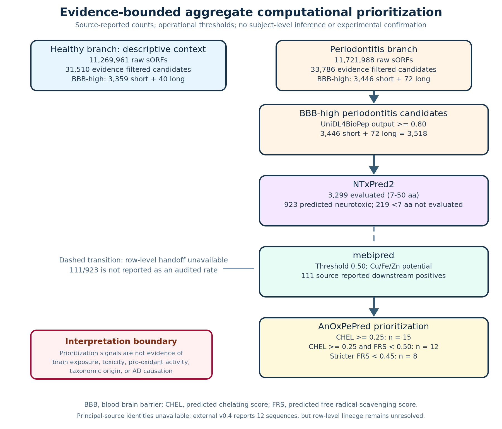
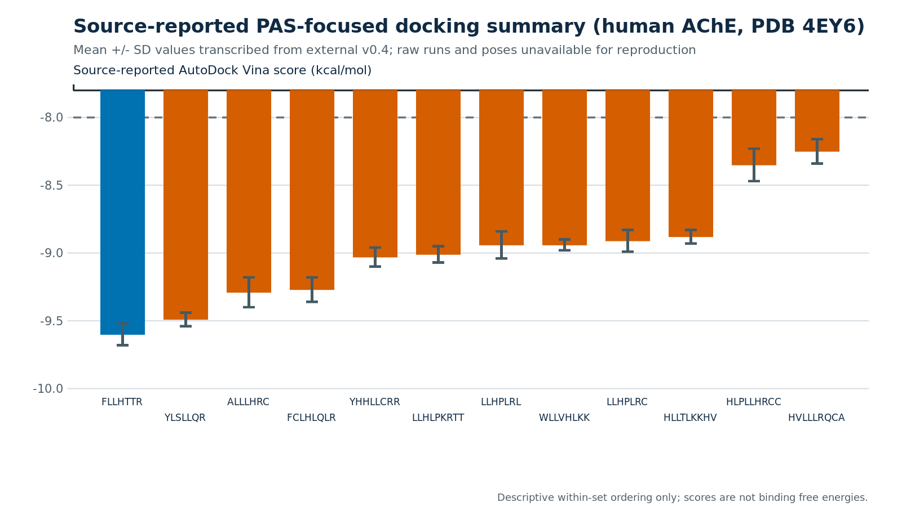
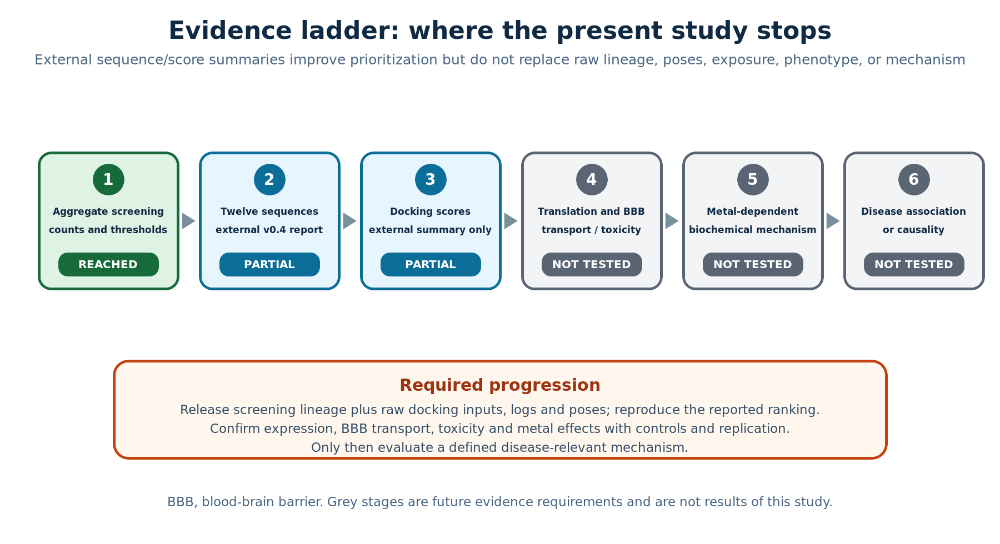

# Provenance-Aware Multi-Model Prioritization of Periodontitis-Cohort Oral Micropeptides: Aggregate Screening and an Acetylcholinesterase Docking Follow-up

**Article type:** Original Research Article  
**Draft status:** Expanded submission-oriented scientific-content draft for accountable-author review. Screening results derive from the principal source record. The twelve sequences and docking summary derive from a user-designated external repository and are explicitly labelled as source-reported because raw lineage and docking artefacts were unavailable.

## Abstract

**Background:** Microbiome small open reading frames (smORFs) encode an incompletely characterized peptide space. Serial predictors can reduce that space, but they do not establish translation, tissue exposure, toxicity, target binding, mechanism, or disease causality. We reconstructed an aggregate oral-smORF prioritization workflow and integrated a separately reported acetylcholinesterase (AChE) docking follow-up while preserving the distinct provenance and evidentiary status of both stages.

**Methods:** The principal record supplied healthy and periodontitis-cohort branch counts for 4–50-aa smORFs, evidence filtering, UniDL4BioPep outputs, NTxPred2, mebipred, and AnOxPePred. Percentages and monotonicity were deterministically recomputed; no candidate-count inferential test was used because candidates are not independent biological replicates. A user-designated external v0.4 report supplied twelve sequences and mean±SD AutoDock Vina scores against human AChE PDB 4EY6. Sequence composition and score ordering were independently audited, but docking was not rerun because prepared structures, configurations, seeds, raw runs, logs, and poses were absent.

**Results:** Evidence filtering retained 31,510/11,269,961 healthy (0.2796%) and 33,786/11,721,988 periodontitis-branch (0.2882%) candidates. BBB-high outputs were 3,359/30,557 (10.99%) and 3,446/32,754 (10.52%) in the short branches and 40/953 (4.20%) and 72/1,032 (6.98%) in the long branches. The periodontitis branch contained 3,518 BBB-high candidates; NTxPred2 evaluated 3,299 (93.77%), classified 923/3,299 (27.98%) as positive, and left 219 outside its stated length range. The principal record subsequently reported 111 metal-binding-positive candidates, of which 15/111 (13.51%) met CHEL≥0.25, 12/111 (10.81%) additionally met FRS<0.50, and 8/111 (7.21%) met FRS<0.45. The external report listed twelve unique 7–9-aa sequences: eleven contained histidine, six contained cysteine, and all contained at least one Arg/Lys. Its reported Vina means ranged from −9.60 to −8.25 kcal/mol (SD 0.04–0.12). These scores could be ordered and plotted but not independently reproduced or interpreted as affinities.

**Conclusions:** The combined record is a provenance-aware shortlist, not a validated periodontitis-specific peptidome or AD mechanism. The external sequence list makes synthesis planning possible, but principal-source row-level linkage, raw docking artefacts, cohort-matched expression, measured BBB transport, toxicology, metal-dependent biochemistry, and disease-relevant validation remain necessary.

**Keywords:** oral microbiome; small open reading frame; micropeptide; periodontitis; blood–brain barrier; neurotoxicity prediction; metal-binding prediction; acetylcholinesterase; molecular docking; provenance; hypothesis generation

## 1. Introduction

### 1.1 Microbiome smORFs are a large but difficult discovery space

Small open reading frames are systematically under-annotated because short coding sequences are difficult to distinguish from random open reading frames and often fall below conventional gene-calling thresholds. Large-scale human-microbiome analyses nevertheless reveal thousands of conserved smORF families, many without known domains or functions [1]. Complementary prediction systems combine profile models, sequence features, evolutionary information, and ribosome-profiling enrichment to improve annotation [2]. Recent high-resolution multi-omics work has gone further by connecting prediction with metatranscriptomic and deep metaproteomic evidence [3]. These developments place microbial smORFs within a legitimate discovery space, but also establish a stringent boundary: a predicted ORF is not necessarily translated, and a translated peptide is not necessarily stable or functional.

This boundary is especially important for very short peptides. General reviews of short-ORF biology emphasize that convincing micropeptide discovery requires orthogonal evidence rather than sequence novelty alone [4]. Human proteogenomic studies similarly show that translation evidence, tissue context, and functional follow-up must be separated [5]. In metagenomic assemblies, six-frame translation can generate millions of short sequences. Exact matches to curated sequence or proteomic resources may reduce this search space, but the meaning of each match depends on the source: a reference database supports sequence existence or taxonomy, whereas a mass-spectrometry dataset may support detection only within its own cohort, disease context, and false-discovery framework.

### 1.2 Periodontitis-associated oral ecology requires subject-level provenance

Periodontitis is accompanied by ecological and functional restructuring of the oral microbiota. Paired metagenomic and metatranscriptomic analyses have identified site- and species-dependent microbial activity associated with periodontitis [6]. Cross-study metatranscriptome synthesis further demonstrates why subject-level mapping, normalization, covariates, and false-discovery control are essential for disease comparisons [7]. HOMD and eHOMD provide curated oral and aerodigestive sequence/taxonomic resources [8,9], whereas oral metaproteomic datasets provide context-dependent peptide observations [10,11]. Contemporary oral metaproteomics additionally emphasizes host depletion, microbial enrichment, peptide- and protein-level error control, taxonomic assignment, and public raw-data preservation [12].

The principal record used several heterogeneous resources as exact-match filters. One contains mixed periodontitis, caries, and healthy saliva samples [10]; another concerns an oral metaproteome in lung cancer [11]; HOMD/eHOMD are sequence resources rather than expression repositories [8,9]. Such resources can support the statement that a matching sequence exists or was observed in a named context. They cannot, without row-level linkage, prove that the same peptide was expressed in the present cohort, enriched in periodontitis, or derived from a particular taxon. Accordingly, this study uses “periodontitis-cohort branch” rather than “periodontitis-specific peptide.”

### 1.3 Serial peptide predictors provide triage, not orthogonal confirmation

UniDL4BioPep provides a common deep-learning architecture for binary peptide-bioactivity tasks [13]. BBB-peptide prediction illustrates both the value and fragility of such models: positive training sets are limited, class imbalance is substantial, and sensitivity–specificity trade-offs and external performance vary across architectures [14,15]. NTxPred2 estimates neurotoxic-peptide labels from sequence [16]; mebipred estimates metal-binding potential [17]; and AnOxPePred estimates chelating and free-radical-scavenging features associated with antioxidative peptides [18]. Each model can narrow a candidate list. Their agreement is not independent biological replication because they reuse overlapping sequence descriptors and have different training domains, endpoints, and calibration properties.

A stronger peptide-discovery standard proceeds from computational prioritization to synthesis and functional testing. Microbiome-derived peptide-antibiotic work provides a useful precedent: predicted candidates became biological findings only after chemical synthesis and experimental assays [19]. The current study therefore treats BBB, neurotoxicity, metal-binding, CHEL, and FRS outputs as operational labels. “BBB-high” does not mean measured brain exposure; “neurotoxic-positive” does not mean cellular toxicity; and CHEL-high/FRS-lower does not establish pro-oxidant chemistry.

### 1.4 AChE/PAS biology motivates—but does not validate—a docking follow-up

Alzheimer’s disease (AD) is characterized by amyloid-β (Aβ) plaques, tau pathology, synaptic dysfunction, and progressive cognitive decline [20,21]. The cholinergic system remains clinically relevant because acetylcholinesterase inhibitors provide established symptomatic treatment [22]. AChE also has a non-catalytic relationship with Aβ: classic experiments showed that AChE accelerates Aβ fibril assembly and implicated the peripheral anionic site (PAS) at the entrance of the active-site gorge [23]. A defined AChE structural motif can promote Aβ fibril formation [24], and PAS-directed ligands can inhibit AChE-induced Aβ aggregation [25]. Crystal structures of AChE complexes map an aromatic gorge extending between the catalytic and peripheral sites [26,27].

Molecular-simulation studies provide additional context but not direct support for the present candidates. A published AChE–Aβ trajectory described dynamic residence near PAS-adjacent surfaces [28], and accelerated simulations explored AChE’s role in Aβ association [29]. These studies justify asking whether a prioritized peptide can be placed near the AChE gorge; they do not imply that any oral candidate binds AChE, changes catalysis, affects Aβ aggregation, or reaches the brain. For this reason, the present docking follow-up is reported as a provenance-limited, source-reported ranking rather than as target validation.

### 1.5 Metal dyshomeostasis and short neuroactive peptides define a testable hypothesis

Copper, iron, and zinc dyshomeostasis has long been discussed in relation to AD aggregation, redox chemistry, and neuronal injury [30]. Elementomic perspectives emphasize that metal imbalance intersects with amyloid biology, lipid peroxidation, ferroptotic processes, and therapeutic attempts [31]. A disease-relevant peptide hypothesis, however, requires more than a metal-binding prediction. It requires an identifiable molecule, reproducible coordination chemistry, metal specificity, measurable redox consequences, exposure to the relevant tissue, and a phenotype.

Short host-derived peptides demonstrate that this combination is experimentally testable. Tau fragments coordinate Cu(II) and can alter Aβ aggregation in a sequence- and metal-dependent manner [32]. The tau26–44 fragment provides a particularly useful conceptual comparator because structural and cell-based work links a short, dynamic peptide to neurotoxicity and membrane effects [33]. Bacterial amyloid exposure can also modify aggregation phenotypes in model systems, as shown for curli and α-synuclein [34]. These precedents do not transfer activity to the current twelve sequences. They define the assays needed to decide whether a predicted oral peptide is inactive, metal-binding but benign, or capable of a metal-dependent biological effect.

### 1.6 Periodontitis–AD evidence demands causal restraint

Observational syntheses report associations between periodontal disease and cognitive disorders, but estimates vary with disease definition, severity, population, and study design [35–38]. Longitudinal work has associated periodontitis with cognitive decline in an AD cohort [39], and combined text-mining/public-dataset analyses have proposed shared signals [40]. Such findings are vulnerable to confounding, reverse causation, oral-care changes, comorbidity, and selection effects. Recent Mendelian-randomization studies and their synthesis have not provided convincing support for a substantial genetic causal effect of periodontal disease on AD [41,42]. A current primer accordingly treats periodontal–AD mechanisms as plausible but incompletely established [43].

Mechanistic studies involving *Porphyromonas gingivalis* provide important but bounded context. Gingipains and bacterial material have been reported in AD-related tissues and models [44–46]; outer-membrane vesicles and gingipain biochemistry offer plausible routes for host interaction [47–50]. These studies concern specific organisms, virulence factors, or experimental exposures. They cannot assign the current candidates to *P. gingivalis*, and they do not validate a micropeptide-mediated pathway. The oral metagenome is a community, not a single-species peptidome.

### 1.7 Study objectives and contribution

This study has two linked objectives. First, it reconstructs and audits the aggregate screening record: how many healthy and periodontitis-branch candidates survive evidence filtering, BBB scoring, NTxPred2, mebipred, and CHEL/FRS thresholds, and which transitions cannot be independently audited? Second, following the user’s request to integrate an external v0.4 repository, it evaluates what additional information is defensibly available from that record: a twelve-sequence list, independently recomputable composition, and source-reported AutoDock Vina summaries against AChE PDB 4EY6 [27,51,52].

The contribution is not a new predictor, a reproduced docking workflow, or a validated disease mechanism. It is a substantially expanded, provenance-aware original-research record that distinguishes principal-source screening results, external sequence/score summaries, independently recomputed descriptors, and future validation. Flexible peptide-docking methods such as FlexPepDock indicate the standard toward which a structure-based follow-up could progress [53], but raw inputs and reproducible execution remain prerequisites.

## 2. Materials and Methods

### 2.1 Study design and evidence tiers

This was an aggregate-level computational reconstruction with a secondary cross-repository follow-up. Evidence was assigned to three tiers before writing:

1. **Tier A—principal-source screening:** counts, thresholds, and workflow descriptions from `材料与方法及结果_机制研究版.docx` (SHA-256 `f4132a02cb9955c808739c3cbf15edd947f6203d577e8586490933a5d2daa4b5`).
2. **Tier B—external v0.4 summary:** twelve sequences, composition claims, docking method labels, and Vina mean±SD values from commit `e28c06db0614512eeb2bca217d2f9a760e804051` of the user-designated external repository. File hashes and acceptance decisions are recorded in `evidence/external_v04_integration.md`.
3. **Tier C—context and future work:** peer-reviewed literature used to motivate AChE/PAS, metal, oral-microbiome, and validation questions. Literature was not used to manufacture missing results.

Tier A remained the sole authority for the screening funnel. Tier B did not retroactively fill principal-source row-level lineage. Tier C supplied interpretation boundaries only.

### 2.2 Cohort and accession provenance

The principal record named PRJNA678453 and PRJEB65451 and stated that 296 high-quality metagenome-assembled genomes were obtained from 24 healthy and 26 periodontitis participants. PRJNA678453 could be linked to published paired oral metagenomic/metatranscriptomic work [6]. PRJEB65451 could not be independently resolved in this environment and was retained as an unresolved provenance element rather than assigned inferred metadata.

No new participants were recruited, no specimens were collected, and no primary omics or clinical analysis was performed for this reconstruction. Candidate nucleotide/amino-acid rows, genomic coordinates, subject/sample mappings, taxonomy, peptide-spectrum matches, model outputs, run logs, database snapshots, and the original pipeline were absent from the principal package.

### 2.3 Principal-source smORF construction and evidence filtering

According to the principal record, sample-specific mapping was used to construct healthy and periodontitis smORF libraries, and translated sequences 4–50 aa long were retained. The raw libraries contained 11,269,961 and 11,721,988 smORFs. Candidates were then exact-matched to named oral sequence/proteomic resources and dereplicated. The resulting evidence-filtered libraries contained 31,510 healthy and 33,786 periodontitis-branch candidates.

The filtered sets were divided into a short branch (5–30 aa: healthy 30,557; periodontitis 32,754) and a long branch (31–50 aa: healthy 953; periodontitis 1,032). The initial rule includes 4-aa candidates, but the downstream bins begin at 5 aa; the disposition of 4-aa sequences remains undocumented. Resource matches were treated as filter evidence rather than current-cohort expression or disease specificity.

### 2.4 UniDL4BioPep and BBB-high definition

The record used UniDL4BioPep with ESM2 sequence representation to score multiple peptide-activity labels [13]. An output ≥0.80 defined a common operational high-score threshold, including the BBB label. Because task-specific calibration, model version, environment, and external validation for the present sequence domain were unavailable, outputs were described as “model-positive” or “BBB-high,” not as calibrated probabilities or confirmed activities [14,15]. Healthy and periodontitis counts were retained as descriptive branch summaries. No group-comparison hypothesis was tested.

### 2.5 NTxPred2, mebipred, and AnOxPePred

The periodontitis BBB-high set was next evaluated with NTxPred2 [16]. The record stated an accepted range of 7–50 aa; candidates below the range were “not evaluated,” not negative. The subsequent narrative applied mebipred at 0.50 for Cu/Fe/Zn-binding potential [17], followed by AnOxPePred CHEL and FRS outputs [18]. Three operational endpoints were retained: CHEL≥0.25; CHEL≥0.25 and FRS<0.50 (main set); and CHEL≥0.25 and FRS<0.45 (stricter subset).

The principal package did not contain the row-level NTxPred2-to-mebipred handoff. Therefore, the source-reported count of 111 was retained as a downstream result, but 111/923 was not calculated or interpreted as an audited transition rate. CHEL-high/FRS-lower was treated as a prioritization pattern, not evidence of pro-oxidant activity.

### 2.6 External twelve-sequence list and composition audit

The external v0.4 manuscript listed twelve sequences as the main CHEL/FRS candidate set. Their linkage to the principal source’s twelve rows could not be independently checked because stable IDs, CHEL/FRS rows, and mapping files were unavailable. For each sequence, length, histidine count, cysteine count, basic-residue count (Arg+Lys), and aromatic-residue count (Phe+Tyr+Trp) were recalculated with Python standard-library code (`scripts/audit_external_docking_summary.py`). Checks required twelve unique standard-amino-acid sequences, lengths 7–9 aa, and agreement with the external composition summary.

### 2.7 External docking summary

The external v0.4 report stated that the twelve peptides were docked with AutoDock Vina 1.2.5 against human AChE PDB 4EY6 using a 40×40×40 ų PAS-centred box [27,51,52]. It supplied mean±SD Vina values and narrative statements about PAS/gorge placement. The current reconstruction transcribed the twelve means and SDs, checked ordering and ranges, and generated a descriptive plot.

Docking was not rerun. The reviewed repository did not contain receptor or ligand preparation files, PDBQT inputs, exact grid-centre coordinates, protonation/charge settings, configurations, exhaustiveness, numbers of runs, seeds, raw scores, commands, software environment, logs, poses, or interaction tables. Consequently, the values are labelled “source-reported.” SD does not have an interpretable experimental or computational denominator until the missing run definition is supplied. Vina scores were not converted to binding affinities or free energies [51,52]. The imported PDF is retained as a provenance artefact; the revised SVG/PNG adds the reporting boundary directly to the figure.

The external record also described an attempted molecular-dynamics calculation. Because no coordinates, topology, parameter files, logs, energies, checkpoint, or trajectory were present, that attempt was excluded from the present Results and is not represented as reproduced work.

### 2.8 Descriptive statistics and audit rules

Counts were transcribed from Tier A. Percentages were recomputed as 100×n/N with explicit denominators. Candidate sequences are computational accounting units nested within samples, genomes, and homologous sequence groups; they are not independent biological replicates. Without subject/sample-to-candidate rows, nominal Fisher or χ² tests on aggregate peptide counts would create pseudoreplication and artificially narrow uncertainty. No p value, confidence interval, effect estimate, receiver-operating characteristic, power calculation, or multiplicity correction was therefore reported for healthy-versus-periodontitis comparisons.

Standard-library scripts checked branch sums, numerator≤denominator constraints, the NTxPred2 evaluated/not-evaluated partition, downstream monotonicity, the 8/12 threshold sensitivity, sequence composition, and score ordering. These are arithmetic and provenance checks, not independent reruns of the biological pipeline or docking.

### 2.9 Literature and reporting integrity

The external bibliography was not imported wholesale. Duplicates, correction-note-only erroneous identifiers, material associated with previously excluded files, and references not used by the revised argument were removed. The final 53-reference set was checked for DOI inventory parity across English, Chinese, the verification record, and BibTeX. Final Crossmark, correction, and retraction screening remains an authorial pre-submission task.

## 3. Results

### 3.1 Evidence filtering reduced each raw smORF library by more than 99.7%

The healthy and periodontitis branches began with 11,269,961 and 11,721,988 smORFs. Evidence filtering and dereplication retained 31,510 healthy candidates (0.2796%) and 33,786 periodontitis-branch candidates (0.2882%). Short- plus long-branch counts exactly reproduced each filtered total. These percentages describe computational retention, not participant prevalence or disease enrichment.

**Table 1. Aggregate candidate libraries and BBB-high outputs**

| Branch | Raw smORFs | Evidence-filtered | Short background (5–30 aa) | BBB-high short, n (%) | Long background (31–50 aa) | BBB-high long, n (%) |
| --- | ---: | ---: | ---: | ---: | ---: | ---: |
| Healthy | 11,269,961 | 31,510 | 30,557 | 3,359 (10.99) | 953 | 40 (4.20) |
| Periodontitis cohort | 11,721,988 | 33,786 | 32,754 | 3,446 (10.52) | 1,032 | 72 (6.98) |

### 3.2 BBB-high rates differed descriptively by length branch

The short-branch BBB-high rates were 10.99% in healthy and 10.52% in periodontitis, whereas the long-branch rates were 4.20% and 6.98%. The periodontitis branch contributed 3,446 short and 72 long BBB-high outputs, for a combined 3,518. Short candidates constituted 3,446/3,518 (97.95%), and long candidates 72/3,518 (2.05%). These parallel proportions were not subjected to inferential testing because candidate-level independence was not established.

The principal record’s short-candidate length summary contained 547 sequences at 5–7 aa, 2,893 at 8–15 aa, and 6 at 16–30 aa; the 72 long candidates were 31–50 aa. Thus, the periodontitis BBB-high set was dominated by short sequences, but the missing row-level identities prevented overlap, taxonomic, and participant-distribution analyses.

### 3.3 Multi-activity outputs included a saturation warning

The complete UniDL4BioPep category summaries are preserved in the supplement. One distribution is particularly important for interpretation: 30,537/30,557 healthy short candidates (99.93%) and 32,721/32,754 periodontitis short candidates (99.90%) were model-positive for the broad antimicrobial label. Near-universal positivity under a common 0.80 threshold is not a plausible estimate of experimentally active oral antibiotics. It signals possible sequence-domain shift, task calibration limitations, or a label-specific threshold problem and argues against treating cross-model agreement as independent validation.

### 3.4 The periodontitis branch narrowed from 3,518 BBB-high candidates to 12/8 source-reported endpoints

NTxPred2 evaluated 3,299/3,518 candidates (93.77%); 219/3,518 (6.23%) fell below the stated model range and were not evaluated. Among evaluated candidates, 923/3,299 (27.98%) were predicted positive. The principal record then reported 111 mebipred-positive candidates. Of these, 15/111 (13.51%) met CHEL≥0.25, 12/111 (10.81%) additionally met FRS<0.50, and 8/111 (7.21%) met FRS<0.45. Tightening FRS retained 8/12 (66.67%) of the main count.

**Table 2. Aggregate periodontitis-branch prioritization record**

| Stage | Operational rule | n | Auditable denominator/status |
| --- | --- | ---: | --- |
| BBB-high short | UniDL4BioPep BBB output≥0.80; 5–30 aa | 3,446 | 32,754 short candidates |
| BBB-high long | UniDL4BioPep BBB output≥0.80; 31–50 aa | 72 | 1,032 long candidates |
| BBB-high total | Short + long | 3,518 | Arithmetic sum |
| NTxPred2 evaluated | Stated range 7–50 aa | 3,299 | 3,518 BBB-high candidates |
| NTxPred2 not evaluated | Below stated range | 219 | 3,518 BBB-high candidates |
| NTxPred2-positive | Source model label | 923 | 3,299 evaluated candidates |
| Metal-binding-positive | Mebipred output≥0.50 | 111 | Source-reported downstream count; row-level handoff absent |
| CHEL-priority | CHEL≥0.25 | 15 | 111 reported metal-positive candidates |
| Main set | CHEL≥0.25 and FRS<0.50 | 12 | 111 reported metal-positive candidates |
| Stricter subset | CHEL≥0.25 and FRS<0.45 | 8 | 111 reported metal-positive candidates; membership unavailable |

**Figure 1.** Aggregate screening funnel. Solid transitions are arithmetically reconstructable. The NTxPred2-to-mebipred transition remains dashed because row-level linkage is absent. The principal source lacks candidate identities; the external v0.4 record supplies twelve sequences but not their row-level screening lineage.

### 3.5 The external sequence list was compositionally auditable

The external v0.4 report listed twelve unique sequences, all composed of standard amino acids and 7–9 residues long (Table 3). Eleven contained histidine, six contained cysteine, and every sequence contained at least one Arg/Lys. These composition statements were reproduced directly from the strings. They are useful for synthesis and hypothesis design, but composition alone does not verify metal binding, BBB transport, toxicity, taxonomy, or correspondence to the principal source’s twelve rows.

**Table 3. Externally reported twelve-sequence set and independently recomputed composition**

| Rank by reported Vina mean | Sequence | Length | His | Cys | Arg+Lys | Phe+Tyr+Trp |
| ---: | --- | ---: | ---: | ---: | ---: | ---: |
| 1 | FLLHTTR | 7 | 1 | 0 | 1 | 1 |
| 2 | YLSLLQR | 7 | 0 | 0 | 1 | 1 |
| 3 | ALLLHRC | 7 | 1 | 1 | 1 | 0 |
| 4 | FCLHLQLR | 8 | 1 | 1 | 1 | 1 |
| 5 | YHHLLCRR | 8 | 2 | 1 | 2 | 1 |
| 6 | LLHLPKRTT | 9 | 1 | 0 | 2 | 0 |
| 7 | LLHPLRL | 7 | 1 | 0 | 1 | 0 |
| 8 | WLLVHLKK | 8 | 1 | 0 | 2 | 1 |
| 9 | LLHPLRC | 7 | 1 | 1 | 1 | 0 |
| 10 | HLLTLKKHV | 9 | 2 | 0 | 2 | 0 |
| 11 | HLPLLHRCC | 9 | 1 | 2 | 1 | 0 |
| 12 | HVLLLRQCA | 9 | 1 | 1 | 1 | 0 |

The stricter 8-of-12 membership remains unknown because sequence-level FRS labels were not present in either evidence tier.

### 3.6 Source-reported Vina summaries ordered the twelve sequences but did not reproduce docking

The external report supplied Vina means from −9.60 to −8.25 kcal/mol and SDs from 0.04 to 0.12 (Table 4; Figure 2). The ordering, uniqueness, and numeric ranges passed deterministic checks. The first three reported means were FLLHTTR −9.60, YLSLLQR −9.49, and ALLLHRC −9.29 kcal/mol; the last two were HLPLLHRCC −8.35 and HVLLLRQCA −8.25 kcal/mol.

**Table 4. Source-reported AutoDock Vina summary against human AChE PDB 4EY6**

| Rank | Sequence | Reported mean (kcal/mol) | Reported SD | Current evidentiary status |
| ---: | --- | ---: | ---: | --- |
| 1 | FLLHTTR | −9.60 | 0.08 | Summary transcribed; raw runs/poses unavailable |
| 2 | YLSLLQR | −9.49 | 0.05 | Same |
| 3 | ALLLHRC | −9.29 | 0.11 | Same |
| 4 | FCLHLQLR | −9.27 | 0.09 | Same |
| 5 | YHHLLCRR | −9.03 | 0.07 | Same |
| 6 | LLHLPKRTT | −9.01 | 0.06 | Same |
| 7 | LLHPLRL | −8.94 | 0.10 | Same |
| 8 | WLLVHLKK | −8.94 | 0.04 | Same |
| 9 | LLHPLRC | −8.91 | 0.08 | Same |
| 10 | HLLTLKKHV | −8.88 | 0.05 | Same |
| 11 | HLPLLHRCC | −8.35 | 0.12 | Same |
| 12 | HVLLLRQCA | −8.25 | 0.09 | Same |

**Figure 2.** Descriptive visualization of source-reported Vina means±SD against PDB 4EY6. Values were transcribed from external v0.4 and were not independently reproduced. The missing run definition prevents interpreting SD as a known number of independent repetitions; Vina scores are not binding free energies [51,52].

The external narrative additionally described PAS/gorge contacts, but no pose or interaction file was available. Residue-level contact claims were therefore not promoted to audited observations. The defensible structural result is limited to a reported within-set score ordering with unresolved computational provenance.

### 3.7 The evidence ladder advanced only partially

The external sequence list resolves the practical problem of having no molecules to synthesize, but it does not resolve lineage: no stable identifier links each sequence to a subject, assembly, evidence match, predictor row, CHEL/FRS row, or the stricter subset. Likewise, docking summaries do not replace reproducible docking artefacts. Translation/expression, BBB transport, cellular toxicity, metal-dependent chemistry, and disease relevance remain untested.

**Figure 3.** Evidence ladder after external-v0.4 integration. Aggregate screening is reached; the twelve sequences and docking scores are partial, source-reported additions. Raw lineage and docking artefacts, expression, exposure, phenotype, mechanism, and causality remain unresolved or untested.

## 4. Discussion

### 4.1 Main contribution of the expanded reconstruction

This reconstruction now has enough scientific depth to show both the biological rationale and the evidentiary bottlenecks. The principal screening record describes a severe narrowing: more than 11.7 million periodontitis-branch smORFs become 33,786 evidence-filtered candidates, 3,518 BBB-high outputs, 923 NTxPred2-positive outputs among 3,299 evaluated sequences, and finally source-reported counts of 12 and 8 under CHEL/FRS rules. The external v0.4 integration adds twelve explicit 7–9-aa sequences and a reported AChE docking ranking. This turns an anonymous endpoint count into a concrete, synthesis-ready hypothesis set.

The expansion does not justify stronger causal language. The twelve sequences cannot yet be traced row by row through the principal funnel, and the docking cannot be reproduced from the available project. The central advance is therefore **provenance-aware actionability**: investigators can see what to synthesize, which source-reported ranking to attempt to reproduce, what information is missing, and which claims remain prohibited.

### 4.2 Comparison with current smORF and peptide-discovery standards

Current smORF work combines prediction with translation or proteomic evidence [1–5]. Current oral metaproteomics uses explicit error control, taxonomy, and deposited spectra [10–12]. Strong peptide-mining studies synthesize candidates and measure function [19]. The present record falls short of those standards in three ways. First, evidence matching cannot be inspected at the sequence/spectrum level. Second, participant and sample mapping is absent. Third, neither source provides an executable screening workflow with locked versions and databases.

The external twelve-sequence list is nevertheless useful. It enables exact duplicate searches, taxonomy assignment, model-domain assessment, synthesis feasibility review, and direct re-execution of predictors—once provenance is confirmed. It also reveals a composition pattern: the set is short, cationic, leucine-rich, and enriched for histidine/cysteine. Such a pattern may reflect the intended metal-binding filters, but it could also reflect sequence-domain bias, membrane-active motifs, or correlated predictor features. Composition-matched decoys and alternative predictors are needed before assigning biological meaning.

### 4.3 Interpretation of the AChE/PAS docking follow-up

AChE PAS is a defensible target for an AD-oriented hypothesis because AChE can accelerate Aβ assembly and PAS-directed ligands can modulate that process [23–29]. PDB 4EY6 provides a human AChE structure with pharmacologically characterized ligands [27]. A reported PAS-centred Vina screen may therefore be a reasonable first structural triage [51,52]. The external score range suggests that all twelve were retained by the chosen scoring protocol, with approximately 1.35 kcal/mol separating the extreme means.

Several reasons prevent treating this range as evidence of binding. Flexible 7–9-aa peptides have many conformers; receptor rigidity, protonation, termini, peptide initialization, box location, exhaustiveness, and scoring stochasticity can change ranking. The external project did not provide these details or any poses. The SDs cannot be interpreted without knowing whether they describe modes, seeds, repeated preparations, or another unit. Scores from one target and protocol do not establish selectivity, PAS preference over alternative sites, catalytic inhibition, Aβ modulation, or in-cell activity. A reproducible follow-up should deposit prepared receptor and ligand files, exact commands, seeds, all scores and poses, and a container or environment. Flexible refinement or peptide-specific protocols such as FlexPepDock could then test ranking stability [53].

### 4.4 Metal-binding and short-neuroactive-peptide hypotheses

Eleven histidine-containing and six cysteine-containing sequences provide plausible coordination handles, but no binding constant, stoichiometry, selectivity, oxidation state, geometry, or redox behavior follows from composition or mebipred. Tau-fragment studies demonstrate how these questions can be measured: Cu(II) coordination can be linked to structural change and effects on Aβ aggregation [32], while tau26–44 provides cell- and biophysics-based evidence for a short neuroactive peptide [33]. Curli experiments show that bacterial amyloid exposure can alter aggregation phenotypes in model organisms [34]. These are experimental templates, not analogical proof.

A minimum metal-validation package would compare Cu(II), Fe(II/III), and Zn(II) using spectroscopy and calorimetry, estimate stoichiometry and affinity, and measure metal-dependent ROS and lipid peroxidation with peptide-only, metal-only, scrambled-sequence, composition-matched, and positive/negative controls. Any effect should be replicated across independently synthesized lots and tested for concentration dependence. A “pro-oxidant” label should require increased oxidation specifically under defined metal conditions, not merely CHEL-high/FRS-lower predictions.

### 4.5 Periodontitis–AD interpretation remains hypothesis-generating

The epidemiological record can motivate but not prove the pathway [35–43]. Periodontitis may correlate with age, smoking, diabetes, socioeconomic status, oral care, medication, frailty, and reverse-causal cognitive decline. Recent genetic causal analyses provide a necessary counterweight to strong mechanistic narratives [41,42]. Specific *P. gingivalis* studies support the plausibility of gingipain, inflammatory, vesicular, or infection-related routes [44–50], but those findings cannot be transferred to unassigned community sequences.

Therefore, the current study does not claim that the twelve peptides are periodontitis-specific, *P. gingivalis*-derived, present in blood or brain, or causally related to AD. The only cohort-related statement is that the principal workflow prioritized them through a periodontitis-labelled branch. Taxonomic assignment and cohort prevalence require sequence-to-assembly-to-sample mapping and appropriate subject-level statistics.

### 4.6 Why aggregate candidate counts do not support inferential group tests

The external v0.4 draft applied peptide-level 2×2 tests. We did not retain them. Millions of smORFs from the same participant, homologous sequences across participants, candidates from the same assembly, and repeated exact matches are correlated. Treating each sequence as independent inflates the effective sample size and can generate small p values for negligible differences. The proper unit is the participant or sample, with candidate outcomes aggregated or modelled while accounting for clustering, repeated sequences, depth, oral site, and covariates.

A valid healthy–periodontitis comparison would require a participant-by-candidate or participant-by-feature matrix, prespecified outcomes, consistent denominators, duplicate/homology handling, and mixed or permutation models operating at the participant level. None of those rows are available. Descriptive percentages are therefore the maximum defensible analysis.

### 4.7 Reproducibility priorities

The highest priority is to reconstruct a single candidate-level table containing: sequence; stable ID; genomic coordinates; assembly; participant/sample; group; taxonomy; sequence/proteomic evidence and spectrum-level statistics; every predictor version, score, threshold decision, and applicability flag; CHEL/FRS values; main/strict membership; and the link to each docking ligand. The screening workflow should include database snapshots, exact commands, environment locking, and checksums.

For docking, the release should add receptor accession and chain, missing-residue handling, protonation, termini, charges, waters/cofactors, ligand conformers, PDBQT files, box centre and size, exhaustiveness, number of modes, energy range, seeds, raw logs, all poses, clustering, and interaction-analysis code. The external report’s failed MD narrative cannot be evaluated without its simulation package and should not be submitted as a result. A fresh simulation should begin only after the docking is reproducible and structural gaps are handled prospectively.

### 4.8 Experimental validation roadmap and stopping rules

A staged validation plan reduces cost and prevents downstream narrative from compensating for upstream uncertainty:

1. **Lineage and computational reproduction:** verify all twelve rows, recover the 8-of-12 subset, rerun predictors and docking, and test alternate peptide conformers/protocols.
2. **Translation/expression:** use cohort-matched metatranscriptomics, ribosome profiling where feasible, or targeted metaproteomics with peptide-level false-discovery control and taxonomic uniqueness.
3. **Chemical identity and stability:** synthesize peptides, verify purity/mass, measure serum/protease stability, solubility, aggregation, and nonspecific membrane disruption.
4. **BBB and toxicology:** use permeability/transport models, then neuronal and non-neuronal viability, membrane integrity, and dose–response assays. Predicted BBB and NTx labels should be evaluated separately.
5. **Metal chemistry:** quantify Cu/Fe/Zn binding and metal-dependent ROS/lipid peroxidation under controlled stoichiometry and oxidation states.
6. **AChE/Aβ tests:** measure AChE/BChE activity, direct binding if appropriate, and Aβ aggregation with peptide-only and metal-conditioned designs. Docking should guide, not substitute for, assay choice.
7. **Disease relevance:** only candidates with verified identity, exposure, reproducible biochemical activity, and biologically replicated phenotypes should enter complex disease models.

Stopping rules are essential. A sequence that cannot be traced should not proceed to mechanistic interpretation. A peptide without expression evidence may remain a synthetic hypothesis but not a cohort biomarker. A peptide that fails reproducible metal-dependent or toxicological assays should not be described as a neurotoxic mechanism regardless of docking score.

### 4.9 Strengths and limitations

Strengths include a clearly separated evidence architecture, complete aggregate arithmetic, explicit denominators, rejection of pseudoreplicated inferential tests, integration of a concrete sequence list, independent sequence-composition audit, transparent docking provenance, a 53-reference mechanistic context, and reproducible figures/document construction. The manuscript also preserves negative boundaries rather than hiding missing materials.

Limitations remain decisive. Principal-source row-level data and code are absent. The external sequence list has no auditable link to the twelve principal-source rows or stricter eight. The docking summary lacks raw artefacts and was not reproduced. Candidate taxonomy, translation, cohort expression, BBB transport, toxicity, metal chemistry, AChE binding/function, Aβ effects, and disease association were not measured. One BioProject remains unresolved. The PDF counterpart of the principal source was retained but not independently parsed page by page. These limitations cannot be removed by adding prose or references.

## 5. Conclusions

A provenance-aware reconstruction can make an aggregate-only study more scientifically useful without overstating it. The principal record supports an auditable numerical funnel ending in 12 main and 8 stricter candidate counts. The user-designated external v0.4 report adds twelve explicit 7–9-aa sequences and a source-reported AChE Vina ranking; sequence composition and score ordering are reproducible, but screening lineage and docking execution are not. The result is an expanded, actionable hypothesis package rather than a validated peptide mechanism.

The immediate deliverable is suitable for accountable-author review and a candid pre-submission enquiry. Formal submission still requires author/declaration completion and an editorial decision about the disclosed reproducibility gap. Scientifically, the next non-negotiable step is release or reconstruction of row-level screening and docking artefacts, followed by expression, transport, toxicology, metal, and AChE/Aβ experiments. Until then, no disease-specific, target-binding, or causal claim is warranted.

## Declarations

### Ethics approval and consent to participate

The available materials describe aggregate secondary computational analyses of public-data-derived sequences and contain no identifiable participant data. No new recruitment, intervention, or specimen collection was conducted for this reconstruction. The accountable authors and their institution must confirm whether the original data use and proposed submission require ethics approval or exemption; no approval identifier is inferred.

### Consent for publication

No identifiable individual material is included. Any journal-specific consent statement must be confirmed by the accountable authors.

### Data availability

The principal record names PRJNA678453, PRJEB65451, PXD003151, PXD004319, PXD026727, and HOMD/eHOMD. PRJEB65451 remains unresolved in this drafting environment. The external v0.4 report supplies the twelve sequences reproduced in Table 3, but not their stable IDs, subject/sample mapping, spectra, taxonomy, predictor rows, strict-subset labels, or principal-source linkage. PDB 4EY6 is public [27]. Raw docking inputs, runs, logs, and poses were unavailable. Final wording requires accountable-author verification.

### Code availability

This repository contains code for document extraction, aggregate arithmetic, sequence-composition checks, figures, bilingual assembly, DOCX packaging, and quality audits. It does not contain the original smORF discovery/prediction pipeline or an executable reproduction of the external docking. The code must not be represented as reproducing analyses for which inputs and execution artefacts are missing.

### Funding

Funding information was not supplied. The accountable authors must provide and verify the final statement.

### Competing interests

No author-approved competing-interest declaration was supplied. Every named author must complete the target journal’s declaration.

### Author contributions

Author identities and contributions were not supplied. CRediT roles, accountability, and final approval must be completed by named human authors; authorship cannot be inferred from file provenance.

### Generative artificial intelligence use

A generative-AI assistant supported source organization, bilingual drafting, deterministic checks, figure scripting, and language editing. It did not generate new biological observations or independently reproduce the missing screening/docking analyses. Human authors must verify every datum, sequence, citation, interpretation, translation, and declaration and adapt this disclosure to journal policy.

## References

1. Sberro H, Fremin BJ, Zlitni S, et al. Large-scale analyses of human microbiomes reveal thousands of small, novel genes. *Cell*. 2019;178(5):1245–1259.e14. doi:10.1016/j.cell.2019.07.016.
2. Durrant MG, Bhatt AS. Automated prediction and annotation of small open reading frames in microbial genomes. *Cell Host Microbe*. 2021;29(1):121–131.e4. doi:10.1016/j.chom.2020.11.002.
3. Davin ME, Ortís Sunyer J, Delgado LF, et al. High-resolution multi-omics enhances prediction and detection of smORF-encoded proteins in the human gut microbiome. *Nat Commun*. 2026. doi:10.1038/s41467-026-72762-5.
4. Couso JP, Patra P. Short ORFs: finding gems in hidden places. *Curr Opin Genet Dev*. 2017;45:14–21. doi:10.1016/j.gde.2017.04.002.
5. van Heesch S, Wit F, Botter J, et al. The translational landscape of the human heart. *Cell*. 2019;178(1):236–251.e24. doi:10.1016/j.cell.2019.05.010.
6. Belstrøm D, Constancias F, Drautz-Moses DI, et al. Periodontitis associates with species-specific gene expression of the oral microbiota. *npj Biofilms Microbiomes*. 2021;7:76. doi:10.1038/s41522-021-00247-y.
7. Ovsepian A, Kardaras FS, Skoulakis A, Hatzigeorgiou AG. Microbial signatures in human periodontal disease: a metatranscriptome meta-analysis. *Front Microbiol*. 2024;15:1383404. doi:10.3389/fmicb.2024.1383404.
8. Chen T, Yu WH, Izard J, et al. The Human Oral Microbiome Database: a web accessible resource for investigating oral microbe taxonomic and genomic information. *Database (Oxford)*. 2010;2010:baq013. doi:10.1093/database/baq013.
9. Escapa IF, Chen T, Huang Y, et al. New insights into human nostril microbiome from the expanded Human Oral Microbiome Database. *mSystems*. 2018;3(6):e00187-18. doi:10.1128/mSystems.00187-18.
10. Belstrøm D, Jersie-Christensen RR, Lyon D, et al. Metaproteomics of saliva identifies human protein markers specific for individuals with periodontitis and dental caries compared to orally healthy controls. *PeerJ*. 2016;4:e2433. doi:10.7717/peerj.2433.
11. Jiang X, Zhang Y, Wang H, et al. In-depth metaproteomics analysis of oral microbiome for lung cancer. *Research*. 2022;2022:9781578. doi:10.34133/2022/9781578.
12. Yuan J, Sun B, Li M, et al. OSaMPle workflow for salivary metaproteomics analysis reveals dysbiosis in inflammatory bowel disease patients. *npj Biofilms Microbiomes*. 2025;11:63. doi:10.1038/s41522-025-00692-z.
13. Du Z, Ding X, Xu Y, Li Y. UniDL4BioPep: a universal deep learning architecture for binary classification in peptide bioactivity. *Brief Bioinform*. 2023;24(3):bbad135. doi:10.1093/bib/bbad135.
14. Gu ZF, Hao YD, Wang TY, et al. Prediction of blood-brain barrier penetrating peptides based on data augmentation with Augur. *BMC Biol*. 2024;22:86. doi:10.1186/s12915-024-01883-4.
15. Liu X, Zhao Z, Guan J, et al. Prediction of blood-brain barrier-penetrating peptides using B3BPFN. *Front Mol Biosci*. 2026;13:1858506. doi:10.3389/fmolb.2026.1858506.
16. Rathore AS, Jain S, Choudhury S, Raghava GPS. A large language model for predicting neurotoxic peptides and neurotoxins. *Protein Sci*. 2025;34(8):e70200. doi:10.1002/pro.70200.
17. Aptekmann AA, Buongiorno J, Giovannelli D, et al. mebipred: identifying metal-binding potential in protein sequence. *Bioinformatics*. 2022;38(14):3532–3540. doi:10.1093/bioinformatics/btac358.
18. Olsen TH, Yesiltas B, Marin FI, et al. AnOxPePred: using deep learning for the prediction of antioxidative properties of peptides. *Sci Rep*. 2020;10:21471. doi:10.1038/s41598-020-78319-w.
19. Torres MDT, Brooks EF, Cesaro A, et al. Mining human microbiomes reveals an untapped source of peptide antibiotics. *Cell*. 2024;187(19):5453–5467.e15. doi:10.1016/j.cell.2024.07.027.
20. Scheltens P, De Strooper B, Kivipelto M, et al. Alzheimer’s disease. *Lancet*. 2021;397(10284):1577–1590. doi:10.1016/S0140-6736(20)32205-4.
21. Selkoe DJ, Hardy J. The amyloid hypothesis of Alzheimer’s disease at 25 years. *EMBO Mol Med*. 2016;8(6):595–608. doi:10.15252/emmm.201606210.
22. Hampel H, Mesulam MM, Cuello AC, et al. The cholinergic system in the pathophysiology and treatment of Alzheimer’s disease. *Brain*. 2018;141(7):1917–1933. doi:10.1093/brain/awy132.
23. Inestrosa NC, Alvarez A, Pérez CA, et al. Acetylcholinesterase accelerates assembly of amyloid-β-peptides into Alzheimer’s fibrils. *Neuron*. 1996;16(4):881–891. doi:10.1016/s0896-6273(00)80108-7.
24. De Ferrari GV, Canales MA, Shin I, et al. A structural motif of acetylcholinesterase that promotes amyloid β-peptide fibril formation. *Biochemistry*. 2001;40(35):10447–10457. doi:10.1021/bi0101392.
25. Bartolini M, Bertucci C, Cavrini V, Andrisano V. β-Amyloid aggregation induced by human acetylcholinesterase: inhibition studies. *Biochem Pharmacol*. 2003;65(3):407–416. doi:10.1016/s0006-2952(02)01514-9.
26. Kryger G, Silman I, Sussman JL. Structure of acetylcholinesterase complexed with E2020 (Aricept). *Structure*. 1999;7(3):297–307. doi:10.1016/s0969-2126(99)80040-9.
27. Cheung J, Rudolph MJ, Burshteyn F, et al. Structures of human acetylcholinesterase in complex with pharmacologically important ligands. *J Med Chem*. 2012;55(23):10282–10286. doi:10.1021/jm300871x.
28. Atanasova M, Dimitrov I, Ivanov S. Molecular dynamics simulations of acetylcholinesterase–beta-amyloid peptide complex. *Cybern Inf Technol*. 2020;20(6):140–154. doi:10.2478/cait-2020-0068.
29. Lushchekina SV, Kots ED, Novichkova DA, et al. Role of acetylcholinesterase in β-amyloid aggregation studied by accelerated molecular dynamics. *BioNanoScience*. 2017;7:396–402. doi:10.1007/s12668-016-0375-x.
30. Bush AI. The metal theory of Alzheimer’s disease. *J Alzheimers Dis*. 2013;33 Suppl 1:S277–S281. doi:10.3233/JAD-2012-129011.
31. Lei P, Ayton S, Bush AI. The essential elements of Alzheimer’s disease. *J Biol Chem*. 2021;296:100105. doi:10.1074/jbc.REV120.008207.
32. Di Natale G, Bellia F, Sciacca MFM, et al. Tau-peptide fragments and their copper(II) complexes: effects on amyloid-β aggregation. *Inorg Chim Acta*. 2018;472:82–92. doi:10.1016/j.ica.2017.09.061.
33. Perini G, Ciasca G, Minelli E, et al. Dynamic structural determinants underlie the neurotoxicity of the N-terminal tau 26–44 peptide. *Int J Biol Macromol*. 2019;141:278–289. doi:10.1016/j.ijbiomac.2019.08.220.
34. Chen SG, Stribinskis V, Rane MJ, et al. Exposure to the functional bacterial amyloid protein curli enhances alpha-synuclein aggregation. *Sci Rep*. 2016;6:34477. doi:10.1038/srep34477.
35. Larvin H, Gao C, Kang J, et al. The impact of study factors in the association of periodontal disease and cognitive disorders. *Age Ageing*. 2023;52(2):afad015. doi:10.1093/ageing/afad015.
36. Kaliamoorthy S, Nagarajan M, Sethuraman V, et al. Association of Alzheimer’s disease and periodontitis. *Med Pharm Rep*. 2022;95(2):144–151. doi:10.15386/mpr-2278.
37. Liu S, Dashper SG, Zhao R. Association between oral bacteria and Alzheimer’s disease. *J Alzheimers Dis*. 2023;91(1):129–150. doi:10.3233/JAD-220627.
38. Kim J, Han DH. Periodontitis as a risk factor for dementia. *J Evid Based Dent Pract*. 2025;25:102094. doi:10.1016/j.jebdp.2025.102094.
39. Ide M, Harris M, Stevens A, et al. Periodontitis and cognitive decline in Alzheimer’s disease. *PLoS One*. 2016;11(3):e0151081. doi:10.1371/journal.pone.0151081.
40. Jiang Z, Shi Y, Zhao W, et al. Association between chronic periodontitis and the risk of Alzheimer’s disease. *BMC Oral Health*. 2021;21:466. doi:10.1186/s12903-021-01827-2.
41. Hu C, Li H, Huang L, et al. Periodontal disease and risk of Alzheimer’s disease: a two-sample Mendelian randomization. *Brain Behav*. 2024;14(4):e3486. doi:10.1002/brb3.3486.
42. Zhao Y, Zhang C, Chang X, et al. Causal association between periodontitis and systemic diseases: a systematic review and meta-analysis of Mendelian randomization studies. *BMC Oral Health*. 2026;26:383. doi:10.1186/s12903-026-07725-9.
43. Chalmers JC, Hernandez-Kapila YL. The role of the oral microbiome, host response, and periodontal disease treatment in Alzheimer’s disease: a primer. *Periodontol 2000*. 2025;98(1):220–227. doi:10.1111/prd.12631.
44. Dominy SS, Lynch C, Ermini F, et al. *Porphyromonas gingivalis* in Alzheimer’s disease brains. *Sci Adv*. 2019;5(1):eaau3333. doi:10.1126/sciadv.aau3333.
45. Poole S, Singhrao SK, Kesavalu L, et al. Determining the presence of *Porphyromonas gingivalis* in Alzheimer’s disease brain. *J Alzheimers Dis*. 2013;33(3):665–678. doi:10.3233/JAD-2012-121149.
46. Ilievski V, Zuchowska PK, Green SJ, et al. Chronic oral application of a periodontal pathogen results in brain inflammation, neurodegeneration and amyloid beta production in wild type mice. *PLoS One*. 2018;13(10):e0204941. doi:10.1371/journal.pone.0204941.
47. Ho MH, Chen CH, Goodwin JS, et al. Functional advantages of *Porphyromonas gingivalis* vesicles. *PLoS One*. 2015;10(4):e0123448. doi:10.1371/journal.pone.0123448.
48. Guo Y, Nguyen KA, Potempa J. Dichotomy of gingipains action as virulence factors. *Periodontol 2000*. 2010;54(1):15–44. doi:10.1111/j.1600-0757.2010.00377.x.
49. Haditsch U, Roth T, Rodriguez L, et al. Alzheimer’s disease-like neurodegeneration in *Porphyromonas gingivalis* infected neurons with persistent expression of active gingipains. *J Alzheimers Dis*. 2020;75(4):1361–1376. doi:10.3233/JAD-200393.
50. Nara PL, Sindelar D, Penn MS, et al. *Porphyromonas gingivalis* outer membrane vesicles as the major driver of and explanation for neuropathogenesis. *J Alzheimers Dis*. 2021;82(4):1417–1450. doi:10.3233/JAD-210448.
51. Trott O, Olson AJ. AutoDock Vina: improving the speed and accuracy of docking with a new scoring function. *J Comput Chem*. 2010;31(2):455–461. doi:10.1002/jcc.21334.
52. Eberhardt J, Santos-Martins D, Tillack AF, Forli S. AutoDock Vina 1.2.0: new docking methods, expanded force field, and Python bindings. *J Chem Inf Model*. 2021;61(8):3891–3898. doi:10.1021/acs.jcim.1c00203.
53. London N, Raveh B, Cohen E, et al. Rosetta FlexPepDock web server—high resolution modeling of peptide–protein interactions. *Nucleic Acids Res*. 2011;39:W249–W253. doi:10.1093/nar/gkr326.
