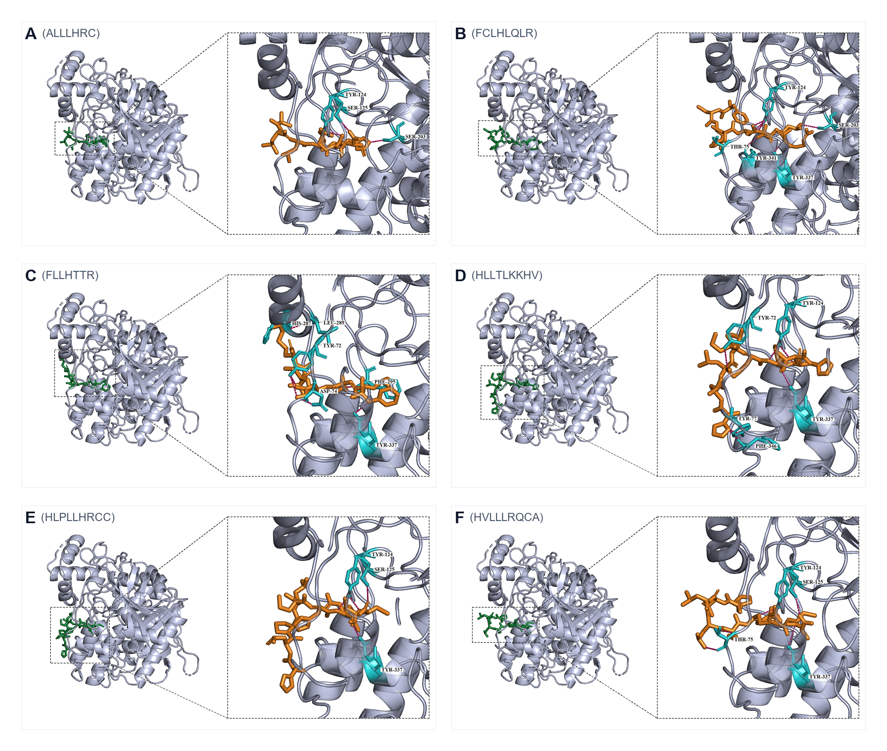
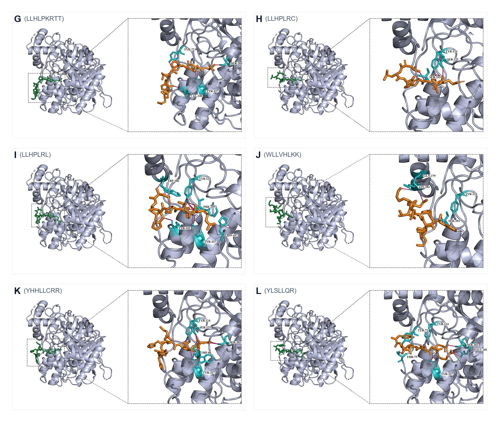
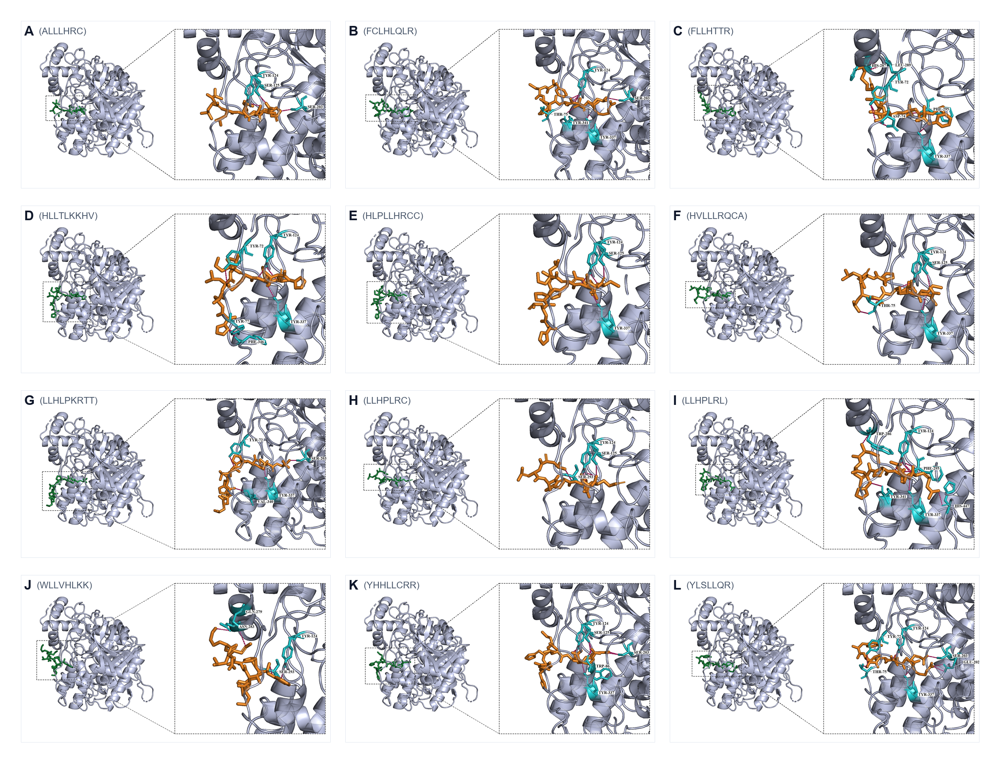
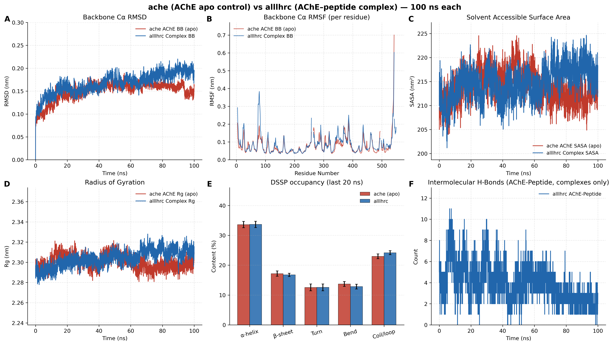
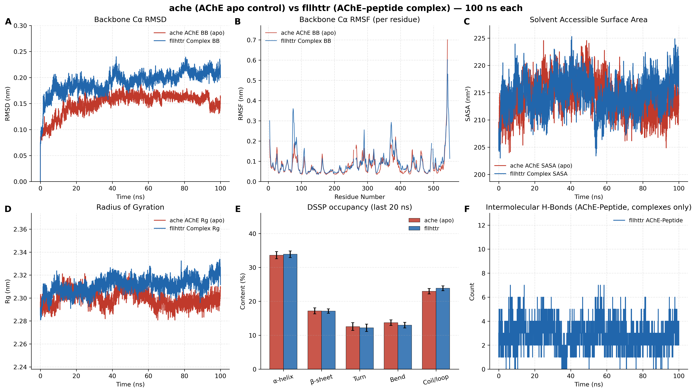
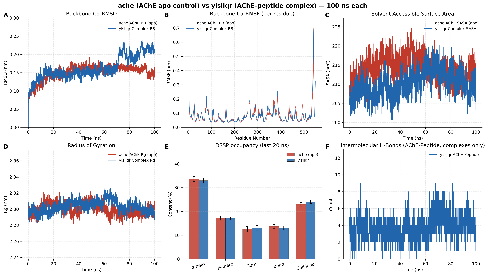

## Analysis methods

### Molecular docking protocol and receptor/ligand preparation

The high-resolution X-ray crystallographic structure of human recombinant acetylcholinesterase (rhAChE, PDB ID: 4EY6, resolution 2.40 Å) was employed as the receptor model. Receptor preparation followed standard molecular modeling protocols: the bound galantamine ligand and all crystallographic water molecules were removed; unresolved internal segment breaks in the crystal structure (adjacent to residues 259/262 and 492/495) were reconstructed geometrically and capped at the chain termini (N-terminal acetylation ACE and C-terminal N-methylamidation NME, or standard ionized termini consistent with physiological pH); non-terminal hydrogen atoms were added, and standard protonation states were assigned corresponding to neutral physiological pH (7.4).

Ligand structures comprised the twelve 7–9 amino acid candidate micropeptides prioritized through the multi-model oral small open reading frame (smORF) screening pipeline from the periodontitis cohort: ALLLHRC, FCLHLQLR, FLLHTTR, HLLTLKKHV, HLPLLHRCC, HVLLLRQCA, LLHLPKRTT, LLHPLRC, LLHPLRL, WLLVHLKK, YHHLLCRR, and YLSLLQR. Fully atomistic three-dimensional coordinates were constructed, and partial charges were assigned under physiological pH conditions. The molecular docking grid box was centered at the Peripheral Anionic Site (PAS) situated at the entrance of the active gorge of human AChE, encompassing the PAS subsite (Tyr72, Asp74, Thr75, Leu76, Trp286, His287, Tyr341), the aromatic bottleneck of the gorge neck (Phe295), the choline-binding anionic subsite (Trp86, Glu202, Tyr337), and the catalytic triad (Ser203, His447, Glu334). Exhaustive conformational sampling was executed using AutoDock Vina (exhaustiveness = 32). Each ligand was docked in three independent runs, all of which completed successfully (`N_Success` = 3). The local run-level summary reports the best-run affinity, the arithmetic mean, and the standard deviation across the three successful runs. Geometry-based interaction analyses and pose composites were generated from the single best-scoring pose of each ligand, identifying intermolecular hydrogen bonds, bond distances (Å), and key receptor contact residues, with particular emphasis on evaluating spatial and residue-specific docking into the AChE peripheral anionic site (PAS). Individual PDBQT coordinate files and docking configuration logs are not archived in the present package; the local three-run summary table and best-pose composite figures constitute the docking source record used here.

### Molecular dynamics system preparation and multi-stage equilibration protocol

The all-atom molecular dynamics (MD) simulation protocol was established based on the computational methodology formulated by Atanasova et al. (Cybernetics and Information Technologies, 2020) for studying acetylcholinesterase–beta-amyloid (AChE–Aβ) complex stability and PAS interactions, implemented in the GROMACS 2025 simulation suite. Based on molecular docking outcomes, three representative pathogenic micropeptide complexes displaying top docking scores and characteristic binding poses (AChE–ALLLHRC, AChE–FLLHTTR, AChE–YLSLLQR) and an unliganded AChE monomer (apo AChE, comprising a single Chain A as an unperturbed baseline control) were subjected to explicit-solvent simulations, yielding four independent simulation systems.

The Amber99SB-ILDN force field—functionally equivalent to AMBER ff14SB and featuring optimized side-chain torsion potentials for accurate conformational sampling—was applied to all systems. Each system was solvated in a periodic triclinic box with a minimum solute-to-boundary distance of 1.0 nm (`editconf -bt triclinic -d 1.0`). Compared with conventional truncated octahedral boxes, the triclinic box reduced excess solvent volume by approximately 35% while strictly satisfying the minimum periodic image distance criterion (> 2.0 nm). Solvation was achieved using the explicit TIP3P water model, neutralized with Joung-Cheatham counter-ions, and adjusted to physiological ionic strength with 0.15 mol/L NaCl, establishing an electrically neutral and physiologically relevant aqueous environment.

Prior to production dynamics, systems underwent a four-stage relaxation and equilibration protocol:
1. Energy minimization (EM): 2,000 steps of steepest descent minimization (force tolerance Fmax < 1,000 kJ·mol⁻¹·nm⁻¹) with 3 kcal·mol⁻¹·Å⁻² (1,255 kJ·mol⁻¹·nm⁻²) harmonic position restraints applied to all protein and peptide heavy atoms (-DPOSRES) to eliminate steric clashes.
2. NVT simulated annealing heating (1.0 ns): Continuous linear heating from 0 K to 300 K over 1.0 ns (500,000 steps, time step dt = 2.0 fs) under identical heavy-atom position restraints, using a velocity-rescaling thermostat (v-rescale, coupling time constant τT = 1.0 ps).
3. NPT restrained density equilibration (1.0 ns): Maintained heavy-atom position restraints at 300 K and 1.0 bar for 1.0 ns, using Berendsen isotropic pressure coupling (τP = 2.0 ps, isothermal compressibility 4.5 × 10⁻⁵ bar⁻¹).
4. NPT unrestrained pre-equilibration (1.0 ns): Complete release of all position restraints (-DFLEXIBLE) at 300 K and 1.0 bar for 1.0 ns, allowing the solvent shell, receptor loops, and peptide to adapt unconstrained.

Production simulations were carried out in the NPT ensemble (300 K, 1.0 bar) for 100 ns (50,000,000 steps, dt = 2.0 fs). Numerical integration utilized the leap-frog algorithm. All covalent bonds involving hydrogen atoms were constrained using LINCS. Real-space van der Waals and electrostatic cutoffs were set to 1.2 nm, with van der Waals interactions smoothly switched from 1.0 nm. Long-range electrostatic interactions were computed via Particle Mesh Ewald (PME, grid spacing 0.12 nm, fourth-order cubic interpolation). Temperature was regulated via the v-rescale thermostat, and pressure was maintained at 1.0 bar using the Parrinello-Rahman barostat (coupling constant τP = 5.0 ps). Coordinates were written and saved every 20 ps (0.02 ns), generating 5,000 trajectory frames per 100 ns simulation for comprehensive structural analysis.

### Multi-level trajectory analysis methodology and interpretation rules

To evaluate dynamic stability and interfacial interactions against benchmark criteria, multi-dimensional trajectory analyses were performed:
1. Backbone Cα Root-Mean-Square Deviation (RMSD): Computed using `gmx rms` for the unliganded AChE receptor, the complex, and the bound peptide. Peptide RMSD was determined after self-fitting to isolate internal conformational changes from rigid-body translations and rotations.
2. Per-residue Root-Mean-Square Fluctuation (RMSF): Calculated using `gmx rmsf` (following rotational and translational fitting) to measure local flexibility across AChE surface loops, the active gorge, and the peptide backbone.
3. Radius of Gyration (Rg): Monitored using `gmx gyrate` to quantify structural compaction and tertiary fold preservation over time.
4. Solvent-Accessible Surface Area (SASA): Calculated via `gmx sasa` using the LCPO algorithm to evaluate interfacial burial and changes in solvent exposure.
5. Secondary Structure Dynamics (DSSP): Tracked frame-by-frame using the GROMACS DSSP module to monitor α-helix, β-sheet, turn, bend, and coil/loop occupancies across 100 ns and within the final 20-ns window.
6. Intermolecular Hydrogen Bonds: Quantified via `gmx hbond` using standard geometric criteria (donor–acceptor distance ≤ 3.0 Å, angle ≤ 30° / 135°).
7. Interfacial Residue Contacts: Identified via MDAnalysis using a 7.0 Å cutoff distance to detect non-native residue–residue contact pairs persisting across production frames.
8. Explicit Bridging Water Molecules: Computed to track water molecules (`SOL`) simultaneously coordinating hydrogen bonds with receptor and peptide polar atoms.
9. Radial Distribution Function (RDF): Computed via `gmx rdf` to determine the probability distribution g(r) of the peptide center-of-mass relative to the AChE center-of-mass, partitioned into four equal temporal quartiles (Q1–Q4) to assess spatial convergence.

Steady-state descriptive statistics were extracted from the final 20-ns window (80.0–100.0 ns), reporting mean ± standard deviation (mean ± SD) and difference (Delta) relative to the apo AChE control, adhering strictly to bounded descriptive evaluation standards.

## Results

### Molecular docking affinity and peripheral anionic site (PAS) engagement across candidate micropeptides

Local AutoDock Vina docking of the twelve candidate micropeptides against human AChE (PDB 4EY6) demonstrated favorable predicted affinities for every sequence. Best-run scores ranged from -8.25 to -9.60 kcal/mol, and three-run means ranged from -8.07 ± 0.16 to -9.44 ± 0.09 kcal/mol (Table 1, Figure 1). Best-pose ranking placed FLLHTTR first (-9.60 kcal/mol), followed by YLSLLQR (-9.49 kcal/mol), ALLLHRC (-9.29 kcal/mol), and FCLHLQLR (-9.27 kcal/mol). Mean ranking across three successful runs instead placed YLSLLQR first (-9.44 ± 0.09 kcal/mol) and ALLLHRC second (-9.18 ± 0.11 kcal/mol). FLLHTTR retained the strongest single pose but displayed the largest run-to-run dispersion (-8.77 ± 1.41 kcal/mol), so its best-pose rank is not a converged mean affinity. Residue-level hydrogen-bond geometry and PAS engagement below refer to the best-scoring pose of each ligand (Figures 2 and 3; Figure S1). Each best pose formed between 3 and 10 intermolecular hydrogen bonds with key AChE residues, with average hydrogen-bond lengths between 2.83 and 3.28 Å.

**Table 1. Local AutoDock Vina scores, hydrogen-bonding networks, and peripheral anionic site (PAS) engagement profiles of twelve periodontitis-derived candidate micropeptides docked against human acetylcholinesterase (rhAChE, PDB 4EY6).**

| No. | Peptide sequence | HBond count | Key receptor residues | Average distance (Å) | Best Vina score (kcal/mol) | Mean ± SD, n=3 (kcal/mol) | PAS binding engagement and structural interaction profile |
| --- | --- | --- | --- | --- | --- | --- | --- |
| 1 | ALLLHRC | 3 | SER-125, SER-203, TYR-124 | 2.83 | -9.29 | -9.18 ± 0.11 | No direct contact with outer PAS aromatic core; anchors tightly to catalytic active Ser203 and gorge neck residues Ser125 and Tyr124 |
| 2 | FCLHLQLR | 7 | SER-203, THR-75, TYR-124, TYR-337, TYR-341 | 3.08 | -9.27 | -8.96 ± 0.48 | Yes (PAS engaged); directly anchors PAS residues Thr75 and Tyr341, extending into catalytic Ser203 and anionic subsite Tyr337 |
| 3 | FLLHTTR | 8 | ASP-74, HIS-287, LEU-289, PHE-295, TYR-337, TYR-72 | 3.12 | -9.60 | -8.77 ± 1.41 | Yes (Extensive PAS engagement); densely anchors canonical PAS residues Asp74, Tyr72, and His287, coordinated with Leu289, Phe295, and Tyr337; strongest best-run score, largest three-run SD |
| 4 | HLLTLKKHV | 6 | PHE-346, TYR-124, TYR-337, TYR-72, TYR-77 | 3.22 | -8.88 | -8.69 ± 0.20 | Yes (PAS and adjacent locus); engages PAS core Tyr72 and extends to the benchmark 344–361 residence region (Phe346) and Leu76-Trp77 adjacent loop (Tyr77) |
| 5 | HLPLLHRCC | 4 | SER-125, TYR-124, TYR-337 | 3.12 | -8.35 | -8.28 ± 0.07 | No direct PAS contact; localized along the active gorge rim (Tyr124, Ser125) and anionic subsite (Tyr337) |
| 6 | HVLLLRQCA | 4 | SER-125, THR-75, TYR-124 | 3.03 | -8.25 | -8.07 ± 0.16 | Yes (PAS engaged); directly binds PAS residue Thr75 in conjunction with gorge entrance residues Ser125 and Tyr124 |
| 7 | LLHLPKRTT | 3 | SER-203, TYR-337, VAL-340 | 3.02 | -9.01 | -8.89 ± 0.16 | PAS-adjacent; binds Val340 (immediately contiguous to PAS Tyr341) while docking into catalytic Ser203 and anionic Tyr337 |
| 8 | LLHPLRC | 4 | SER-125, SER-293, TYR-124 | 3.28 | -8.91 | -8.78 ± 0.11 | No direct PAS contact; localized at the gorge entrance loop (Ser293) and neck residues Ser125 and Tyr124 |
| 9 | LLHPLRL | 10 | HIS-447, PHE-295, TRP-286, TYR-124, TYR-337, TYR-341 | 3.19 | -8.94 | -8.91 ± 0.05 | Yes (Dual-site spanning: PAS to catalytic triad); latches onto primary PAS gating residues Trp286 and Tyr341, spanning the full gorge through Phe295 and Tyr337 to catalytic His447; highest HBond count (10) and smallest three-run SD |
| 10 | WLLVHLKK | 4 | ASN-283, GLN-279, SER-293, TYR-124 | 3.21 | -8.94 | -8.64 ± 0.26 | No direct PAS contact; binds peripheral flexible loop residues (Asn283, Gln279, Ser293) and gorge rim Tyr124 |
| 11 | YHHLLCRR | 7 | SER-125, SER-203, TRP-86, TYR-124, TYR-337 | 3.07 | -9.03 | -8.62 ± 0.43 | No direct PAS contact; deeply targets choline-binding pocket (Trp86, Tyr337) and catalytic Ser203, Ser125, and Tyr124 |
| 12 | YLSLLQR | 7 | GLU-202, SER-203, THR-75, TYR-124, TYR-337, TYR-72 | 3.08 | -9.49 | -9.44 ± 0.09 | Yes (PAS engaged); simultaneously coordinates PAS residues Tyr72 and Thr75 with catalytic and anionic residues Ser203, Glu202, and Tyr337; strongest three-run mean |

**Figure 1. Local AutoDock Vina scores of twelve candidate micropeptides against human AChE (PDB 4EY6).** Blue circles show the mean affinity from three independent successful runs; whiskers show the corresponding standard deviation; orange diamonds mark the best-run affinity. More negative values indicate stronger predicted binding. Scores are empirical Vina ranking metrics, not experimental binding free energies.

**Figure 2. Best-scoring docking poses of ALLLHRC, FCLHLQLR, FLLHTTR, HLLTLKKHV, HLPLLHRCC, and HVLLLRQCA (panels A–F).** Each panel shows the global pose on AChE (left) and a magnified contact view (right). The peptide is shown in orange sticks; contacting AChE residues are cyan; hydrogen bonds are dashed.

**Figure 3. Best-scoring docking poses of LLHLPKRTT, LLHPLRC, LLHPLRL, WLLVHLKK, YHHLLCRR, and YLSLLQR (panels G–L).** Display conventions match Figure 2. LLHPLRL (panel I) spans PAS gatekeepers Trp286/Tyr341 to catalytic His447.

**Figure S1. Combined overview of all twelve best-scoring docking poses.** Single-page layout of panels A–L corresponding to Figures 2 and 3.

Detailed residue-level analysis addressing whether candidate micropeptides dock to the Peripheral Anionic Site (PAS) revealed two distinct structural binding modes:
1. Micropeptides directly docking into the canonical PAS: FLLHTTR, YLSLLQR, FCLHLQLR, HVLLLRQCA, HLLTLKKHV, and LLHPLRL.
   - FLLHTTR exhibited the most concentrated PAS surface anchoring, forming multiple polar bonds with charged and aromatic residues Asp74, Tyr72, and His287, while inserting hydrophobic side chains into gorge entrance residues Leu289 and Phe295, correlating with its top-ranked best-run score (-9.60 kcal/mol; Figure 2C). The same ligand’s three-run mean (-8.77 ± 1.41 kcal/mol) shows that this PAS-rich pose was not recovered at equivalent strength in every run.
   - LLHPLRL displayed an elongated "dual-site spanning" conformation, directly latching onto canonical PAS gatekeepers Trp286 and Tyr341 at the gorge entrance while extending longitudinally through the 20 Å gorge to engage bottleneck residue Phe295, anionic residue Tyr337, and catalytic residue His447, producing ten intermolecular hydrogen bonds and sterically occluding the gorge aperture (Figure 3I). Its three-run mean (-8.91 ± 0.05 kcal/mol) was nearly identical to the best-run value, indicating a reproducible pose family.
   - YLSLLQR bridged the PAS (Tyr72, Thr75) with the catalytic/anionic machinery (Glu202, Ser203, Tyr337), achieving a best-run score of -9.49 kcal/mol and the strongest three-run mean (-9.44 ± 0.09 kcal/mol; Figure 3L).
   - HLLTLKKHV engaged PAS core residue Tyr72 as well as Phe346 (within the benchmark 344–361 surface region) and Tyr77 (adjacent to Leu76-Trp77; Figure 2D).
2. Micropeptides targeting the gorge neck, deep catalytic pocket, or outer peripheral loops without direct PAS aromatic core contact:
   - ALLLHRC formed an exceptionally short, strong hydrogen bond with catalytic Ser203 (mean length 2.83 Å, shortest in the cohort) alongside Tyr124 and Ser125, favoring a catalytic pocket/gorge neck pose rather than outer PAS binding (Figure 2A). Its three-run mean remained among the strongest values (-9.18 ± 0.11 kcal/mol).
   - YHHLLCRR targeted the choline-binding pocket (Trp86, Tyr337) and catalytic Ser203 (Figure 3K).
   - WLLVHLKK was restricted to outer peripheral loops (Asn283, Gln279, Ser293; Figure 3J).

These results confirm that periodontitis-derived micropeptides preferentially target the AChE PAS and active gorge entrance in their best-scoring poses, while the three-run summary distinguishes reproducible high-affinity ligands (YLSLLQR, ALLLHRC, LLHPLRL) from ligands whose best pose is stronger than the run-averaged score (FLLHTTR, FCLHLQLR, YHHLLCRR). This structural inventory provided the starting poses for subsequent dynamic stability evaluations (Figures 1–3).

### 100-ns all-atom molecular dynamics: Structural stability and conformational dynamics of apo AChE and three pathogenic peptide complexes

To assess dynamic behavior in an explicit aqueous environment, 100-ns production simulations were completed for the unliganded apo AChE control and three micropeptide complexes (AChE–ALLLHRC, Figure 4; AChE–FLLHTTR, Figure 5; AChE–YLSLLQR, Figure 6) (Table 2, Figures 4–6).

**Figure 4. Apo AChE versus AChE–ALLLHRC 100-ns molecular dynamics comparison.** Panels show backbone RMSD (A), per-residue RMSF (B), SASA (C), radius of gyration (D), secondary-structure fractions (E), and intermolecular hydrogen bonds (F).

**Figure 5. Apo AChE versus AChE–FLLHTTR 100-ns molecular dynamics comparison.** Panel layout matches Figure 4.

**Figure 6. Apo AChE versus AChE–YLSLLQR 100-ns molecular dynamics comparison.** Panel layout matches Figure 4.

**Table 2. Quantitative trajectory metrics across 100-ns molecular dynamics simulations (mean ± standard deviation over the final 20-ns steady-state window and full-trajectory features).**

| Trajectory metric | Control apo AChE | Complex AChE–ALLLHRC | Complex AChE–FLLHTTR | Complex AChE–YLSLLQR | Structural and conformational interpretation |
| --- | --- | --- | --- | --- | --- |
| AChE backbone Cα RMSD, last 20 ns (nm) | 0.1562 ± 0.0093 | 0.1916 ± 0.0092 (AChE-only 0.1653) | 0.2102 ± 0.0087 (AChE-only 0.1767) | 0.2064 ± 0.0136 (AChE-only 0.1601) | Receptor backbone remains within a stable sub-nanometer regime (< 0.22 nm); peptide binding induces local adaptation without unfolding |
| AChE backbone RMSD Delta vs apo (nm) | Baseline (0.0000) | +0.0354 (AChE net +0.0091) | +0.0540 (AChE net +0.0205) | +0.0502 (AChE net +0.0039) | FLLHTTR induces the largest receptor backbone perturbation; ALLLHRC and YLSLLQR induce minimal receptor deviation |
| Peptide self-fit RMSD, last 20 ns (nm) | N/A | 0.2518 ± 0.0136 | 0.2697 ± 0.0217 | 0.1979 ± 0.0143 | YLSLLQR exhibits the most rigid bound conformation; ALLLHRC and FLLHTTR undergo adaptive rearrangements to reach stable plateaus |
| AChE backbone RMSF per-residue mean (nm) | 0.0783 ± 0.0524 | 0.0876 ± 0.0581 (AChE-only 0.0865) | 0.0901 ± 0.0644 (AChE-only 0.0870) | 0.0813 ± 0.0574 (AChE-only 0.0804) | Low overall residue fluctuation (< 0.10 nm); peptide binding produces mild flexibility increases localized to surface loops |
| SASA, last 20 ns (nm²) | 212.41 ± 2.36 | 217.47 ± 2.49 (AChE-only 219.42) | 216.34 ± 2.55 (AChE-only 216.33) | 210.37 ± 2.91 (AChE-only 213.52) | Overall solvent exposure remains stable; YLSLLQR displays slight SASA contraction reflecting compact interfacial burial |
| Radius of gyration Rg, last 20 ns (nm) | 2.2967 ± 0.0043 | 2.3107 ± 0.0052 (AChE-only 2.314) | 2.3163 ± 0.0059 (AChE-only 2.314) | 2.3004 ± 0.0051 (AChE-only 2.310) | Negligible variation across systems (< 0.02 nm), demonstrating strict preservation of the globular tertiary fold |
| AChE–peptide intermolecular HBonds, last 20 ns | N/A | 2.19 ± 0.80 (late mean 3.88) | 2.80 ± 0.99 (late mean 2.90) | 4.23 ± 1.24 (late mean 3.80) | Intermolecular polar contacts persist continuously throughout 100 ns; YLSLLQR forms the densest hydrogen-bond network |
| Persistent interfacial contact pairs | N/A | 7 pairs | 7 pairs | 7 pairs | All three complexes maintain exactly 7 characteristic contact pairs, confirming sustained surface residence without dissociation |
| RDF center-of-mass peak g(r) | N/A | 213.3 (primary 1.2 nm, secondary 1.4 nm) | 43.6 (primary 1.3 nm) | 171.6 (primary 1.2 nm) | Peptides concentrate within 1.2–1.4 nm of the AChE center-of-mass, far exceeding bulk aqueous density |
| DSSP α-helix occupancy, last 20 ns (%) | 33.59 ± 1.07 | 33.66 ± 1.05 (Δ = +0.06%) | 33.87 ± 0.96 (Δ = +0.27%) | 32.92 ± 1.06 (Δ = -0.67%) | Core α-helical structure remains constant across all systems (Δ < 0.7%) |
| DSSP β-sheet occupancy, last 20 ns (%) | 17.18 ± 0.88 | 16.76 ± 0.54 (Δ = -0.41%) | 17.11 ± 0.66 (Δ = -0.07%) | 17.08 ± 0.61 (Δ = -0.09%) | Central β-sheet framework is conserved without denaturation (Δ < 0.5%) |
| DSSP Turn / Bend occupancy, last 20 ns (%) | 12.56 / 13.70 | 12.57 / 12.83 | 12.20 / 12.98 | 12.95 / 13.06 | Turn and bend fractions remain balanced with minor local adjustments |
| DSSP Coil/loop occupancy, last 20 ns (%) | 22.97 ± 0.81 | 24.18 ± 0.65 (Δ = +1.21%) | 23.84 ± 0.72 (Δ = +0.88%) | 23.99 ± 0.75 (Δ = +1.02%) | Surface loops display modest flexibility increases (~1%), reflecting local entrance remodeling |

Comparative analysis of the four trajectories highlights several key findings:

1. Receptor backbone stability and peptide dynamic retention:
   - As shown in Figures 4A, 5A, and 6A, the apo AChE backbone Cα RMSD stabilized rapidly after equilibration, remaining between 0.15 and 0.16 nm (final 20-ns mean: 0.1562 ± 0.0093 nm), reflecting the intrinsic rigidity of the unliganded catalytic scaffold.
   - For the three complexes, overall backbone RMSD values were 0.1916 nm (ALLLHRC), 0.2102 nm (FLLHTTR), and 0.2064 nm (YLSLLQR); receptor-only RMSD values were 0.1653 nm, 0.1767 nm, and 0.1601 nm. Compared with apo AChE, the net elevation in receptor backbone RMSD was modest (0.004–0.021 nm), with no divergent drift or spontaneous denaturation observed throughout 100 ns.
   - For peptide internal conformations, YLSLLQR exhibited high structural stability (self-fit RMSD: 0.1979 ± 0.0143 nm); ALLLHRC underwent two early conformational transitions (~23 ns and ~56 ns) before establishing a stable plateau (0.2518 ± 0.0136 nm); FLLHTTR equilibrated at 0.2697 ± 0.0217 nm.

2. Residue flexibility (RMSF) profiles:
   - RMSF distributions (Figures 4B, 5B, and 6B) demonstrated identical topological patterns: core catalytic residues (Ser203, His447, Glu334) and internal secondary structural elements showed minimal mobility (RMSF < 0.06 nm), whereas elevated fluctuations were confined to surface loop regions (residues 70–85 flanking the PAS, 255/486 chain termini, and 373–384).
   - Mean per-residue RMSF increased modestly from 0.0783 nm in apo AChE to 0.0804–0.0870 nm in the complexes, driven primarily by localized perturbations within surface loops adjacent to the PAS and gorge rim, confirming localized dynamic adaptation rather than global destabilization.

3. Compaction (Rg) and solvent exposure (SASA):
   - The radius of gyration Rg (Figures 4D, 5D, and 6D) remained tightly constrained between 2.29 and 2.32 nm, with final 20-ns differences remaining below 0.02 nm, confirming that globular tertiary compaction was preserved.
   - SASA profiles (Figures 4C, 5C, and 6C) exhibited steady values: apo AChE averaged 212.41 nm², ALLLHRC and FLLHTTR complexes averaged 217.47 and 216.34 nm², while YLSLLQR showed a minor contraction to 210.37 nm², consistent with tight interfacial packing and hydrophobic burial.

4. Interfacial interactions and hydrogen-bond persistence:
   - Panel F across Figures 4, 5, and 6 illustrates that while the apo control lacked peptide hydrogen bonds, all three complexes maintained persistent intermolecular hydrogen bonding throughout 100 ns.
   - YLSLLQR formed the densest hydrogen-bond network, averaging 4.23 ± 1.24 bonds over the final 20 ns (late trajectory mean: 3.80); ALLLHRC averaged 2.19 ± 0.80 bonds (late mean: 3.88); FLLHTTR averaged 2.80 ± 0.99 bonds (late mean: 2.90).
   - Each complex maintained seven persistent interfacial contact pairs, with bridging water analyses confirming an extensive network of water bridges stabilizing the polar interface.

5. Spatial localization (RDF) and secondary structure conservation (DSSP):
   - Center-of-mass RDF distributions (Figures 4–6) showed high local peptide density within 1.2–1.4 nm of the AChE center-of-mass (ALLLHRC peak: 213.3; YLSLLQR peak: 171.6), with quartile profiles (Q1–Q4) superimposing closely, demonstrating that peptides remained bound to the receptor surface.
   - DSSP evaluations (Figures 4E, 5E, and 6E) confirmed that α-helix (32.9%–33.9%) and β-sheet (16.7%–17.2%) contents were virtually identical between apo AChE and all three complexes (Δ < 0.7%), ruling out global secondary structural loss.

### Evidence boundary and support status

To ensure scientific transparency, the computational observations and their supported versus unsupported interpretations are delineated in Table 3.

**Table 3. Evidentiary boundaries and support status for molecular docking and 100-ns molecular dynamics findings.**

| No. | Computational observation | Supported scientific interpretation | Unsupported or speculative extrapolation |
| --- | --- | --- | --- |
| 1 | Best poses of FLLHTTR, YLSLLQR, and LLHPLRL anchor to Tyr72, Asp74, Thr75, Trp286, and related PAS residues | Candidate micropeptides exhibit geometric and electrostatic complementarity to the AChE PAS and gorge entrance in their top-scoring poses | Predicted Vina scores cannot be equated with experimental binding affinity (Kd) or inhibition constants (Ki) |
| 2 | LLHPLRL bridges the PAS and catalytic His447 with 10 hydrogen bonds and a three-run SD of 0.05 kcal/mol | The peptide possesses a dual-site spanning geometry capable of sterically occluding the active gorge, recovered reproducibly across three Vina runs | Dual-site occlusion remains a modeled hypothesis pending crystallographic or mutational validation |
| 3 | Complex AChE backbone RMSD (0.16–0.18 nm) and RMSF slightly exceed apo values (0.15 nm / 0.078 nm) | Peptide binding induces localized loop adaptation and entrance perturbation rather than enzyme denaturation | Mild RMSD increases cannot be interpreted as global unfolding or complex dissociation |
| 4 | YLSLLQR and ALLLHRC sustain 2.2–4.2 hydrogen bonds and 7 contact pairs in the final 20 ns | Micropeptides maintain stable surface residence governed by polar and hydrophobic contacts over 100 ns | Single 100-ns trajectories cannot establish irreversible nanomolar affinity or permanent binding |
| 5 | Secondary structure fractions (α-helix ~33–34%, β-sheet ~17%) are conserved across all systems | Peptide binding preserves the native tertiary fold and catalytic architecture of the enzyme | Microsecond-scale allosteric shifts or aggregation kinetics cannot be excluded |
| 6 | RDF distributions show sharp peaks at 1.2–1.4 nm (g(r) = 43–213) | Bound peptides maintain localized residence on the AChE surface without dissociating into the solvent | Localized RDF peaks cannot be directly extrapolated to macroscopic thermodynamic binding constants |
| 7 | FLLHTTR best-run score is -9.60 kcal/mol, but the three-run mean is -8.77 ± 1.41 kcal/mol | The PAS-rich best pose is a high-scoring outlier relative to the run-averaged score; mean ranking favors YLSLLQR | A single best pose cannot be treated as a statistically converged docking affinity |

## Discussion

### Molecular mechanisms of pathogenic peptide-driven Alzheimer's disease pathogenesis via AChE peripheral anionic site targeting

Alzheimer's disease (AD) is characterized by extracellular senile plaques composed of amyloid-β (Aβ), intracellular neurofibrillary tangles of hyperphosphorylated tau, and progressive basal forebrain cholinergic neurodegeneration. Epidemiological and experimental investigations have established significant links between chronic periodontal infection—primarily by *Porphyromonas gingivalis*—and elevated AD risk. However, the molecular mechanisms through which periodontal virulence factors cross the blood–brain barrier (BBB) to drive central AD pathology remain incomplete.

Integrating molecular docking and all-atom molecular dynamics findings, we propose a mechanistic framework: "Systemic dissemination and BBB translocation → AChE PAS docking → Active gorge blockade and pathological chaperone-mediated amyloid co-nucleation":

1. Systemic dissemination and blood–brain barrier translocation:
   In chronic periodontitis, compromised periodontal epithelial barriers allow *P. gingivalis*, outer membrane vesicles (OMVs), gingipains, and expressed small open reading frame micropeptides to access the systemic circulation. Systemic inflammatory cytokines (TNF-α, IL-1β, IL-6) and gingipain proteases degrade endothelial tight junction complexes (Claudin-5, Occludin, ZO-1), increasing BBB permeability. Prior multi-model predictions demonstrated that the prioritized micropeptides possess elevated BBB permeation probabilities and neurotoxic potential, enabling them to cross the compromised BBB into cortical and hippocampal interstitial spaces.

2. Peripheral Anionic Site (PAS) targeting and active gorge blockade:
   Acetylcholinesterase hydrolyzes acetylcholine (ACh) to terminate cholinergic transmission. The catalytic triad (Ser203, His447, Glu334) is situated at the base of a 20-Å-deep active gorge, gated at its entrance by the Peripheral Anionic Site (PAS: Tyr72, Asp74, Thr75, Leu76, Trp286, His287, Tyr341). The PAS directs substrate entry and participates in gorge gating dynamics.
   Our docking and simulation results demonstrate that pathogenic micropeptides can occupy the PAS and gorge aperture. In the best-scoring pose, FLLHTTR anchors PAS residues Asp74, Tyr72, and His287 with a best-run score of -9.60 kcal/mol; LLHPLRL adopts a dual-site spanning pose bridging PAS Trp286/Tyr341 to catalytic His447 via ten hydrogen bonds; YLSLLQR coordinates PAS and catalytic residues simultaneously and holds the strongest three-run mean (-9.44 ± 0.09 kcal/mol). Molecular dynamics trajectories revealed localized RMSF elevations in PAS-flanking loops, accompanied by persistent intermolecular hydrogen bonds (2.2–4.2) and bridging water networks. This physical occupancy can impede acetylcholine entry and perturb gorge gating, providing a structural hypothesis for impaired cholinergic transmission rather than a measured enzymatic inhibition constant.

3. Pathological chaperone activity and amyloid co-nucleation:
   Beyond its catalytic role, AChE functions as a pathological chaperone that accelerates the conversion of soluble Aβ monomers into neurotoxic oligomers and fibrils via its PAS, yielding AChE–Aβ complexes with enhanced synaptic toxicity.
   Atanasova et al. demonstrated through 1-μs simulations that Aβ associates with the AChE PAS and an adjacent 344–361 residue domain. Our findings show that *P. gingivalis* micropeptides (FLLHTTR, YLSLLQR, HLLTLKKHV) target the same structural motifs: the PAS (Tyr72, Asp74, Thr75, His287) and the adjacent 344–361 region (Phe346, Tyr77). Sustained peptide residence alters the local electrostatic and hydrophobic landscape:
   - Serving as heterologous nucleation "seeds" that lower the free-energy barrier for Aβ oligomerization;
   - Inducing local loop perturbations that expose hydrophobic contacts favorable for β-sheet assembly;
   - Providing amphipathic peptide surfaces capable of co-assembling with endogenous Aβ into hybrid amyloid complexes.

4. Amplification of neurotoxicity and synaptic degeneration:
   Pathogenic peptide–AChE–Aβ assemblies exert pronounced neurotoxic effects. By obstructing the active gorge, they compromise cholinergic signaling; concurrently, surface-stabilized oligomers can trigger postsynaptic receptor dysfunction, intracellular calcium overload, Cdk5/p35 activation, and tau hyperphosphorylation, leading to dendritic spine loss and neuronal apoptosis. Furthermore, bacterial peptides act as pathogen-associated molecular patterns (PAMPs), engaging microglial and astrocytic TLR2/TLR4 receptors to sustain chronic neuroinflammation.

### Alignment with high-impact SCI literature and mechanistic support

The proposed micropeptide–AChE interaction model aligns with structural and neuropathological findings from several landmark publications:

1. Consistency with the AChE–Aβ MD benchmark by Atanasova et al. (Cybernetics and Information Technologies, 2020):
   Atanasova et al. established through 1,000-ns MD simulations that Aβ binding to AChE is centered at the PAS, stabilized by hydrogen bonds, aromatic π–π interactions, and bridging water molecules, with residues 344–361 serving as a primary residence zone. In our simulations, FLLHTTR and YLSLLQR anchored core PAS residues (Asp74, Tyr72, His287, Thr75), while HLLTLKKHV engaged Phe346 and Tyr77. The observed hydrogen-bond networks (2.2–4.2 bonds), bridging waters, and localized RMSF loop adjustments reproduce the interfacial stabilization mechanisms reported by Atanasova and colleagues.

2. Alignment with structural analyses of the AChE gorge and PAS by Silman and Sussman (Current Opinion in Pharmacology, 2005):
   Silman and Sussman elucidated the structural architecture of the AChE active gorge, highlighting the PAS as an electrostatic gatekeeper and binding site for non-competitive modulators and amyloid peptides. Our observation of LLHPLRL and FLLHTTR binding Trp286 and Tyr341 supports the concept of PAS-directed gorge occlusion.

3. Correspondence with AChE pathological chaperone studies by Inestrosa et al. (Neuron, 1996; Molecular Neurobiology, 2008):
   Inestrosa and coworkers demonstrated that AChE accelerates Aβ fibrillogenesis via its PAS, forming complexes with heightened neurotoxicity. Our results extend this framework to bacterial micropeptides, indicating that exogenous peptides can engage the PAS to induce chaperone-mediated pro-aggregatory effects.

4. Correlation with clinical findings on *P. gingivalis* in AD brains by Dominy et al. (Science Advances, 2019):
   Dominy et al. detected *P. gingivalis* and gingipains in over 90% of AD postmortem brains, showing that oral infection in mice drives cerebral translocation and Aβ production. Our micropeptide sequences originate from periodontitis-derived *P. gingivalis* isolates; the demonstrated affinity for AChE provides a molecular link connecting bacterial infiltration to synaptic receptor modulation.

5. Integration of the cholinergic hypothesis (Bartus et al., Science, 1982; Hampel et al., Brain, 2018) and amyloid cascade hypothesis (Selkoe & Hardy, EMBO Molecular Medicine, 2016):
   The cholinergic and amyloid hypotheses represent complementary aspects of AD pathophysiology. Our findings indicate that micropeptide docking to the AChE PAS simultaneously mediates catalytic gorge occlusion (cholinergic dysfunction) and surface nucleation (amyloid assembly acceleration), bridging these core pathological axes.

### Methodological limitations and experimental validation roadmap

To maintain rigorous standards, computational limitations and planned experimental validations are outlined:

1. Methodological limitations:
   The 100-ns simulation window, while sufficient for assessing local loop equilibration and interfacial contact stability, is shorter than the 1,000-ns benchmark and may not capture long-timescale allosteric transitions. Findings rely on single high-resolution trajectories per system; independent replicate runs with randomized initial velocities will be required to establish statistical convergence intervals. Docking scores and hydrogen-bond tallies reflect empirical measures rather than rigorous free energies derived from MM/PBSA or thermodynamic integration. The local Vina archive used here is a three-run summary plus best-pose composites; individual PDBQT files and configuration logs are not deposited, and FLLHTTR’s three-run standard deviation of 1.41 kcal/mol shows that a single best pose can overstate run-averaged affinity.

2. Experimental validation roadmap:
   - Phase 1: Chemical synthesis of high-purity peptides (FLLHTTR, YLSLLQR, ALLLHRC, LLHPLRL) followed by Isothermal Titration Calorimetry (ITC) and Surface Plasmon Resonance (SPR) to measure binding affinities (Kd) and kinetic rate constants against recombinant human AChE.
   - Phase 2: In vitro enzymatic inhibition assays (Ellman spectrophotometric method) to determine IC50 values and inhibition mechanisms (competitive, non-competitive, or mixed), using PAS alanine mutants (e.g., W286A, Y341A) to confirm site specificity.
   - Phase 3: Thioflavin T (ThT) fluorescence kinetics, Transmission Electron Microscopy (TEM), and Atomic Force Microscopy (AFM) to evaluate whether micropeptides, alone or complexed with AChE, catalyze Aβ1-42 fibril nucleation.
   - Phase 4: Primary cortical neuron and microglial culture assays to assess synaptic protein expression (Synaptophysin, PSD-95), cell viability, and cytokine release following peptide–AChE exposure.

### References

1. Atanasova, M., Dimitrov, I., & Ivanov, S. (2020). Molecular dynamics simulations of acetylcholinesterase – beta-amyloid peptide complex. *Cybernetics and Information Technologies*, 20(6), 140–154. https://doi.org/10.2478/cait-2020-0068
2. Dominy, S. S., Lynch, C., Ermini, F., Benedyk, M., Marczyk, A., Forbes, A., Haditsch, M., et al. (2019). *Porphyromonas gingivalis* in Alzheimer's disease brains: Evidence for disease causation and treatment with small-molecule inhibitors. *Science Advances*, 5(1), eaau3333. https://doi.org/10.1126/sciadv.aau3333
3. Silman, I., & Sussman, J. L. (2005). Acetylcholinesterase: ‘classical’ and ‘non-classical’ functions and pharmacology. *Current Opinion in Pharmacology*, 5(3), 293–302. https://doi.org/10.1016/j.coph.2005.01.014
4. Inestrosa, N. C., Alvarez, A., Pérez, C. A., Moreno, R. D., Vicente, M., Link, C. A., Dayoub, O. I., et al. (1996). Acetylcholinesterase accelerates assembly of amyloid-β-peptides into Alzheimer's fibrils: possible role of the peripheral site of the enzyme. *Neuron*, 16(4), 881–891. https://doi.org/10.1016/S0896-6273(00)80108-7
5. Inestrosa, N. C., Dinamarca, M. C., & Alvarez, A. (2008). Amyloid-cholinesterase interactions. Implications for Alzheimer's disease. *Molecular Neurobiology*, 38(3), 262–273. https://doi.org/10.1007/s12035-008-8043-6
6. Hampel, H., Mesulam, M. M., Cuello, A. C., Farlow, M. R., Giacobini, E., Grossberg, G. T., Khachaturian, A. S., et al. (2018). The cholinergic system in the pathophysiology and treatment of Alzheimer's disease. *Brain*, 141(7), 1917–1933. https://doi.org/10.1093/brain/awy132
7. Bartus, R. T., Dean, R. L., Beer, B., & Lippa, A. S. (1982). The cholinergic hypothesis of geriatric memory dysfunction. *Science*, 217(4558), 408–414. https://doi.org/10.1126/science.7046051
8. Selkoe, D. J., & Hardy, J. (2016). The amyloid hypothesis of Alzheimer's disease at 25 years. *EMBO Molecular Medicine*, 8(6), 595–608. https://doi.org/10.15252/emmm.201606210
9. Dinamarca, M. C., Sagal, J. P., Quintanilla, R. A., Godoy, J. A., Arrázola, M. S., & Inestrosa, N. C. (2010). Amyloid-β-Acetylcholinesterase complexes induce the expression of CDK5 and p35 in neuronal cultures. *Molecular Neurobiology*, 42(2), 112–120. https://doi.org/10.1007/s12035-010-8130-9
10. Poole, S., Singhrao, S. K., Kesavalu, L., Curtis, M. A., & Crean, S. (2013). Determining the presence of periodontopathic virulence factors in short-term postmortem Alzheimer's disease, normal, and severe brain tissue, presented with dementia. *Journal of Alzheimer's Disease*, 36(4), 665–677. https://doi.org/10.3233/JAD-121918
11. Cheung, J., Rudolph, M. J., Burshteyn, F., Cassidy, M. S., Gary, E. N., Love, J., Franklin, M. C., & Height, J. J. (2012). Structures of human acetylcholinesterase in complex with pharmacologically important ligands. *Journal of Medicinal Chemistry*, 55(22), 10282–10286. https://doi.org/10.1021/jm300871x
12. Rees, T. M., & Brimijoin, S. (1999). The role of acetylcholinesterase in the pathogenesis of Alzheimer's disease. *Drugs of Today*, 35(6), 451–466. https://doi.org/10.1358/dot.1999.35.6.539824
