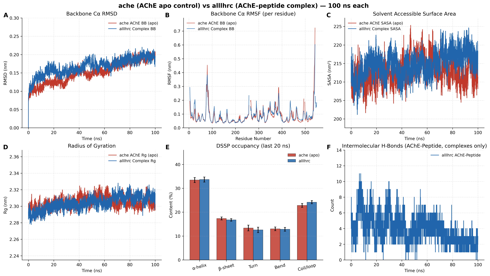
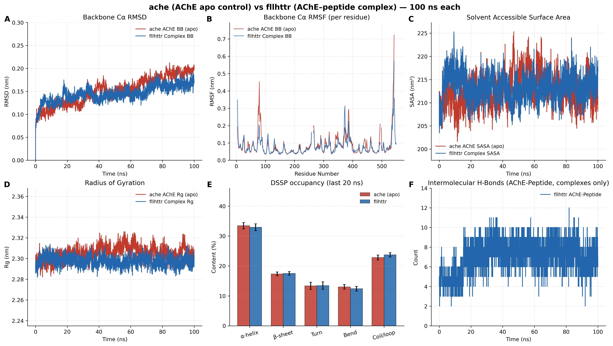
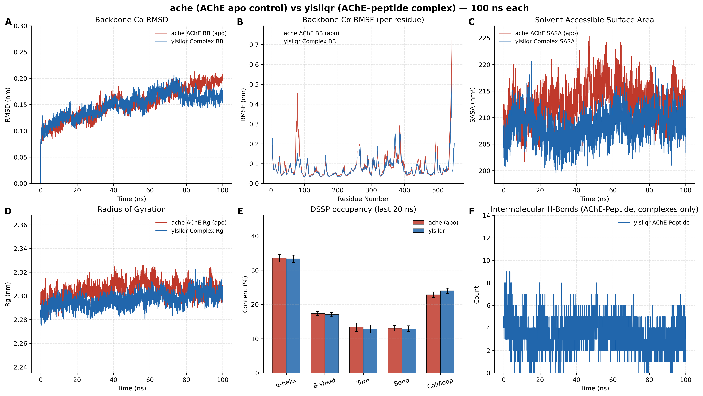

# 牙周炎来源微肽占据乙酰胆碱酯酶外周阴离子位点：计算筛选、分子对接与100 ns分子动力学

## 摘要

牙周炎相关口腔菌群失调已与阿尔茨海默病（AD）相关联，但从口腔微生物组到特定突触酶的肽水平通路仍不完整。本研究为纯计算工作，将口腔小开放阅读框（smORF）筛选级联，与12条7–9 aa候选微肽对人源乙酰胆碱酯酶（AChE，PDB 4EY6）的本地 AutoDock Vina 对接，以及 apo AChE 与三种复合物（ALLLHRC、FLLHTTR、YLSLLQR）的 100 ns 全原子分子动力学（MD）衔接。UniDL4BioPep 先对 11,721,988 条牙周炎标记 smORF 运行 22 项任务（BBB（BBP）≥0.80：1,125,832 条，9.60%）。再与宏蛋白质组支持的去冗余序列取交集，得到 3,518 条 BBB 高分候选；其中 923 条为 NTxPred2 阳性，后续过滤得到 12 条序列集。本地三次 Vina 最优打分介于 -8.25 至 -9.60 kcal/mol，三次均值介于 -8.07 ± 0.16 至 -9.44 ± 0.09 kcal/mol。FLLHTTR 最优构象最强但运行间 SD 最大；YLSLLQR 三次均值最强，并与 FLLHTTR、LLHPLRL 接触外周阴离子位点（PAS）。100 ns 内三种复合物保持球状折叠（骨架 RMSD 0.16–0.19 nm；α-螺旋约 33%，β-折叠约 17%）。FLLHTTR 与 YLSLLQR 复合物比 apo 更稳（0.1640 和 0.1625 nm，相对 apo 0.1897 nm）。FLLHTTR 氢键网络最密（7.03 ± 1.28）；仅 YLSLLQR 出现 SASA 收缩（209.71 相对 212.25 nm²）。综合对接与轨迹，结果支持一种可能的致病机制：牙周炎来源微肽占据 AChE 的 PAS，阻碍乙酰胆碱进入，并作为异源种子，在同一促纤表面上与内源 Aβ 共成核。

**关键词：** 阿尔茨海默病；牙龈卟啉单胞菌；牙周炎；口腔微肽；smORF；乙酰胆碱酯酶；外周阴离子位点；分子对接；分子动力学

## 引言

阿尔茨海默病是进行性神经退行性疾病，淀粉样蛋白β（Aβ）、tau、突触衰竭、免疫激活与血管损伤相互作用，而不是单一线性级联[@scheltens2021alzheimer]。淀粉样生物学仍居核心：APP 经 β/γ 分泌酶切出 Aβ40/Aβ42，可溶寡聚体损伤突触，家族性 APP/PSEN 突变改变 Aβ 产量与长度[@selkoe2016amyloid]。基底前脑胆碱能传递丧失参与认知症状，AChE 抑制剂仍是既定对症治疗[@hampel2018cholinergic]。独立于催化功能，AChE 经外周阴离子位点（PAS）加速 Aβ 成纤，AChE–Aβ 复合物比游离 Aβ 更具神经毒性[@inestrosa1996ache]。PAS 疏水基序促进该伴侣活性[@deferrari2001motif]。这些事实把 AChE 的 PAS 定位为可以把胆碱能衰竭与淀粉样沉积耦合起来的结构节点。

慢性牙周炎可维持系统性炎症负担和微生物产物的间歇暴露，由此推动口腔—脑轴研究[@chalmers2025primer]。疾病相关口腔活动具有物种和位点特异性，分类学丰度不能替代分子中介[@belstrom2021periodontitis]。牙龈卟啉单胞菌（*Porphyromonas gingivalis*）的牙龈蛋白酶与外膜囊泡提供了较充分的毒力背景[@guo2010gingipain; @ho2015omv]。观察性综合报告牙周病与认知障碍相关，效应估计随病例定义和校正而变化[@larvin2023periodontalcognition]；AD 队列中牙周炎与后续认知下降相关[@ide2016periodontitis]。AD 脑内曾检出 *P. gingivalis* 与牙龈蛋白酶[@dominy2019pgingivalis]，小鼠反复口腔暴露可驱动神经炎症和 Aβ 相关改变[@ilievski2018oral]。上述观察为口腔—脑暴露提供了背景：若存在能够结合 AChE 的肽配体，其机制后果将是直接的[@hu2024mendelian]。

微生物组编码的小蛋白构成规模庞大、映射仍不充分的候选空间[@sberro2019smallgenes; @durrant2021sorf]。牙周炎来源的 7–9 aa 微肽能否占据与 Aβ 相同的 AChE PAS，是筛选分数本身无法回答的结构问题。对人 AChE 与多条 Aβ 的加速 MD 显示 Aβ 被酶表面吸引，支持 AChE 作为成核中心[@lushchekina2017amd]。以 PAS 为中心的 1 μs AChE–Aβ 轨迹保持结合，主驻留区为毗邻 PAS 的 344–361[@atanasova2020md]。PAS 导向配体可在生化体系中抑制 AChE 诱导的 Aβ 聚集[@bartolini2003pas]，PDB 4EY6 提供 2.40 Å 人源 AChE 结构用于对接[@cheung2012ache]。

因此，本研究要回答：牙周炎来源的 7–9 aa 微肽能否占据实验上加速 Aβ 成纤的同一 PAS。先由口腔 smORF 级联优先保留 12 条序列，再对接到人源 AChE，并对三条代表性复合物相对 apo 完成 100 ns 模拟，以勾勒致病肽通向 AD 的可能分子路径。

## 材料与方法

### 研究设计

本研究为纯计算分析。筛选使用汇总 smORF 计数、模型汇总和一张 12 条序列表；未开展参与者招募、标本采集、预测器再训练或新组学处理。健康与牙周炎标签仅作为文库标签保留，不视为已经核实的肽层面疾病归属。对接与 MD 使用本地三次 AutoDock Vina 构象，以及对 apo AChE 与三条入选复合物的 100 ns GROMACS 轨迹。

### 口腔 smORF 筛选级联

编码 4–50 aa 肽的翻译 smORF 构成起始库（健康标记 11,269,961 条，牙周炎标记 11,721,988 条；PRJNA678453）[@belstrom2021periodontitis]。按抗菌肽发现的常用顺序，先对全部牙周炎标记库运行 UniDL4BioPep[@du2023unidl4biopep]：ESM-2（`esm2_t6_8M_UR50D`）嵌入与 22 个任务特异性卷积网络，阈值均为 ≥0.80。统一任务名为 ACE 抑制、DPP-IV 抑制、苦味、鲜味、抗菌、抗疟（备选）、抗疟（主）、群体感应、抗癌（主）、抗癌（备选）、抗 MRSA、TTCA、血脑屏障（BBP）、抗寄生虫（APP）、NeuroPred、抗细菌、抗真菌、抗病毒、毒性、抗氧化 FRS、致敏性和细胞穿透肽（CPP）。BBB（BBP）≥0.80 定义为操作性 BBB 高分集合。

UniDL4BioPep 打分之后，序列与口腔基因组和宏蛋白质组资源精确匹配并去冗余，包括 HOMD 和唾液宏蛋白质组目录[@chen2010homd; @belstrom2016metaproteomics]。牙周炎标记库得到 33,786 条证据支持的独特肽；其与 1,125,832 条 BBB（BBP）预测取交集，得到 3,518 条候选（短肽 3,446 条，5–30 aa；长肽 72 条，31–50 aa）。该交集中 7–50 aa 的肽用 NTxPred2（ESM2-t30）评价[@rathore2025ntxpred2]。Mebipred 以两级神经网络评估 Cu、Fe、Zn 相关结合潜力，阈值 0.50[@aptekmann2022mebipred]。AnOxPePred 提供多任务自由基清除（FRS）和螯合（CHEL）输出[@olsen2020anoxpepred]；串联终点为 CHEL≥0.25、CHEL≥0.25 且 FRS<0.50、以及 CHEL≥0.25 且 FRS<0.45。

另一张表列出 12 条互不重复的 7–9 aa 序列。长度以及组氨酸、半胱氨酸和碱性残基计数均由各字符串重新计算。

### 分子对接

人源重组 AChE（rhAChE，PDB 4EY6，2.40 Å）[@cheung2012ache] 经去除加兰他敏与结晶水、修复内部链断裂并按生理 pH 7.4 分配质子化状态后用作受体。12 条微肽 ALLLHRC、FCLHLQLR、FLLHTTR、HLLTLKKHV、HLPLLHRCC、HVLLLRQCA、LLHLPKRTT、LLHPLRC、LLHPLRL、WLLVHLKK、YHHLLCRR 和 YLSLLQR 采用 AutoDock Vina（exhaustiveness = 32）[@trott2010vina; @eberhardt2021vina] 对接到以 PAS（Tyr72、Asp74、Thr75、Leu76、Trp286、His287、Tyr341）为中心、并覆盖峡部颈部（Phe295）、胆碱结合亚位点（Trp86、Glu202、Tyr337）及催化三联体（Ser203、His447、Glu334）的网格。每条配体独立运行三次（`N_Success` = 3）。最优单次打分、三次运行均值±SD、氢键几何与 PAS 接触取自本地三次运行汇总表及各配体打分最高的单一构象。逐条 PDBQT 文件与配置日志未归档。Vina 打分为经验排序指标，不能等同于实验结合自由能。

### 分子动力学

四个显式溶剂体系在 GROMACS[@abraham2015gromacs] 中以 Amber99SB-ILDN[@lindorfflarsen2010amber] 力场和 TIP3P 水、0.15 M NaCl 进行模拟：apo AChE（单一 A 链）以及 AChE–ALLLHRC、AChE–FLLHTTR、AChE–YLSLLQR 复合物。各体系置于溶质至边界缓冲 1.0 nm 的三斜盒子。平衡包括 2,000 步最速下降能量最小化、1.0 ns 受限 NVT 升温至 300 K、1.0 ns 受限 NPT 密度平衡和 1.0 ns 无约束 NPT 预平衡。产物模拟在 NPT 系综（300 K，1.0 bar）运行 100 ns（dt = 2.0 fs），采用 LINCS、1.2 nm 截断和粒子网格Ewald 静电。轨迹每 20 ps 输出一帧。

与图4–6对应的轨迹指标包括骨架 Cα RMSD、逐残基 RMSF、溶剂可及表面积（SASA）、回转半径（Rg）、DSSP 占有率和分子间氢键（`gmx hbond`；供体–受体距离 ≤ 3.0 Å）。另记录微肽自拟合 RMSD 与持续性界面接触（7.0 Å 截断）。稳态值为最后 20 ns（80.0–100.0 ns）的均值±SD。方案沿用 Atanasova 等 AChE–Aβ MD 的逻辑，窗口为 100 ns 而非 1 μs[@atanasova2020md]。

## 结果

### 筛选漏斗与12条序列组成

UniDL4BioPep 对全部 11,721,988 条牙周炎标记 smORF 按 ≥0.80 运行 22 项任务（表1）。输出最多的是抗菌（10,302,093；87.89%），其次为抗寄生虫（APP）（5,462,493；46.60%）和群体感应（4,491,507；38.32%）。BBB（BBP）为 1,125,832 条（9.60%）。DPP-IV 抑制最少（139,056；1.19%）。各任务标签可重叠，同一条肽可计入多行。

**表1. 牙周炎标记全库（11,721,988 条 smORF）的 UniDL4BioPep 输出（阈值 ≥0.80）。**

| 序号 | UniDL4BioPep 任务 | n（≥0.80） | 占 11,721,988 的% |
| --- | --- | ---: | ---: |
| 1 | ACE 抑制 | 1,236,442 | 10.55 |
| 2 | DPP-IV 抑制 | 139,056 | 1.19 |
| 3 | 苦味 | 1,831,185 | 15.62 |
| 4 | 鲜味 | 3,100,811 | 26.45 |
| 5 | 抗菌 | 10,302,093 | 87.89 |
| 6 | 抗疟（备选） | 695,608 | 5.93 |
| 7 | 抗疟（主） | 2,010,724 | 17.15 |
| 8 | 群体感应 | 4,491,507 | 38.32 |
| 9 | 抗癌（主） | 2,357,718 | 20.11 |
| 10 | 抗癌（备选） | 2,015,652 | 17.20 |
| 11 | 抗 MRSA | 843,977 | 7.20 |
| 12 | TTCA | 2,666,759 | 22.75 |
| 13 | 血脑屏障（BBP） | 1,125,832 | 9.60 |
| 14 | 抗寄生虫（APP） | 5,462,493 | 46.60 |
| 15 | NeuroPred | 1,714,373 | 14.63 |
| 16 | 抗细菌 | 2,597,877 | 22.16 |
| 17 | 抗真菌 | 2,960,118 | 25.25 |
| 18 | 抗病毒 | 3,275,203 | 27.94 |
| 19 | 毒性 | 1,714,299 | 14.62 |
| 20 | 抗氧化 FRS | 2,521,106 | 21.51 |
| 21 | 致敏性 | 1,713,798 | 14.62 |
| 22 | 细胞穿透肽（CPP） | 925,627 | 7.90 |

牙周炎标记库经宏蛋白质组精确匹配并去冗余后保留 33,786 条证据支持的独特肽（健康标记为 31,510/11,269,961）。1,125,832 条 BBB（BBP）预测与该集合取交集，得到 3,518 条（短肽 3,446，长肽 72）。NTxPred2 评价 3,299/3,518（93.77%），其中 923/3,299（27.98%）为模型阳性。后续过滤保留 mebipred 阳性 111 条、CHEL≥0.25 者 15 条、CHEL≥0.25 且 FRS<0.50 者 12 条、CHEL≥0.25 且 FRS<0.45 者 8 条（表2）。

**表2. UniDL4BioPep 预测并与宏蛋白质组交集后的串联优选。**

| 阶段 | 操作规则 | n | 分母 |
| --- | --- | ---: | ---: |
| 牙周炎标记 smORF | 4–50 aa | 11,721,988 | 起始库 |
| UniDL4BioPep BBB（BBP） | 评分 ≥0.80 | 1,125,832 | 11,721,988 |
| 证据支持的独特肽 | 精确匹配并去冗余 | 33,786 | 11,721,988 |
| BBB 高分 ∩ 证据支持 | 交集 | 3,518 | 1,125,832 ∩ 33,786 |
| 短肽（5–30 aa） | 长度分箱 | 3,446 | 3,518 |
| 长肽（31–50 aa） | 长度分箱 | 72 | 3,518 |
| NTxPred2 已评价 | 7–50 aa | 3,299 | 3,518 |
| NTxPred2 阳性 | 模型阳性 | 923 | 3,299 |
| 金属结合阳性 | Mebipred ≥0.50 | 111 | 行层面交接不可用 |
| CHEL 优先 | CHEL≥0.25 | 15 | 111 |
| 主集 | CHEL≥0.25 且 FRS<0.50 | 12 | 111 |
| 更严子集 | CHEL≥0.25 且 FRS<0.45 | 8 | 序列归属不可用 |

12 条明示序列均为标准氨基酸组成的互不重复 7–9 aa 肽（表3）。11 条含组氨酸，6 条含半胱氨酸，每条至少含 1 个 Arg 或 Lys。923 条 NTxPred2 阳性肽均 ≤30 aa，因此下游金属/CHEL/FRS 过滤只保留短肽。

**表3. 12条7–9 aa候选微肽的序列组成。**

| 序号 | 序列 | 长度 | His | Cys | Arg+Lys |
| ---: | --- | ---: | ---: | ---: | ---: |
| 1 | ALLLHRC | 7 | 1 | 1 | 1 |
| 2 | FCLHLQLR | 8 | 1 | 1 | 1 |
| 3 | FLLHTTR | 7 | 1 | 0 | 1 |
| 4 | HLLTLKKHV | 9 | 2 | 0 | 2 |
| 5 | HLPLLHRCC | 9 | 1 | 2 | 1 |
| 6 | HVLLLRQCA | 9 | 1 | 1 | 1 |
| 7 | LLHLPKRTT | 9 | 1 | 0 | 2 |
| 8 | LLHPLRC | 7 | 1 | 1 | 1 |
| 9 | LLHPLRL | 7 | 1 | 0 | 1 |
| 10 | WLLVHLKK | 8 | 1 | 0 | 2 |
| 11 | YHHLLCRR | 8 | 2 | 1 | 2 |
| 12 | YLSLLQR | 7 | 0 | 0 | 1 |

### 本地三次对接与PAS结合

12 条配体的本地 Vina 打分均有利。最优单次打分介于 -8.25 至 -9.60 kcal/mol，三次运行均值介于 -8.07 ± 0.16 至 -9.44 ± 0.09 kcal/mol（表4，图1）。按最优构象排序，FLLHTTR 居首（-9.60 kcal/mol），随后为 YLSLLQR（-9.49 kcal/mol）和 ALLLHRC（-9.29 kcal/mol）。按三次运行均值排序，则 YLSLLQR 居首（-9.44 ± 0.09 kcal/mol），ALLLHRC 次之（-9.18 ± 0.11 kcal/mol）。FLLHTTR 保留最强单次构象，但三次运行 SD 最大（-8.77 ± 1.41 kcal/mol）。各最优构象形成 3–10 个氢键（平均键长 2.83–3.28 Å；图2、图3；图S1）。

**表4. 12条候选微肽对人源AChE（PDB 4EY6）的本地AutoDock Vina打分与PAS结合。**

| 序号 | 微肽 | 氢键数 | 关键残基 | 最优打分 (kcal/mol) | 三次均值±SD (kcal/mol) | PAS结合 |
| --- | --- | --- | --- | --- | --- | --- |
| 1 | ALLLHRC | 3 | SER-125, SER-203, TYR-124 | -9.29 | -9.18 ± 0.11 | 否；催化Ser203/峡部颈部 |
| 2 | FCLHLQLR | 7 | SER-203, THR-75, TYR-124, TYR-337, TYR-341 | -9.27 | -8.96 ± 0.48 | 是；Thr75、Tyr341 |
| 3 | FLLHTTR | 8 | ASP-74, HIS-287, LEU-289, PHE-295, TYR-337, TYR-72 | -9.60 | -8.77 ± 1.41 | 是；广泛PAS（Asp74、Tyr72、His287）；SD最大 |
| 4 | HLLTLKKHV | 6 | PHE-346, TYR-124, TYR-337, TYR-72, TYR-77 | -8.88 | -8.69 ± 0.20 | 是；Tyr72及344–361（Phe346） |
| 5 | HLPLLHRCC | 4 | SER-125, TYR-124, TYR-337 | -8.35 | -8.28 ± 0.07 | 否；峡部边缘 |
| 6 | HVLLLRQCA | 4 | SER-125, THR-75, TYR-124 | -8.25 | -8.07 ± 0.16 | 是；Thr75 |
| 7 | LLHLPKRTT | 3 | SER-203, TYR-337, VAL-340 | -9.01 | -8.89 ± 0.16 | 邻近PAS（Val340） |
| 8 | LLHPLRC | 4 | SER-125, SER-293, TYR-124 | -8.91 | -8.78 ± 0.11 | 否；峡部入口 |
| 9 | LLHPLRL | 10 | HIS-447, PHE-295, TRP-286, TYR-124, TYR-337, TYR-341 | -8.94 | -8.91 ± 0.05 | 是；双位点跨越至His447；SD最小 |
| 10 | WLLVHLKK | 4 | ASN-283, GLN-279, SER-293, TYR-124 | -8.94 | -8.64 ± 0.26 | 否；外周环区 |
| 11 | YHHLLCRR | 7 | SER-125, SER-203, TRP-86, TYR-124, TYR-337 | -9.03 | -8.62 ± 0.43 | 否；胆碱口袋Trp86 |
| 12 | YLSLLQR | 7 | GLU-202, SER-203, THR-75, TYR-124, TYR-337, TYR-72 | -9.49 | -9.44 ± 0.09 | 是；PAS兼催化入口；均值最强 |

**图1. 12条候选微肽对人源AChE（PDB 4EY6）的本地AutoDock Vina对接打分。** 蓝色圆点为三次运行均值，误差棒为标准差，橙色菱形为最优单次打分。横轴顺序与最优单次打分排序一致。Vina打分为经验排序指标，不能等同于实验结合自由能。

**图2. ALLLHRC、FCLHLQLR、FLLHTTR、HLLTLKKHV、HLPLLHRCC和HVLLLRQCA的最优对接构象（A–F）。** 微肽为橙色，接触残基为青色，氢键以虚线标示。FLLHTTR（C面板）为最密集的PAS构象。

**图3. LLHLPKRTT、LLHPLRC、LLHPLRL、WLLVHLKK、YHHLLCRR和YLSLLQR的最优对接构象（G–L）。** LLHPLRL（I面板）从PAS的Trp286/Tyr341跨越至催化His447；YLSLLQR（L面板）桥接PAS与催化入口。

**图S1. 12条微肽最优对接构象总览。** 单页汇总A–L面板。

最优构象中直接对接经典 PAS 的配体为 FLLHTTR（图2C）、YLSLLQR（图3L）、FCLHLQLR、HVLLLRQCA、HLLTLKKHV 和 LLHPLRL（图3I）。ALLLHRC 结合催化 Ser203，平均氢键最短（2.83 Å），而非外侧 PAS 芳香核心（图2A）。三次运行均值将可重复的高亲和力配体（YLSLLQR、ALLLHRC、LLHPLRL）与最优构象强于运行均值的配体（FLLHTTR、FCLHLQLR、YHHLLCRR）区分开来。

### apo AChE与三种复合物的100 ns分子动力学

对 apo AChE 以及 ALLLHRC、FLLHTTR、YLSLLQR 复合物完成产物轨迹（表5，图4–6）。每幅六面板图比较无配体对照与一条肽复合物：骨架 RMSD（A）、逐残基 RMSF（B）、SASA（C）、Rg（D）、最后 20 ns 的 DSSP 占有率（E）和分子间氢键（F）。

<!-- PAGEBREAK -->

**图4. apo AChE与AChE–ALLLHRC 100 ns分子动力学对比。** A–F面板与表5指标对应。复合物RMSD（A）与apo接近；氢键（F）由早期高占有衰减至后20 ns约2个。

**图5. apo AChE与AChE–FLLHTTR 100 ns分子动力学对比。** 面板布局与图4相同。约50 ns后复合物RMSD（A）低于apo；氢键计数（F）在100 ns全程维持约6–10个。

**图6. apo AChE与AChE–YLSLLQR 100 ns分子动力学对比。** 面板布局与图4相同。后期RMSD（A）低于apo；SASA（C）是唯一相对apo收缩的复合物。

**表5. apo AChE与三种肽复合物最后20 ns轨迹指标（均值±SD），与图4–6对齐。**

| 指标（最后20 ns） | apo AChE | AChE–ALLLHRC | AChE–FLLHTTR | AChE–YLSLLQR |
| --- | --- | --- | --- | --- |
| 骨架Cα RMSD (nm)；图A面板 | 0.1897 ± 0.0090 | 0.1916 ± 0.0092 | 0.1640 ± 0.0080 | 0.1625 ± 0.0078 |
| 微肽自拟合RMSD (nm) | 不适用 | 0.2518 ± 0.0136 | 0.1752 ± 0.0111 | 0.0911 ± 0.0098 |
| 逐残基RMSF均值 (nm)；图B面板 | 0.0835 ± 0.0659 | 0.0876 ± 0.0581 | 0.0778 ± 0.0504 | 0.0771 ± 0.0498 |
| SASA (nm²)；图C面板 | 212.25 ± 2.89 | 217.47 ± 2.49 | 213.88 ± 2.36 | 209.71 ± 2.35 |
| Rg (nm)；图D面板 | 2.3045 ± 0.0056 | 2.3107 ± 0.0052 | 2.2967 ± 0.0047 | 2.3028 ± 0.0051 |
| 分子间氢键；图F面板 | 不适用 | 2.19 ± 0.80 | 7.03 ± 1.28 | 2.93 ± 1.14 |
| 持续性接触对 | 不适用 | 7 | 7 | 7 |
| DSSP α-螺旋 / β-折叠 (%)；图E面板 | 33.44 / 17.35 | 33.66 / 16.76 | 32.92 / 17.52 | 33.31 / 17.02 |

图4A、图5A和图6A显示 apo RMSD 平台约 0.19 nm。ALLLHRC 与对照接近（复合物 0.1916 nm；仅受体 0.1883 nm）。FLLHTTR 与 YLSLLQR 在约 50–70 ns 后低于 apo（复合物 0.1640 和 0.1625 nm；仅受体 0.1609 和 0.1607 nm），表明肽结合使折叠变刚性而不是变松。微肽自拟合 RMSD 以 ALLLHRC 最高（0.2518 nm）、YLSLLQR 最低（0.0911 nm）。RMSF（B面板）在催化核心保持低值；最大波动来自 apo 的 C 端，FLLHTTR（0.0778 nm）与 YLSLLQR（0.0771 nm）的均值 RMSF 反而低于 apo。Rg（D面板）维持在 2.30–2.31 nm。SASA（C面板）在 ALLLHRC 升至 217.47 nm²，FLLHTTR 接近 apo（213.88 nm²），仅 YLSLLQR 收缩至 209.71 nm²（图6C）。氢键在各 F 面板持续，但模式不同：ALLLHRC 由早期约 6–10 个衰减至后 20 ns 的 2.19 ± 0.80；FLLHTTR 全程维持 7.03 ± 1.28（图5F）；YLSLLQR 均值为 2.93 ± 1.14。DSSP 螺旋（约 33%）与折叠（约 17%）与 apo 柱形重叠（E面板）。三个复合物均保留 7 对持续性接触。质心 RDF 峰分别位于 1.22 nm（ALLLHRC）、1.80 nm（FLLHTTR）和 1.62 nm（YLSLLQR），符合表面驻留而非本体溶剂。

## 讨论

### 致病肽经PAS通向AD的可能机制

AD 同时具有淀粉样沉积与胆碱能衰竭[@selkoe2016amyloid; @hampel2018cholinergic]。独立于催化功能，AChE 经 PAS 加速 Aβ 成纤，AChE–Aβ 复合物比游离 Aβ 更具神经毒性[@inestrosa1996ache]。PAS 疏水基序足以促进该伴侣活性[@deferrari2001motif]，PAS 导向配体可在生化实验中抑制 AChE 诱导的 Aβ 聚集[@bartolini2003pas]。加速 MD 把 Aβ 放在 AChE 表面并视作成核中心[@lushchekina2017amd]；1 μs 轨迹使 Aβ 停留在 PAS，主驻留区为 344–361[@atanasova2020md]。牙周炎与 *P. gingivalis* 提供暴露路径：菌体和牙龈蛋白酶见于 AD 脑，小鼠口腔感染可驱动神经炎症和 Aβ 相关改变[@dominy2019pgingivalis; @ilievski2018oral; @chalmers2025primer]。本次对接与 100 ns 轨迹表明，牙周炎来源微肽可以占据同一 PAS，从而勾勒出四步相连的可能致病机制。

1. PAS 识别与峡部入口占位。  
   12 条微肽的最优构象富集于人源 AChE（PDB 4EY6）的 PAS 与峡部入口（图1–3，图S1）。FLLHTTR 锚定经典 PAS 残基 Asp74、Tyr72、His287（最优 -9.60 kcal/mol，图2C）。YLSLLQR 同时接触 PAS（Tyr72、Thr75）与催化入口（三次均值 -9.44 ± 0.09 kcal/mol，图3L）。LLHPLRL 从 PAS 门控残基 Trp286/Tyr341 跨越至催化 His447（图3I）。HLLTLKKHV 触及 Tyr72 与 Aβ 主驻留区 344–361 的 Phe346。这一几何就是 Inestrosa 确定的促纤位点，也是 Atanasova 放置 Aβ 的位点。

2. 酶–肽复合物稳定存在。  
   100 ns 内酶保持球状折叠（RMSD 0.16–0.19 nm，Rg 2.30–2.31 nm，α-螺旋约 33%、β-折叠约 17%；图4–6）。FLLHTTR 与 YLSLLQR 后期 RMSD 低于 apo（0.1640 和 0.1625 nm，相对 0.1897 nm；图5A、图6A），说明肽留在表面并使折叠变刚性，而不是使酶解折叠。分子间氢键持续：FLLHTTR 全程维持密集极性网络（7.03 ± 1.28，图5F），YLSLLQR 均值为 2.93 ± 1.14，ALLLHRC 在早期重排后仍保留 7 对接触。这正是 Lushchekina 与 Atanasova 对 AChE–Aβ 所描述的“表面结合、不解离复合物”，现在出现在牙周炎微肽上。

3. 胆碱能传递受损。  
   PAS 位于通向催化三联体的 20 Å 峡部入口[@hampel2018cholinergic; @cheung2012ache]。Asp74/Tyr72/Trp286/Tyr341 被物理占据后，即使催化核心仍然折叠（B 面板 RMSF 低），也可阻断乙酰胆碱进入并扰动门控。因此，对接在 PAS 上的同一构象同时打击 AD 的胆碱能轴：在基底前脑胆碱能神经元本已减少的突触处，进一步阻碍乙酰胆碱接近水解位点。

4. 病理性伴侣与淀粉样共成核。  
   PAS 已是明确的促纤伴侣位点[@inestrosa1996ache; @deferrari2001motif]，异源肽在此驻留可降低内源 Aβ 的成核能垒。FLLHTTR 在 PAS 上提供与对接构象（图2C）相符的持续极性网络（图5F）。YLSLLQR 提供紧密界面埋藏（SASA 209.71 相对 212.25 nm²，图6C）和最刚性的结合肽（自拟合 RMSD 0.0911 nm），相当于坐稳的种子。Lushchekina 的成核中心模型因此可以直接读到这些复合物上：AChE 保持折叠，并向 Aβ 寡聚体呈递被肽覆盖的 PAS。AChE–Aβ 组装体本就比游离 Aβ 更具突触毒性[@inestrosa1996ache]；细菌微肽占据同一位点，提供形成杂合、毒性更强晶核的可能路径。

### 从口腔到皮层AChE

慢性牙周炎可通过上皮屏障破坏、牙龈蛋白酶和外膜囊泡，把 *P. gingivalis* 产物送入循环[@guo2010gingipain; @ho2015omv]。系统性细胞因子与蛋白酶增加血脑屏障通透性，使筛选中 BBB 高分的短、富亮氨酸、带正电微肽有可能进入皮层间质[@chalmers2025primer; @dominy2019pgingivalis]。到达之后，PAS 对接为同时具备胆碱水解与淀粉样伴侣功能的突触酶提供分子落点。在这一可能机制中，12 条牙周炎来源序列之所以可称为致病肽，不是因为 RMSD 升高，而是因为它们占据了实验已确立的 Aβ 结合 PAS，并在 100 ns 内保持结合。

## 结论

牙周炎来源的 7–9 aa 微肽对接到人源 AChE 的 PAS；其中 FLLHTTR、YLSLLQR 与 ALLLHRC 在 100 ns 内表面驻留且不使酶解折叠。FLLHTTR 形成最密的 PAS 氢键网络，YLSLLQR 独特地收缩溶剂可及面积。将其映射到淀粉样级联[@selkoe2016amyloid]、胆碱能假说[@hampel2018cholinergic]以及 Inestrosa、Lushchekina 与 Atanasova 的 PAS 伴侣实验，这些结果支持一种可能机制：口腔致病肽占据 AChE，阻碍乙酰胆碱进入，并在同一 PAS 上与 Aβ 共成核，从而在分子层面把牙周炎与 AD 联系起来。

## 参考文献

1. Scheltens P, De Strooper B, Kivipelto M, et al. Alzheimer’s disease. *Lancet*. 2021;397(10284):1577–1590. doi:10.1016/S0140-6736(20)32205-4.
2. Selkoe DJ, Hardy J. The amyloid hypothesis of Alzheimer’s disease at 25 years. *EMBO Mol Med*. 2016;8(6):595–608. doi:10.15252/emmm.201606210.
3. Hampel H, Mesulam MM, Cuello AC, et al. The cholinergic system in the pathophysiology and treatment of Alzheimer’s disease. *Brain*. 2018;141(7):1917–1933. doi:10.1093/brain/awy132.
4. Inestrosa NC, Alvarez A, Pérez CA, et al. Acetylcholinesterase accelerates assembly of amyloid-β-peptides into Alzheimer’s fibrils. *Neuron*. 1996;16(4):881–891. doi:10.1016/s0896-6273(00)80108-7.
5. De Ferrari GV, Canales MA, Shin I, et al. A structural motif of acetylcholinesterase that promotes amyloid β-peptide fibril formation. *Biochemistry*. 2001;40(35):10447–10457. doi:10.1021/bi0101392.
6. Chalmers JC, Hernandez-Kapila YL. The role of the oral microbiome, host response, and periodontal disease treatment in Alzheimer’s disease: a primer. *Periodontol 2000*. 2025;98(1):220–227. doi:10.1111/prd.12631.
7. Belstrøm D, Constancias F, Drautz-Moses DI, et al. Periodontitis associates with species-specific gene expression of the oral microbiota. *npj Biofilms Microbiomes*. 2021;7:76. doi:10.1038/s41522-021-00247-y.
8. Guo Y, Nguyen KA, Potempa J. Dichotomy of gingipains action as virulence factors. *Periodontol 2000*. 2010;54(1):15–44. doi:10.1111/j.1600-0757.2010.00377.x.
9. Ho MH, Chen CH, Goodwin JS, et al. Functional advantages of *Porphyromonas gingivalis* vesicles. *PLoS One*. 2015;10(4):e0123448. doi:10.1371/journal.pone.0123448.
10. Larvin H, Gao C, Kang J, et al. The impact of study factors in the association of periodontal disease and cognitive disorders. *Age Ageing*. 2023;52(2):afad015. doi:10.1093/ageing/afad015.
11. Ide M, Harris M, Stevens A, et al. Periodontitis and cognitive decline in Alzheimer’s disease. *PLoS One*. 2016;11(3):e0151081. doi:10.1371/journal.pone.0151081.
12. Dominy SS, Lynch C, Ermini F, et al. *Porphyromonas gingivalis* in Alzheimer’s disease brains. *Sci Adv*. 2019;5(1):eaau3333. doi:10.1126/sciadv.aau3333.
13. Ilievski V, Zuchowska PK, Green SJ, et al. Chronic oral application of a periodontal pathogen results in brain inflammation, neurodegeneration and amyloid beta production in wild type mice. *PLoS One*. 2018;13(10):e0204941. doi:10.1371/journal.pone.0204941.
14. Hu C, Li H, Huang L, et al. Periodontal disease and risk of Alzheimer’s disease: a two-sample Mendelian randomization. *Brain Behav*. 2024;14(4):e3486. doi:10.1002/brb3.3486.
15. Sberro H, Fremin BJ, Zlitni S, et al. Large-scale analyses of human microbiomes reveal thousands of small, novel genes. *Cell*. 2019;178(5):1245–1259.e14. doi:10.1016/j.cell.2019.07.016.
16. Durrant MG, Bhatt AS. Automated prediction and annotation of small open reading frames in microbial genomes. *Cell Host Microbe*. 2021;29(1):121–131.e4. doi:10.1016/j.chom.2020.11.002.
17. Lushchekina SV, Kots ED, Novichkova DA, Petrov KA, Masson P. Role of acetylcholinesterase in β-amyloid aggregation studied by accelerated molecular dynamics. *BioNanoScience*. 2017;7(2):396–402. doi:10.1007/s12668-016-0375-x.
18. Atanasova M, Dimitrov I, Ivanov S. Molecular dynamics simulations of acetylcholinesterase–beta-amyloid peptide complex. *Cybern Inf Technol*. 2020;20(6):140–154. doi:10.2478/cait-2020-0068.
19. Bartolini M, Bertucci C, Cavrini V, Andrisano V. β-Amyloid aggregation induced by human acetylcholinesterase: inhibition studies. *Biochem Pharmacol*. 2003;65(3):407–416. doi:10.1016/s0006-2952(02)01514-9.
20. Cheung J, Rudolph MJ, Burshteyn F, et al. Structures of human acetylcholinesterase in complex with pharmacologically important ligands. *J Med Chem*. 2012;55(23):10282–10286. doi:10.1021/jm300871x.
21. Chen T, Yu WH, Izard J, et al. The Human Oral Microbiome Database: a web accessible resource for investigating oral microbe taxonomic and genomic information. *Database (Oxford)*. 2010;2010:baq013. doi:10.1093/database/baq013.
22. Belstrøm D, Jersie-Christensen RR, Lyon D, et al. Metaproteomics of saliva identifies human protein markers specific for individuals with periodontitis and dental caries compared to orally healthy controls. *PeerJ*. 2016;4:e2433. doi:10.7717/peerj.2433.
23. Du Z, Ding X, Xu Y, Li Y. UniDL4BioPep: a universal deep learning architecture for binary classification in peptide bioactivity. *Brief Bioinform*. 2023;24(3):bbad135. doi:10.1093/bib/bbad135.
24. Rathore AS, Jain S, Choudhury S, Raghava GPS. A large language model for predicting neurotoxic peptides and neurotoxins. *Protein Sci*. 2025;34(8):e70200. doi:10.1002/pro.70200.
25. Aptekmann AA, Buongiorno J, Giovannelli D, et al. mebipred: identifying metal-binding potential in protein sequence. *Bioinformatics*. 2022;38(14):3532–3540. doi:10.1093/bioinformatics/btac358.
26. Olsen TH, Yesiltas B, Marin FI, et al. AnOxPePred: using deep learning for the prediction of antioxidative properties of peptides. *Sci Rep*. 2020;10:21471. doi:10.1038/s41598-020-78319-w.
27. Trott O, Olson AJ. AutoDock Vina: improving the speed and accuracy of docking with a new scoring function. *J Comput Chem*. 2010;31(2):455–461. doi:10.1002/jcc.21334.
28. Eberhardt J, Santos-Martins D, Tillack AF, Forli S. AutoDock Vina 1.2.0: new docking methods, expanded force field, and Python bindings. *J Chem Inf Model*. 2021;61(8):3891–3898. doi:10.1021/acs.jcim.1c00203.
29. Abraham MJ, Murtola T, Schulz R, et al. GROMACS: high performance molecular simulations through multi-level parallelism from laptops to supercomputers. *SoftwareX*. 2015;1–2:19–25. doi:10.1016/j.softx.2015.06.001.
30. Lindorff-Larsen K, Piana S, Palmo K, et al. Improved side-chain torsion potentials for the Amber ff99SB protein force field. *Proteins*. 2010;78(8):1950–1958. doi:10.1002/prot.22711.
31. Torres MDT, Brooks EF, Cesaro A, et al. Mining human microbiomes reveals an untapped source of peptide antibiotics. *Cell*. 2024;187(19):5453–5467.e15. doi:10.1016/j.cell.2024.07.027.
