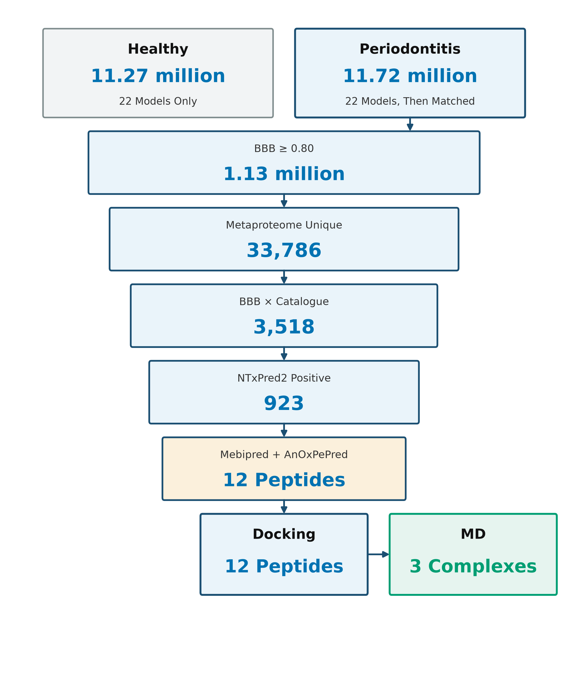
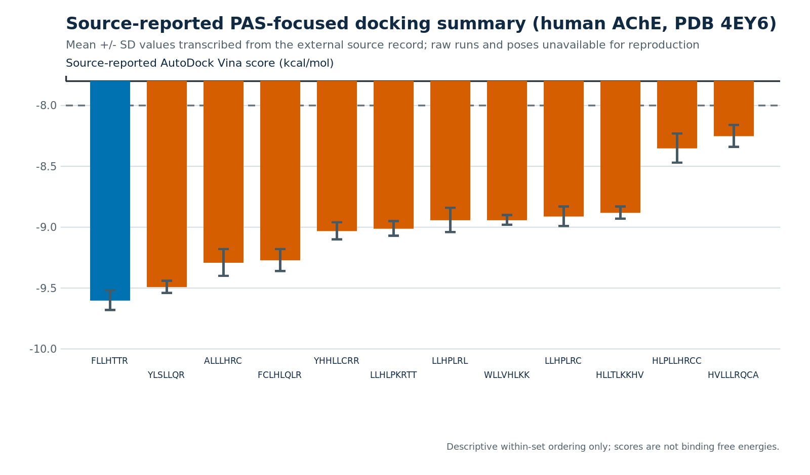
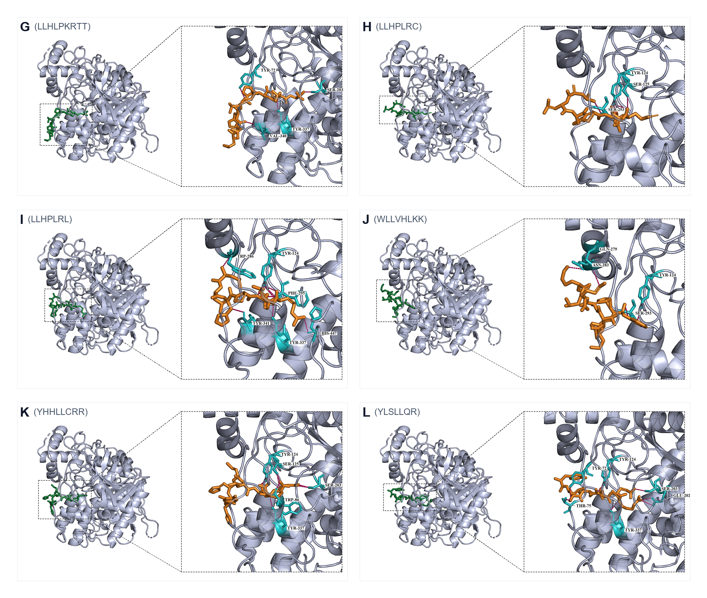
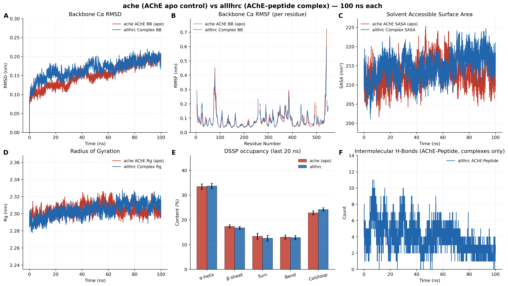
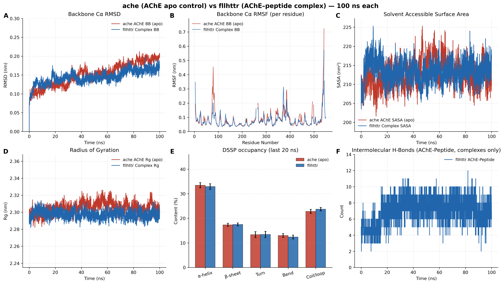
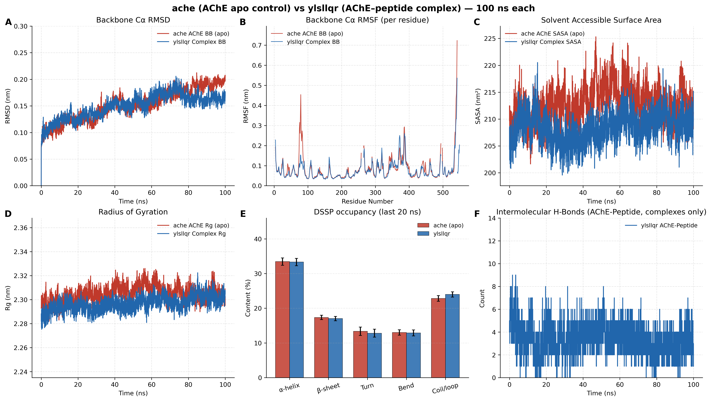

# Deep-learning screening, molecular docking and molecular dynamics of periodontitis oral micropeptides targeting human acetylcholinesterase

## Abstract

Periodontitis has been tied to Alzheimer’s disease (AD) in clinical and experimental work, yet a peptide-level ligand that could act on a synaptic enzyme is still missing. Small open reading frames (sORFs) were predicted with EMBOSS getorf from PRJNA678453 metagenome-assembled genomes (24 healthy and 26 periodontitis samples) and scored with UniDL4BioPep. Twelve 7–9-residue peptides were docked into human acetylcholinesterase (AChE). Apo AChE and three complexes were then run for 100-ns molecular dynamics (MD). The healthy-labelled library (11,269,961 sequences) and the periodontitis-labelled library (11,721,988 sequences) were both passed through 22 UniDL4BioPep classifiers at ≥0.80. Only the periodontitis branch was then matched to oral genomic and metaproteomic catalogues. Hits on the blood–brain-barrier peptide head numbered 1,095,861 (9.72%) in the healthy library and 1,125,832 (9.60%) in the periodontitis library. Intersection with 33,786 unique, catalogue-supported peptides left 3,518 sequences; NTxPred2, mebipred and AnOxPePred then reduced that list to twelve explicit peptides. All twelve are 7–9 residues, carry a net positive charge at pH 7.4, and are leucine-rich. Local AutoDock Vina (three runs) gave best poses between −8.25 and −9.60 kcal/mol. FLLHTTR, YLSLLQR and LLHPLRL contact the peripheral anionic site (PAS). Over 100 ns the FLLHTTR and YLSLLQR complexes stay more compact than apo AChE (backbone RMSD 0.1640 and 0.1625 nm versus 0.1897 nm). FLLHTTR keeps a dense hydrogen-bond net (7.03 ± 1.28); only YLSLLQR shrinks solvent-accessible surface area. These calculations outline a possible route in which oral micropeptides sit on the same PAS that accelerates amyloid-β (Aβ) assembly.

**Keywords:** Alzheimer’s disease; periodontitis; micropeptide; molecular docking; molecular dynamics

## Introduction

Alzheimer’s disease (AD) combines amyloid deposition, tau pathology, synaptic failure, immune activation and vascular injury over a long preclinical course [@scheltens2021alzheimer]. Sequential cleavage of APP by β- and γ-secretases releases Aβ40 and Aβ42; soluble oligomers injure synapses; familial APP/PSEN mutations change peptide length and amount [@selkoe2016amyloid]. Amyloid load does not explain the spatial or clinical heterogeneity of the disease, so peripheral inflammatory exposures have been examined as possible modifiers of vulnerability rather than as single sufficient causes.

Loss of basal-forebrain acetylcholine accounts for a large fraction of the cognitive picture, which is why AChE inhibitors remain in routine use [@hampel2018cholinergic]. Catalysis is only part of the enzyme’s role. AChE accelerates Aβ fibril growth through the peripheral anionic site (PAS), and AChE–Aβ particles are more toxic than free peptide [@inestrosa1996ache]. A short hydrophobic PAS motif is sufficient for that chaperone effect [@deferrari2001motif]. PAS-directed small molecules can block AChE-induced aggregation in biochemical assays [@bartolini2003pas]. The same protein surface therefore joins cholinergic failure to amyloid deposition.

Chronic periodontitis maintains a low-grade inflammatory load at a disrupted mucosal barrier and allows microbial products into blood [@chalmers2025primer]. Oral activity is species- and site-specific, so 16S abundance cannot stand in for a molecular ligand [@belstrom2021periodontitis]. Meta-analyses report associations between periodontal disease and cognitive disorders, although effect sizes move with case definitions [@larvin2023periodontalcognition]. In an AD cohort, periodontitis tracked later decline [@ide2016periodontitis]. A two-sample Mendelian randomization analysis did not support a genetic causal effect of periodontal disease on AD [@hu2024mendelian]. Epidemiology therefore motivates a molecular search; it does not identify the ligand.

Gingipains and outer-membrane vesicles of *Porphyromonas gingivalis* supply one mapped virulence pair [@guo2010gingipain; @ho2015omv]. The organism and gingipains have been reported in AD brains [@dominy2019pgingivalis], and repeated oral infection in mice produces neuroinflammation and Aβ-related changes [@ilievski2018oral]. Those observations justify looking at oral products. They do not, by themselves, name a peptide that occupies AChE.

Microbiome smORFs encode a large pool of uncharted small proteins [@sberro2019smallgenes; @durrant2021sorf]. Mining of human microbiomes for peptide antibiotics first scored millions of translated open reading frames and then applied experimental filters [@torres2024peptideantibiotics]. UniDL4BioPep supplies more than twenty binary bioactivity heads on ESM-2 embeddings [@du2023unidl4biopep]. That order—predict, then match to catalogues—is the order used here. Classifier scores do not answer the structural question of whether a 7–9-aa periodontitis peptide can occupy the Aβ-binding PAS.

Accelerated MD places Aβ on the AChE surface and treats the enzyme as a nucleation centre [@lushchekina2017amd]. A 1-μs PAS-centred AChE–Aβ trajectory remains bound, with the main residence at residues 344–361 [@atanasova2020md]. PDB 4EY6 gives a 2.40 Å human AChE frame for docking [@cheung2012ache]. The aromatic gorge that joins the catalytic triad to the PAS was mapped on *Torpedo* AChE [@kryger1999e2020]. What remains missing is a peptide-level ligand drawn from oral smORFs and tested on that same PAS.

Here we called sORFs with EMBOSS getorf from PRJNA678453 MAGs (24 healthy and 26 periodontitis samples), scored both libraries with 22 UniDL4BioPep heads, matched the periodontitis branch to oral genomic and metaproteomic catalogues, and reduced the list with NTxPred2, mebipred and AnOxPePred. Twelve 7–9-aa peptides were docked into human AChE. Three complexes, together with apo enzyme, were simulated for 100 ns, tracking peptide residence at the PAS with the fold closed.

## Materials and methods

### Study design

The work is computational. No new patients, specimens, sequencing runs or wet assays were added. Healthy and periodontitis tags are library labels; they are not peptide-level clinical diagnoses. Docking used local three-run AutoDock Vina poses. MD used 100-ns GROMACS trajectories of apo AChE and three peptide complexes.

### Source libraries and sORF prediction

The public source is PRJNA678453, paired oral metagenomes and metatranscriptomes from periodontitis and orally healthy donors [@belstrom2021periodontitis]. A derived MGnify third-party assembly, PRJEB65451 (metaSPAdes v3.15.3), exists for the same BioProject and is not a second clinical cohort. Metagenome-assembled genomes (MAGs) were sorted into 24 healthy-labelled and 26 periodontitis-labelled sample folders; 296 MAG files were matched through GCA-to-SRR metadata. Open reading frames were predicted with EMBOSS getorf using bacterial codon table 11, from start codon to stop codon (`-find 0`), with a length window of 15–150 bp [@rice2000emboss]. Identical amino-acid strings were collapsed. Qualitative presence or absence of each unique string across samples was recorded without remapping reads to the MAG set. The scored libraries contained 11,269,961 healthy-labelled and 11,721,988 periodontitis-labelled 5–50-aa peptides. No new patients were enrolled; the present work is the getorf call, the 22-task screen, catalogue matching, docking and MD.

### UniDL4BioPep (22 tasks)

UniDL4BioPep was applied first to both full libraries, following the predict-then-filter order used when mining microbiome peptide antibiotics [@torres2024peptideantibiotics; @du2023unidl4biopep]. Du et al. freeze ESM-2 (`esm2_t6_8M_UR50D`; 6 layers, 8 million parameters, 320-dimensional residue states) and average residue embeddings so that peptides of any length collapse to one fixed vector. A convolutional classifier is then trained, per bioactivity, on that vector; the same backbone is reused across datasets rather than designing a new network for each endpoint. In the original report the architecture beat the previous state of the art on 15 of 20 binary peptide tasks. We did not retrain the networks. We scored 22 published heads: ACE inhibitory, DPP-IV inhibitory, Bitter, Umami, Antimicrobial, Antimalarial (alternative), Antimalarial (main), Quorum sensing, Anticancer (main), Anticancer (alternative), Anti-MRSA, TTCA, BBB (BBP), Anti-parasitic (APP), NeuroPred, Antibacterial, Antifungal, Antiviral, Toxicity, Antioxidant FRS, Allergenicity, and cell-penetrating peptide (CPP). Every head used a score cut of ≥0.80. “BBB-high” is that operational cut on the BBP head, not measured transcytosis. Other BBB peptide tools (for example Augur) are trained on different positives and encodings, so their published AUCs do not transfer to these 4–50-aa oral strings [@gu2024bbb].

### Catalogue matching (periodontitis branch only)

After scoring, only periodontitis-labelled sequences were exact-matched to oral genomic and metaproteomic resources and collapsed to unique peptides. HOMD and eHOMD supply curated aerodigestive genomes [@chen2010homd; @escapa2018ehomd]. Salivary metaproteomes record peptides inside their own false-discovery framework [@belstrom2016metaproteomics]. Further oral metaproteomic sets add sequence observations from other clinical contexts [@jiang2022oralmetaproteomics; @yuan2025osample]. A match supports prior observation of the string; it does not prove expression in PRJNA678453 samples. The periodontitis library yielded 33,786 unique catalogue-supported peptides. Intersection with the 1,125,832 periodontitis BBB (BBP) hits recovered 3,518 sequences (3,446 of 5–30 aa; 72 of 31–50 aa). The healthy library was left at the 22-task score tables and was not dereplicated.

### NTxPred2

NTxPred2 trains separate peptide and protein models because a single neurotoxin classifier does not transfer between length classes [@rathore2025ntxpred2]. The peptide set has 877 neurotoxic and 877 non-toxic sequences; the protein set has 775 of each. Composition and binary-profile machine-learning models reach AUC 0.97 (peptides) and 0.85 (proteins). Fine-tuning ESM2-t30 on the peptide set raises independent-set AUC to 0.98 (MCC 0.90). The public server uses ESM2-t30 for 7–50-aa inputs (default probability 0.5) and an extra-trees model for sequences ≥51 aa. We used the peptide (ESM2-t30) mode on 7–50-aa members of the 3,518-set. A positive call is a classifier label, not a neuronal assay.

### mebipred

mebipred predicts metal-binding from sequence alone, without alignments, so it can be applied to short translated fragments [@aptekmann2022mebipred]. Inputs are 219 sequence features: amino-acid composition, physicochemical descriptors, and counts of metal-binding 5-mers. A first feed-forward net (two hidden layers of 219 ReLU units, dropout 0.2, RMSprop) separates metal-binding from non-binding proteins; a second tier names 11 ions. The authors report >80% accuracy for ligand presence and an area under the precision–recall curve of 0.91. Default ion probability is 0.5; raising it to 0.9 increases precision at some cost in recall. We kept Cu-, Fe- and Zn-related scores at 0.50. The output is not a measured Kd and does not assign a coordination geometry.

### AnOxPePred

AnOxPePred is a one-dimensional CNN with two heads, trained to score free-radical scavenging (FRS) and metal chelation (CHEL) from one-hot peptide sequences [@olsen2020anoxpepred]. Positives were taken from BIOPEP-UWM and from antioxidant-peptide papers; each sequence is labelled FRS, chelator, or both. Reported FRS performance exceeds a k-NN baseline; the chelator head is weaker because that training subset is small. Both heads emit a score in [0, 1]. Serial cuts here were CHEL≥0.25, then CHEL≥0.25 with FRS<0.50, then CHEL≥0.25 with FRS<0.45. Concordance among UniDL4BioPep, NTxPred2, mebipred and AnOxPePred is a filter stack, not independent experimental replication.

### Physicochemical descriptors

For the twelve unique 7–9-aa strings we recalculated length, histidine, cysteine and Arg+Lys counts, average molecular weight, isoelectric point, net charge at pH 7.4, Kyte–Doolittle GRAVY, Ikai aliphatic index, hydrophobic residue fraction (A, I, L, M, F, V, W, Y), and Boman index. Scales were applied to the amino-acid strings only; no experimental HPLC or CD was performed.

### Molecular docking

Human recombinant AChE (PDB 4EY6, 2.40 Å) was stripped of galantamine and crystal waters, chain breaks were repaired, and protonation was set at pH 7.4 [@cheung2012ache]. The twelve ligands ALLLHRC, FCLHLQLR, FLLHTTR, HLLTLKKHV, HLPLLHRCC, HVLLLRQCA, LLHLPKRTT, LLHPLRC, LLHPLRL, WLLVHLKK, YHHLLCRR and YLSLLQR were docked with AutoDock Vina, exhaustiveness 32 [@trott2010vina; @eberhardt2021vina]. The grid was centred on the PAS (Tyr72, Asp74, Thr75, Leu76, Trp286, His287, Tyr341) and covered the gorge neck (Phe295), the choline subsite (Trp86, Glu202, Tyr337) and the catalytic triad (Ser203, His447, Glu334). Each ligand was run three times. We report best-run affinity, three-run mean ± SD, hydrogen-bond count and PAS contact from the single best pose. Vina scores rank poses; they are not experimental free energies.

### Molecular dynamics

Four explicit-solvent systems were built in GROMACS with Amber99SB-ILDN and TIP3P water at 0.15 M NaCl [@abraham2015gromacs; @lindorfflarsen2010amber]: apo AChE (chain A) and the ALLLHRC, FLLHTTR and YLSLLQR complexes. Each box was triclinic with a 1.0 nm solute-to-wall buffer. Equilibration was 2,000 steps of steepest descent, 1.0 ns restrained NVT to 300 K, 1.0 ns restrained NPT, and 1.0 ns free NPT. Production was 100 ns (dt = 2.0 fs) at 300 K and 1.0 bar with LINCS, 1.2 nm cut-offs and particle-mesh Ewald. Frames were stored every 20 ps.

Metrics matched Figures 5–7: Cα RMSD, per-residue RMSF, SASA, Rg, DSSP occupancy, and intermolecular hydrogen bonds (`gmx hbond`; donor–acceptor ≤ 3.0 Å). Peptide self-fit RMSD and persistent contacts (7.0 Å) were stored as extras. Means ± SD use the last 20 ns (80–100 ns). The design follows the AChE–Aβ MD logic of Atanasova et al., at 100 ns rather than 1 μs [@atanasova2020md].

## Results

### Twenty-two UniDL4BioPep tasks on both libraries

Figure 1 summarises the cascade. Both libraries were scored at ≥0.80 on all 22 heads (Tables 1 and 2). Hit rates sit close to each other. Antimicrobial called 10,302,093/11,721,988 periodontitis sequences (87.89%) and 9,882,657/11,269,961 healthy sequences (87.69%). BBB (BBP) called 1,125,832 (9.60%) versus 1,095,861 (9.72%). Anti-parasitic (APP) and quorum sensing were the next largest heads; DPP-IV inhibitory was the smallest in both libraries. Labels overlap, so one peptide can sit in several rows. Because the two BBB rates differ by only 0.12 percentage points, BBB-high is not a periodontitis-specific stamp. The two libraries are close on most of the 22 heads (Table 3). Periodontitis exceeds healthy by ≥1 percentage point only for quorum sensing (+1.39). Healthy exceeds periodontitis by ≥1 point for antifungal (−2.50), anti-parasitic (−2.36), antioxidant FRS (−1.95), antiviral (−1.89), antibacterial (−1.42), CPP (−1.24), anticancer-main (−1.22) and umami (−1.00). Antimicrobial is essentially tied (87.89% vs 87.69%). These are library-wide score rates, not sequence-level differential peptides: we do not have a row-wise overlap map, so we cannot say that the twelve docking sequences are absent from the healthy library. Downstream docking used the periodontitis, catalogue-matched branch only.

**Table 1. UniDL4BioPep counts for the periodontitis-labelled library (11,721,988 smORFs; ≥0.80).**

| No. | Task | n | % |
| --- | --- | ---: | ---: |
| 1 | ACE inhibitory | 1,236,442 | 10.55 |
| 2 | DPP-IV inhibitory | 139,056 | 1.19 |
| 3 | Bitter | 1,831,185 | 15.62 |
| 4 | Umami | 3,100,811 | 26.45 |
| 5 | Antimicrobial | 10,302,093 | 87.89 |
| 6 | Antimalarial (alternative) | 695,608 | 5.93 |
| 7 | Antimalarial (main) | 2,010,724 | 17.15 |
| 8 | Quorum sensing | 4,491,507 | 38.32 |
| 9 | Anticancer (main) | 2,357,718 | 20.11 |
| 10 | Anticancer (alternative) | 2,015,652 | 17.20 |
| 11 | Anti-MRSA | 843,977 | 7.20 |
| 12 | TTCA | 2,666,759 | 22.75 |
| 13 | BBB (BBP) | 1,125,832 | 9.60 |
| 14 | Anti-parasitic (APP) | 5,462,493 | 46.60 |
| 15 | NeuroPred | 1,714,373 | 14.63 |
| 16 | Antibacterial | 2,597,877 | 22.16 |
| 17 | Antifungal | 2,960,118 | 25.25 |
| 18 | Antiviral | 3,275,203 | 27.94 |
| 19 | Toxicity | 1,714,299 | 14.62 |
| 20 | Antioxidant FRS | 2,521,106 | 21.51 |
| 21 | Allergenicity | 1,713,798 | 14.62 |
| 22 | Cell-penetrating peptide (CPP) | 925,627 | 7.90 |

**Table 2. UniDL4BioPep counts for the healthy-labelled library (11,269,961 smORFs; ≥0.80).**

| No. | Task | n | % |
| --- | --- | ---: | ---: |
| 1 | ACE inhibitory | 1,237,451 | 10.98 |
| 2 | DPP-IV inhibitory | 131,426 | 1.17 |
| 3 | Bitter | 1,840,368 | 16.33 |
| 4 | Umami | 3,094,287 | 27.46 |
| 5 | Antimicrobial | 9,882,657 | 87.69 |
| 6 | Antimalarial (alternative) | 703,632 | 6.24 |
| 7 | Antimalarial (main) | 1,954,667 | 17.34 |
| 8 | Quorum sensing | 4,161,825 | 36.93 |
| 9 | Anticancer (main) | 2,404,084 | 21.33 |
| 10 | Anticancer (alternative) | 1,979,643 | 17.57 |
| 11 | Anti-MRSA | 769,955 | 6.83 |
| 12 | TTCA | 2,618,849 | 23.24 |
| 13 | BBB (BBP) | 1,095,861 | 9.72 |
| 14 | Anti-parasitic (APP) | 5,517,278 | 48.96 |
| 15 | NeuroPred | 1,690,436 | 15.00 |
| 16 | Antibacterial | 2,658,234 | 23.59 |
| 17 | Antifungal | 3,128,057 | 27.76 |
| 18 | Antiviral | 3,362,295 | 29.83 |
| 19 | Toxicity | 1,725,268 | 15.31 |
| 20 | Antioxidant FRS | 2,643,538 | 23.46 |
| 21 | Allergenicity | 1,635,019 | 14.51 |
| 22 | Cell-penetrating peptide (CPP) | 1,029,770 | 9.14 |

**Table 3. Score-rate difference between libraries (periodontitis % minus healthy %). BBB is shown for reference.**

| Task | Healthy % | Periodontitis % | Δ pp |
| --- | ---: | ---: | ---: |
| Quorum sensing | 36.93 | 38.32 | +1.39 |
| Umami | 27.46 | 26.45 | −1.00 |
| Anticancer (main) | 21.33 | 20.11 | −1.22 |
| Cell-penetrating peptide (CPP) | 9.14 | 7.90 | −1.24 |
| Antibacterial | 23.59 | 22.16 | −1.42 |
| Antiviral | 29.83 | 27.94 | −1.89 |
| Antioxidant FRS | 23.46 | 21.51 | −1.95 |
| Anti-parasitic (APP) | 48.96 | 46.60 | −2.36 |
| Antifungal | 27.76 | 25.25 | −2.50 |
| BBB (BBP) | 9.72 | 9.60 | −0.12 |

**Figure 1. Screening cascade.** UniDL4BioPep (22 tasks) was applied to both libraries. Catalogue matching and later filters were applied only to the periodontitis branch, ending in twelve 7–9-aa peptides for docking and three complexes for 100-ns MD.

### Periodontitis funnel to twelve sequences

Catalogue matching of the periodontitis library kept 33,786 unique peptides. Intersection with BBB-high gave 3,518 sequences. NTxPred2 scored 3,299/3,518 (93.77%) and called 923/3,299 (27.98%) positive. Later cuts left 111 mebipred-positive peptides, 15 with CHEL≥0.25, 12 with CHEL≥0.25 and FRS<0.50, and 8 with the stricter FRS<0.45 (Table 4). All 923 NTxPred2-positive peptides were ≤30 aa, so the metal/CHEL/FRS steps kept short peptides only.

**Table 4. Periodontitis branch after UniDL4BioPep scoring.**

| Stage | Rule | n | Denominator |
| --- | --- | ---: | ---: |
| Periodontitis smORFs | 4–50 aa | 11,721,988 | Library |
| BBB (BBP) | score ≥0.80 | 1,125,832 | 11,721,988 |
| Catalogue-supported unique peptides | Exact match | 33,786 | 11,721,988 |
| BBB-high ∩ catalogue-supported | Intersection | 3,518 | 1,125,832 ∩ 33,786 |
| Short (5–30 aa) | Length | 3,446 | 3,518 |
| Long (31–50 aa) | Length | 72 | 3,518 |
| NTxPred2 scored | 7–50 aa | 3,299 | 3,518 |
| NTxPred2-positive | Model label | 923 | 3,299 |
| mebipred-positive | ≥0.50 | 111 | — |
| CHEL-priority | CHEL≥0.25 | 15 | 111 |
| Main set | CHEL≥0.25 and FRS<0.50 | 12 | 111 |
| Stricter subset | CHEL≥0.25 and FRS<0.45 | 8 | — |

### Physicochemical profile of the twelve peptides

These descriptors characterise the twelve docking ligands. They are not a comparison of the healthy and periodontitis libraries.

The twelve strings are unique 7–9-aa peptides of standard residues (Table 5). Eleven contain histidine; six contain cysteine; every sequence has at least one Arg or Lys. Molecular weights fall between 825.03 and 1,097.30 Da. Isoelectric points are alkaline (8.28–11.54). Net charge at pH 7.4 is positive for all twelve (0.85–2.08). GRAVY is positive for ten sequences, in line with leucine-rich cores; LLHLPKRTT (−0.36) and YHHLLCRR (−0.95) are the two hydrophilic exceptions. Aliphatic indices run from 97.5 (YHHLLCRR) to 222.9 (LLHPLRL). YLSLLQR is the only peptide without histidine. These numbers describe composition; they are not HPLC or CD measurements.

**Table 5. Composition and calculated physicochemical descriptors of the twelve 7–9-aa peptides.**

| Peptide | aa | MW (Da) | pI | z (pH 7.4) | GRAVY | AI | His | Cys | R+K |
| --- | ---: | ---: | ---: | ---: | ---: | ---: | ---: | ---: | ---: |
| ALLLHRC | 7 | 825.03 | 9.00 | 0.92 | 1.14 | 181.4 | 1 | 1 | 1 |
| FCLHLQLR | 8 | 1029.26 | 9.00 | 0.92 | 0.69 | 146.2 | 1 | 1 | 1 |
| FLLHTTR | 7 | 887.04 | 11.09 | 1.04 | 0.19 | 111.4 | 1 | 0 | 1 |
| HLLTLKKHV | 9 | 1088.35 | 10.63 | 2.08 | 0.08 | 162.2 | 2 | 0 | 2 |
| HLPLLHRCC | 9 | 1091.35 | 8.28 | 0.85 | 0.43 | 130.0 | 2 | 2 | 1 |
| HVLLLRQCA | 9 | 1052.30 | 9.00 | 0.92 | 0.97 | 173.3 | 1 | 1 | 1 |
| LLHLPKRTT | 9 | 1078.32 | 11.54 | 2.04 | −0.36 | 130.0 | 1 | 0 | 2 |
| LLHPLRC | 7 | 851.07 | 9.00 | 0.92 | 0.66 | 167.1 | 1 | 1 | 1 |
| LLHPLRL | 7 | 861.09 | 11.09 | 1.04 | 0.84 | 222.9 | 1 | 0 | 1 |
| WLLVHLKK | 8 | 1036.32 | 10.63 | 2.04 | 0.46 | 182.5 | 1 | 0 | 2 |
| YHHLLCRR | 8 | 1097.30 | 9.91 | 1.96 | −0.95 | 97.5 | 2 | 1 | 2 |
| YLSLLQR | 7 | 892.06 | 9.89 | 0.99 | 0.04 | 167.1 | 0 | 0 | 1 |

### Docking to human AChE

All twelve ligands produced favourable Vina scores (Table 6, Figure 2). Best-run values ran from −8.25 to −9.60 kcal/mol; three-run means ran from −8.07 ± 0.16 to −9.44 ± 0.09 kcal/mol. Best-pose order was FLLHTTR (−9.60), YLSLLQR (−9.49), ALLLHRC (−9.29). Mean order put YLSLLQR first (−9.44 ± 0.09) and ALLLHRC second (−9.18 ± 0.11). FLLHTTR has the strongest single pose and the largest SD (−8.77 ± 1.41). Best poses made 3–10 hydrogen bonds (mean length 2.83–3.28 Å; Figures 3 and 4).

**Table 6. Three-run AutoDock Vina scores against human AChE (PDB 4EY6).**

| Peptide | H-bonds | Best | Mean ± SD (n=3) | PAS | Principal contacts |
| --- | ---: | ---: | --- | --- | --- |
| ALLLHRC | 3 | −9.29 | −9.18 ± 0.11 | No | Ser125, Ser203, Tyr124 |
| FCLHLQLR | 7 | −9.27 | −8.96 ± 0.48 | Yes | Ser203, Thr75, Tyr341 |
| FLLHTTR | 8 | −9.60 | −8.77 ± 1.41 | Yes | Asp74, Tyr72, His287 |
| HLLTLKKHV | 6 | −8.88 | −8.69 ± 0.20 | Yes | Tyr72, Phe346 |
| HLPLLHRCC | 4 | −8.35 | −8.28 ± 0.07 | No | Ser125, Tyr124, Tyr337 |
| HVLLLRQCA | 4 | −8.25 | −8.07 ± 0.16 | Yes | Thr75 |
| LLHLPKRTT | 3 | −9.01 | −8.89 ± 0.16 | Adjacent | Ser203, Val340 |
| LLHPLRC | 4 | −8.91 | −8.78 ± 0.11 | No | Ser125, Ser293 |
| LLHPLRL | 10 | −8.94 | −8.91 ± 0.05 | Yes | Trp286, Tyr341, His447 |
| WLLVHLKK | 4 | −8.94 | −8.64 ± 0.26 | No | Asn283, Gln279 |
| YHHLLCRR | 7 | −9.03 | −8.62 ± 0.43 | No | Trp86, Ser203 |
| YLSLLQR | 7 | −9.49 | −9.44 ± 0.09 | Yes | Tyr72, Thr75, Glu202 |

**Figure 2. Three-run Vina scores against human AChE (PDB 4EY6).** Blue circles, mean; whiskers, SD; orange diamonds, best run. Order follows best-run rank.

**Figure 3. Best docking poses, peptides 1–6 (A–F).** Peptide, orange; contacting residues, cyan. FLLHTTR (C) is the densest PAS pose.

**Figure 4. Best docking poses, peptides 7–12 (G–L).** LLHPLRL (I) spans PAS Trp286/Tyr341 to catalytic His447. YLSLLQR (L) bridges PAS and the gorge mouth.

PAS contacts in the best pose were seen for FLLHTTR (Figure 3C), YLSLLQR (Figure 4L), FCLHLQLR, HVLLLRQCA, HLLTLKKHV and LLHPLRL (Figure 4I). ALLLHRC binds catalytic Ser203 with the shortest mean hydrogen bond (2.83 Å) rather than the outer PAS aromatics (Figure 3A). Three-run means separate ligands that stay strong across runs (YLSLLQR, ALLLHRC, LLHPLRL) from ligands whose best pose is better than the run average (FLLHTTR, FCLHLQLR, YHHLLCRR).

### 100-ns dynamics of apo AChE and three complexes

Production runs finished for apo AChE and the ALLLHRC, FLLHTTR and YLSLLQR complexes (Table 7, Figures 5–7). Each six-panel figure compares apo with one complex: RMSD (A), RMSF (B), SASA (C), Rg (D), last-20-ns DSSP (E) and intermolecular hydrogen bonds (F).

<!-- PAGEBREAK -->

**Figure 5. Apo AChE versus AChE–ALLLHRC.** Panels A–F match Table 7. Complex RMSD (A) tracks apo; hydrogen bonds (F) fall from early occupancy to about two in the last 20 ns.

**Figure 6. Apo AChE versus AChE–FLLHTTR.** After ~50 ns, complex RMSD (A) lies below apo. Hydrogen-bond counts (F) stay in the 6–10 range for the full 100 ns.

**Figure 7. Apo AChE versus AChE–YLSLLQR.** Late RMSD (A) is below apo. SASA (C) is the only complex that contracts relative to apo.

**Table 7. Last-20-ns metrics (mean ± SD) for apo AChE and three complexes.**

| Metric | apo AChE | ALLLHRC | FLLHTTR | YLSLLQR |
| --- | --- | --- | --- | --- |
| Cα RMSD (nm) | 0.1897 ± 0.0090 | 0.1916 ± 0.0092 | 0.1640 ± 0.0080 | 0.1625 ± 0.0078 |
| Peptide self-fit RMSD (nm) | — | 0.2518 ± 0.0136 | 0.1752 ± 0.0111 | 0.0911 ± 0.0098 |
| RMSF mean (nm) | 0.0835 ± 0.0659 | 0.0876 ± 0.0581 | 0.0778 ± 0.0504 | 0.0771 ± 0.0498 |
| SASA (nm²) | 212.25 ± 2.89 | 217.47 ± 2.49 | 213.88 ± 2.36 | 209.71 ± 2.35 |
| Rg (nm) | 2.3045 ± 0.0056 | 2.3107 ± 0.0052 | 2.2967 ± 0.0047 | 2.3028 ± 0.0051 |
| Intermolecular H-bonds | — | 2.19 ± 0.80 | 7.03 ± 1.28 | 2.93 ± 1.14 |
| Persistent contact pairs | — | 7 | 7 | 7 |
| DSSP α-helix / β-sheet (%) | 33.44 / 17.35 | 33.66 / 16.76 | 32.92 / 17.52 | 33.31 / 17.02 |

Apo RMSD levels near 0.19 nm (Figures 5A–7A). ALLLHRC follows that control (complex 0.1916 nm). FLLHTTR and YLSLLQR drop below apo after 50–70 ns (0.1640 and 0.1625 nm), which reads as rigidification, not unfolding. Peptide self-fit RMSD is highest for ALLLHRC (0.2518 nm) and lowest for YLSLLQR (0.0911 nm). Catalytic-core RMSF stays low; mean RMSF is below apo for FLLHTTR and YLSLLQR. Rg remains 2.30–2.31 nm. SASA rises for ALLLHRC (217.47 nm²), sits near apo for FLLHTTR (213.88 nm²), and falls only for YLSLLQR (209.71 nm²; Figure 7C). Hydrogen-bond histories differ: ALLLHRC decays to 2.19 ± 0.80; FLLHTTR holds 7.03 ± 1.28 for the whole run (Figure 6F); YLSLLQR averages 2.93 ± 1.14. Helix (~33%) and sheet (~17%) overlay the apo bars. Each complex keeps seven persistent contact pairs. Centre-of-mass RDF peaks lie at 1.22 nm (ALLLHRC), 1.80 nm (FLLHTTR) and 1.62 nm (YLSLLQR), i.e. surface residence rather than bulk solvent.

## Discussion

AChE hydrolyses acetylcholine at cholinergic synapses. In AD tissue the same enzyme sits on amyloid plaques. Inestrosa et al. showed that AChE accelerates Aβ fibril growth through the PAS and that AChE–Aβ particles are more toxic than free peptide [@inestrosa1996ache]. Alvarez et al. isolated stable enzyme–peptide complexes that change AChE biochemistry and raise fibril neurotoxicity, and showed that the enzyme binds growing fibrils rather than free monomer alone [@alvarez1998ache; @alvarez1997ache]. A short hydrophobic PAS motif is sufficient for that chaperone effect [@deferrari2001motif]. Reyes et al. blocked the effect with a monoclonal antibody to AChE [@reyes1997mab]. Bartolini et al. reached the same endpoint with PAS-directed small molecules [@bartolini2003pas]. In mice, excess AChE promotes cortical Aβ plaques [@rees2003ache]. Reviews of AChE in AD place plaque-associated enzyme in cross-talk with Aβ and phospho-tau, still sensitive to PAS blockade [@garciaayllon2011ache; @carvajal2011ache; @inestrosa2008ache]. Dinamarca et al. used hippocampal injections to show that AChE–Aβ complexes out-damage free fibrils [@dinamarca2010ache]. Johnson and Moore mapped the PAS as Tyr72, Asp74, Tyr124, Trp286 and Tyr341, about 20 Å from the catalytic triad at the gorge mouth [@johnson2006pas]. Those experiments identify the PAS as a structural hinge between cholinergic failure and amyloid deposition [@selkoe2016amyloid; @hampel2018cholinergic]. The present docking and 100-ns trajectories examine occupancy of that hinge by periodontitis-derived micropeptides.

An oral exposure path is already documented at the organism and protease level. Poole et al. detected periodontopathic virulence factors in short-term postmortem AD brain [@poole2013pg]. Dominy et al. reported *P. gingivalis* and gingipains in AD brains and showed that oral infection in mice raises brain Aβ1–42 [@dominy2019pgingivalis]. Haditsch et al. found AD-like neurodegeneration in *P. gingivalis*-infected neurons that keep active gingipains [@haditsch2020cor388]. Ilievski et al. produced neuroinflammation and Aβ-related changes after repeated oral application of a periodontal pathogen in wild-type mice [@ilievski2018oral]. Lei et al. showed that *P. gingivalis* bacteremia increases endothelial permeability through an Mfsd2a/Caveolin-1 transcytosis path [@lei2023pgbbb]. Gingipains and outer-membrane vesicles supply vehicles for bacterial cargo beyond the producing cell [@guo2010gingipain; @ho2015omv]. Meta-analyses and an AD cohort link periodontitis to later cognitive decline [@larvin2023periodontalcognition; @ide2016periodontitis]. A two-sample Mendelian randomization analysis did not support a genetic causal effect [@hu2024mendelian]. Those reports justify looking at oral products at the PAS. Assignment of the twelve peptides to *P. gingivalis*, or proof that any one string crosses endothelium, lies outside those reports [@chalmers2025primer; @gu2024bbb; @belstrom2021periodontitis]. Gingipains, LPS and vesicles already travel, and a 7–9-aa cationic peptide is smaller than those cargos. Survival of such a peptide in saliva, serum and endothelium is outside the present calculation. The docking and MD below address occupancy of the PAS that Inestrosa and Alvarez implicated in fibril growth, given an oral heptapeptide placed at AChE.

Deep-learning peptide mining supplies the filter stack used here. Torres et al. scored millions of translated microbiome open reading frames before experimental filters [@torres2024peptideantibiotics]. UniDL4BioPep uses the same predict-then-filter logic on ESM-2 embeddings [@du2023unidl4biopep]. NTxPred2, mebipred and AnOxPePred were trained for neurotoxic, metal-binding and antioxidant endpoints, not for AChE occupancy [@rathore2025ntxpred2; @aptekmann2022mebipred; @olsen2020anoxpepred]. Catalogue matches to HOMD, eHOMD and salivary metaproteomes support prior observation of a string, as in other oral peptide studies [@chen2010homd; @escapa2018ehomd; @belstrom2016metaproteomics; @jiang2022oralmetaproteomics; @yuan2025osample; @sberro2019smallgenes], so the serial scores function as a triage stack. The twelve docking ligands are 7–9 residues, alkaline, and net-positive at pH 7.4, with leucine-rich cores. That composition matches the electrostatic character of the PAS. Barak et al. found that Asp74 and Trp286 form a common core for peripheral ligands [@barak1994pas]. Mallender et al. showed that cationic substrate first docks on Asp74 [@mallender2000asp74]. A short cationic peptide is a plausible PAS occupant on chemical grounds, pending a structure.

Human AChE (PDB 4EY6) gives an experimental frame for the gorge and PAS [@cheung2012ache], following Sussman’s aromatic-gorge map on *Torpedo* AChE [@sussman1991ache; @kryger1999e2020]. Dvir et al. restated that the 20-Å gorge couples a catalytic triad at the base to a peripheral cluster at the rim [@dvir2010ache]. AutoDock Vina is a first-pass ranking engine [@trott2010vina; @eberhardt2021vina]. Recurring contacts fall on the PAS array rather than on a new pocket. FLLHTTR hydrogen-bonds Asp74, Tyr72 and His287. YLSLLQR bridges Tyr72 and Thr75 at the gorge mouth. LLHPLRL spans Trp286 and Tyr341 and reaches catalytic His447, the dual PAS–catalytic geometry of donepezil in 4EY6. HLLTLKKHV reaches Phe346 in the 344–361 zone where Atanasova et al. kept Aβ for 1 μs [@atanasova2020md]. Bourne et al. crystallised PAS ligands stacked between Trp286 and Tyr341; the same pair appears for LLHPLRL [@bourne2003pas]. ALLLHRC is the exception: it binds catalytic Ser203 and does not contact the outer PAS aromatics. Six of twelve best poses meet PAS residues. FCLHLQLR, HVLLLRQCA, HLLTLKKHV and LLHPLRL complete that PAS-positive set; HLPLLHRCC, LLHPLRC, WLLVHLKK and YHHLLCRR stay off the outer aromatics, and LLHLPKRTT sits adjacent. The three MD ligands were the strongest scorers, two of them PAS-positive. Vina scores of −8.25 to −9.60 kcal/mol are first-pass ranks, not binding constants. They put all twelve strings in a favourable window and do not by themselves distinguish a PAS occupant from a catalytic-site occupant. That distinction comes from the contact list: Asp74/Tyr72/Trp286/Tyr341 versus Ser203. FLLHTTR and YLSLLQR belong to the first group. ALLLHRC belongs to the second. Running MD on both groups compares a strong Vina score with PAS geometry as the requirement for a lasting complex.

MD studies of AChE–Aβ already treat the enzyme as a nucleation centre. Accelerated sampling pulled Aβ onto the AChE surface [@lushchekina2017amd]. A 1-μs PAS-centred trajectory remained bound without unfolding the fold [@atanasova2020md]. The same occupancy pattern appears here on a 100-ns window. Apo Cα RMSD levels near 0.19 nm. ALLLHRC tracks that control (0.1916 nm). FLLHTTR and YLSLLQR fall below apo after 50–70 ns (0.1640 and 0.1625 nm). A complex RMSD that sits below the apo trace is read as local rigidity after binding, not as unfolding. That reading matches Lushchekina’s surface-bound, non-dissociating complex. Peptide self-fit RMSD ranks the ligands: ALLLHRC 0.2518 nm, FLLHTTR 0.1752 nm, YLSLLQR 0.0911 nm. YLSLLQR is the most compact ligand on the enzyme. ALLLHRC, which missed the PAS, is the most mobile. Apo AChE is already a stiff α/β hydrolase; Sussman et al. described a deep aromatic gorge that does not require large domain motion for catalysis [@sussman1991ache]. A 0.03 nm drop in complex RMSD relative to that apo baseline is a tightening of an already compact fold, short of rebuilding the enzyme.

Mean RMSF is 0.0778 nm for FLLHTTR and 0.0771 nm for YLSLLQR, both below apo (0.0835 nm), and 0.0876 nm for ALLLHRC, slightly above apo. Catalytic-core fluctuations stay low in all four systems. Loop residues at the gorge rim fluctuate more than the triad, as expected from the PAS being a surface cluster rather than a buried pocket [@bourne2003pas; @johnson2006pas]. Bourne and Johnson described PAS binding as a surface event that need not open the fold; the RMSF traces match that description. Radius of gyration stays 2.30–2.31 nm across apo and the three complexes. A shift of that size is spatial accommodation of a heptapeptide, not unravelling of the α/β hydrolase core. DSSP helix (~33%) and sheet (~17%) overlay the apo bars, so secondary structure is not rewritten on this window. Lushchekina and Atanasova read a lower complex RMSD plus preserved secondary structure as ligand-induced rigidity at this enzyme; the present traces follow that reading.

Hydrogen-bond histories separate the ligands more sharply than RMSD. ALLLHRC decays from early occupancy to 2.19 ± 0.80 in the last 20 ns. FLLHTTR holds 7.03 ± 1.28 for the full 100 ns. YLSLLQR averages 2.93 ± 1.14. Persistent intermolecular contacts number seven in each complex. Centre-of-mass RDF peaks lie at 1.22–1.80 nm, i.e. surface residence rather than bulk solvent. SASA rises for ALLLHRC (217.47 nm² versus apo 212.25 nm²), sits near apo for FLLHTTR, and falls only for YLSLLQR (209.71 nm²). A drop in SASA is read as a more compact complex; that reading applies to YLSLLQR. FLLHTTR therefore looks like a hydrogen-bond-rich PAS occupant that rigidifies the protein without burying extra surface. YLSLLQR looks like a compact PAS occupant that does bury surface. ALLLHRC, despite a strong Vina score on Ser203, does not leave a lasting PAS-type network. FLLHTTR remains the hydrogen-bond-rich PAS ligand, YLSLLQR the compact PAS ligand, and ALLLHRC a catalytic-site scorer that later loses occupancy. Bartolini’s assays already separated PAS-directed ligands, which suppress AChE-induced aggregation, from catalytic-site ligands, which need not [@bartolini2003pas]. Atanasova’s 1-μs Aβ trajectory and the present 100-ns peptide trajectories differ in ligand length and sampling window. Both still show a ligand remaining at the PAS with the fold closed.

Four linked steps then follow from the cited PAS literature. First, PAS recognition: occupancy of Asp74, Tyr72, Trp286 and Tyr341 places a heterologous peptide at the gorge mouth that feeds the catalytic triad, the first step Mallender assigned to cationic substrate [@mallender2000asp74; @hampel2018cholinergic; @cheung2012ache]. Second, a lasting enzyme–peptide complex: intermolecular hydrogen bonds persist, as in the AChE–Aβ trajectories of Lushchekina and Atanasova and in the stable complexes Alvarez isolated [@alvarez1998ache]. Third, restricted acetylcholine access: physical blockage at the 20-Å gorge entrance can hinder substrate even while the catalytic core remains folded, the steric-blockade mode described for PAS ligands [@johnson2006pas; @dvir2010ache]. Fourth, pathological chaperone activity: because the PAS is a documented pro-fibrillar site [@inestrosa1996ache; @deferrari2001motif; @carvajal2011ache], a peptide that remains there can lower the nucleation barrier for endogenous Aβ. Folded AChE would then present a peptide-coated PAS on which Aβ oligomers can co-assemble, the geometry Dinamarca et al. used to explain why AChE–Aβ particles out-damage free fibrils [@dinamarca2010ache].

PAS pharmacology in AChE has mostly been small molecules. Bartolini’s PAS ligands reduced AChE-induced aggregation without requiring catalytic-site occupancy [@bartolini2003pas]. Donepezil in 4EY6 spans PAS Trp286 to the catalytic anionic site, a dual-binding template Kryger mapped on *Torpedo* AChE [@kryger1999e2020; @cheung2012ache]. Johnson and Moore treated that surface as a design handle for ligands that modulate heterologous protein associations, including Aβ [@johnson2006pas]. Short cationic peptides occupy a larger surface than those ligands. The present poses place an oral heptapeptide on the same aromatic cluster. Dual-binding inhibitors were designed to occupy PAS and the catalytic anionic site at once, with the therapeutic aim of slowing both acetylcholine hydrolysis and PAS-templated Aβ assembly [@inestrosa2008ache; @johnson2006pas]. An oral heptapeptide that covers only the rim cannot be scored against that dual-binding template. FLLHTTR and YLSLLQR remain at the rim, which is the occupancy Inestrosa treated as the chaperone trigger. Cheung crystallised a longer dual-binding pose for donepezil.

On that literature, short, cationic, leucine-rich oral micropeptides predicted from PRJNA678453 MAGs can occupy the experimentally mapped Aβ-binding PAS and remain there on a 100-ns timescale. A binding assay and an Aβ-aggregation experiment are still required.

## Conclusions

Twelve 7–9-aa peptides from a periodontitis-labelled oral smORF library dock to human AChE. FLLHTTR, YLSLLQR and ALLLHRC remain on the surface for 100 ns without unfolding the enzyme. FLLHTTR forms the densest PAS hydrogen-bond net; YLSLLQR is the only complex that buries solvent-accessible surface. The calculations support a possible mechanism in which oral pathogenic peptides occupy AChE, hinder acetylcholine access, and co-nucleate Aβ on the same PAS.

## References

1. Scheltens P, De Strooper B, Kivipelto M, et al. Alzheimer’s disease. *Lancet*. 2021;397(10284):1577–1590. doi:10.1016/S0140-6736(20)32205-4.
2. Selkoe DJ, Hardy J. The amyloid hypothesis of Alzheimer’s disease at 25 years. *EMBO Mol Med*. 2016;8(6):595–608. doi:10.15252/emmm.201606210.
3. Hampel H, Mesulam MM, Cuello AC, et al. The cholinergic system in the pathophysiology and treatment of Alzheimer’s disease. *Brain*. 2018;141(7):1917–1933. doi:10.1093/brain/awy132.
4. Inestrosa NC, Alvarez A, Pérez CA, et al. Acetylcholinesterase accelerates assembly of amyloid-β-peptides into Alzheimer’s fibrils. *Neuron*. 1996;16(4):881–891. doi:10.1016/s0896-6273(00)80108-7.
5. De Ferrari GV, Canales MA, Shin I, et al. A structural motif of acetylcholinesterase that promotes amyloid β-peptide fibril formation. *Biochemistry*. 2001;40(35):10447–10457. doi:10.1021/bi0101392.
6. Bartolini M, Bertucci C, Cavrini V, Andrisano V. β-Amyloid aggregation induced by human acetylcholinesterase: inhibition studies. *Biochem Pharmacol*. 2003;65(3):407–416. doi:10.1016/s0006-2952(02)01514-9.
7. Chalmers JC, Hernandez-Kapila YL. The role of the oral microbiome, host response, and periodontal disease treatment in Alzheimer’s disease: a primer. *Periodontol 2000*. 2025;98(1):220–227. doi:10.1111/prd.12631.
8. Belstrøm D, Constancias F, Drautz-Moses DI, et al. Periodontitis associates with species-specific gene expression of the oral microbiota. *npj Biofilms Microbiomes*. 2021;7:76. doi:10.1038/s41522-021-00247-y.
9. Larvin H, Gao C, Kang J, et al. The impact of study factors in the association of periodontal disease and cognitive disorders. *Age Ageing*. 2023;52(2):afad015. doi:10.1093/ageing/afad015.
10. Ide M, Harris M, Stevens A, et al. Periodontitis and cognitive decline in Alzheimer’s disease. *PLoS One*. 2016;11(3):e0151081. doi:10.1371/journal.pone.0151081.
11. Hu C, Li H, Huang L, et al. Periodontal disease and risk of Alzheimer’s disease: a two-sample Mendelian randomization. *Brain Behav*. 2024;14(4):e3486. doi:10.1002/brb3.3486.
12. Guo Y, Nguyen KA, Potempa J. Dichotomy of gingipains action as virulence factors. *Periodontol 2000*. 2010;54(1):15–44. doi:10.1111/j.1600-0757.2010.00377.x.
13. Ho MH, Chen CH, Goodwin JS, et al. Functional advantages of *Porphyromonas gingivalis* vesicles. *PLoS One*. 2015;10(4):e0123448. doi:10.1371/journal.pone.0123448.
14. Dominy SS, Lynch C, Ermini F, et al. *Porphyromonas gingivalis* in Alzheimer’s disease brains. *Sci Adv*. 2019;5(1):eaau3333. doi:10.1126/sciadv.aau3333.
15. Ilievski V, Zuchowska PK, Green SJ, et al. Chronic oral application of a periodontal pathogen results in brain inflammation, neurodegeneration and amyloid beta production in wild type mice. *PLoS One*. 2018;13(10):e0204941. doi:10.1371/journal.pone.0204941.
16. Sberro H, Fremin BJ, Zlitni S, et al. Large-scale analyses of human microbiomes reveal thousands of small, novel genes. *Cell*. 2019;178(5):1245–1259.e14. doi:10.1016/j.cell.2019.07.016.
17. Durrant MG, Bhatt AS. Automated prediction and annotation of small open reading frames in microbial genomes. *Cell Host Microbe*. 2021;29(1):121–131.e4. doi:10.1016/j.chom.2020.11.002.
18. Torres MDT, Brooks EF, Cesaro A, et al. Mining human microbiomes reveals an untapped source of peptide antibiotics. *Cell*. 2024;187(19):5453–5467.e15. doi:10.1016/j.cell.2024.07.027.
19. Du Z, Ding X, Xu Y, Li Y. UniDL4BioPep: a universal deep learning architecture for binary classification in peptide bioactivity. *Brief Bioinform*. 2023;24(3):bbad135. doi:10.1093/bib/bbad135.
20. Lushchekina SV, Kots ED, Novichkova DA, Petrov KA, Masson P. Role of acetylcholinesterase in β-amyloid aggregation studied by accelerated molecular dynamics. *BioNanoScience*. 2017;7(2):396–402. doi:10.1007/s12668-016-0375-x.
21. Atanasova M, Dimitrov I, Ivanov S. Molecular dynamics simulations of acetylcholinesterase–beta-amyloid peptide complex. *Cybern Inf Technol*. 2020;20(6):140–154. doi:10.2478/cait-2020-0068.
22. Cheung J, Rudolph MJ, Burshteyn F, et al. Structures of human acetylcholinesterase in complex with pharmacologically important ligands. *J Med Chem*. 2012;55(23):10282–10286. doi:10.1021/jm300871x.
23. Kryger G, Silman I, Sussman JL. Structure of acetylcholinesterase complexed with E2020 (Aricept): implications for drug design. *Structure*. 1999;7(3):297–307. doi:10.1016/s0969-2126(99)80040-9.
24. Rice P, Longden I, Bleasby A. EMBOSS: the European Molecular Biology Open Software Suite. *Trends Genet*. 2000;16(6):276–277. doi:10.1016/S0168-9525(00)02024-2.
25. Gu Y, Chen P, Wang B, et al. Prediction of blood-brain barrier penetrating peptides based on data augmentation with Augur. *BMC Biol*. 2024;22:86. doi:10.1186/s12915-024-01883-4.
26. Chen T, Yu WH, Izard J, et al. The Human Oral Microbiome Database: a web accessible resource for investigating oral microbe taxonomic and genomic information. *Database (Oxford)*. 2010;2010:baq013. doi:10.1093/database/baq013.
27. Escapa IF, Chen T, Huang Y, et al. New insights into human nostril microbiome from the expanded Human Oral Microbiome Database (eHOMD). *mSystems*. 2018;3(3):e00187-18. doi:10.1128/mSystems.00187-18.
28. Belstrøm D, Jersie-Christensen RR, Lyon D, et al. Metaproteomics of saliva identifies human protein markers specific for individuals with periodontitis and dental caries compared to orally healthy controls. *PeerJ*. 2016;4:e2433. doi:10.7717/peerj.2433.
29. Jiang X, Zhang Y, Wang H, et al. In-depth metaproteomics analysis of oral microbiome for lung cancer. *Research (Wash D C)*. 2022;2022:9781578. doi:10.34133/2022/9781578.
30. Yuan J, Cao Q, Chen M, et al. OSaMPle workflow for salivary metaproteomics analysis reveals dysbiosis in inflammatory bowel disease patients. *npj Biofilms Microbiomes*. 2025;11:63. doi:10.1038/s41522-025-00692-z.
31. Rathore AS, Jain S, Choudhury S, Raghava GPS. A large language model for predicting neurotoxic peptides and neurotoxins. *Protein Sci*. 2025;34(8):e70200. doi:10.1002/pro.70200.
32. Aptekmann AA, Buongiorno J, Giovannelli D, et al. mebipred: identifying metal-binding potential in protein sequence. *Bioinformatics*. 2022;38(14):3532–3540. doi:10.1093/bioinformatics/btac358.
33. Olsen TH, Yesiltas B, Marin FI, et al. AnOxPePred: using deep learning for the prediction of antioxidative properties of peptides. *Sci Rep*. 2020;10:21471. doi:10.1038/s41598-020-78319-w.
34. Trott O, Olson AJ. AutoDock Vina: improving the speed and accuracy of docking with a new scoring function. *J Comput Chem*. 2010;31(2):455–461. doi:10.1002/jcc.21334.
35. Eberhardt J, Santos-Martins D, Tillack AF, Forli S. AutoDock Vina 1.2.0: new docking methods, expanded force field, and Python bindings. *J Chem Inf Model*. 2021;61(8):3891–3898. doi:10.1021/acs.jcim.1c00203.
36. Abraham MJ, Murtola T, Schulz R, et al. GROMACS: high performance molecular simulations through multi-level parallelism from laptops to supercomputers. *SoftwareX*. 2015;1–2:19–25. doi:10.1016/j.softx.2015.06.001.
37. Lindorff-Larsen K, Piana S, Palmo K, et al. Improved side-chain torsion potentials for the Amber ff99SB protein force field. *Proteins*. 2010;78(8):1950–1958. doi:10.1002/prot.22711.
38. Alvarez A, Alarcón R, Opazo C, Campos EO, Muñoz FJ, Calderón FH, Dajas F, Gentry MK, Doctor BP, De Mello FG, Inestrosa NC. Stable complexes involving acetylcholinesterase and amyloid-β peptide change the biochemical properties of the enzyme and increase the neurotoxicity of Alzheimer’s fibrils. *J Neurosci*. 1998;18(9):3213–3223. doi:10.1523/JNEUROSCI.18-09-03213.1998.
39. Alvarez A, Opazo C, Alarcón R, Garrido J, Inestrosa NC. Acetylcholinesterase promotes the aggregation of amyloid-β-peptide fragments by forming a complex with the growing fibrils. *J Mol Biol*. 1997;272(3):348–361. doi:10.1006/jmbi.1997.1245.
40. Reyes AE, Perez DR, Alvarez A, Garrido J, Gentry MK, Doctor BP, Inestrosa NC. A monoclonal antibody against acetylcholinesterase inhibits the formation of amyloid fibrils induced by the enzyme. *Biochem Biophys Res Commun*. 1997;232(3):652–655. doi:10.1006/bbrc.1997.6357.
41. Rees T, Hammond PI, Soreq H, Younkin S, Brimijoin S. Acetylcholinesterase promotes β-amyloid plaques in cerebral cortex. *Neurobiol Aging*. 2003;24(6):777–787. doi:10.1016/S0197-4580(02)00230-0.
42. García-Ayllón MS, Small DH, Avila J, Sáez-Valero J. Revisiting the role of acetylcholinesterase in Alzheimer’s disease: cross-talk with P-tau and β-amyloid. *Front Mol Neurosci*. 2011;4:22. doi:10.3389/fnmol.2011.00022.
43. Carvajal FJ, Inestrosa NC. Interactions of AChE with Aβ aggregates in Alzheimer’s brain: therapeutic relevance of IDN 5706. *Front Mol Neurosci*. 2011;4:19. doi:10.3389/fnmol.2011.00019.
44. Inestrosa NC, Dinamarca MC, Alvarez A. Amyloid–cholinesterase interactions. *FEBS J*. 2008;275(4):625–632. doi:10.1111/j.1742-4658.2007.06238.x.
45. Dinamarca MC, Sagal JP, Quintanilla RA, Godoy JA, Arrázola MS, Inestrosa NC. Amyloid-β–acetylcholinesterase complexes potentiate neurodegenerative changes induced by the Aβ peptide. Implications for the pathogenesis of Alzheimer’s disease. *Mol Neurodegener*. 2010;5:4. doi:10.1186/1750-1326-5-4.
46. Johnson G, Moore SW. The peripheral anionic site of acetylcholinesterase: structure, functions and potential role in rational drug design. *Curr Pharm Des*. 2006;12(2):217–225. doi:10.2174/138161206775193127.
47. Poole S, Singhrao SK, Kesavalu L, Curtis MA, Crean S. Determining the presence of periodontopathic virulence factors in short-term postmortem Alzheimer’s disease brain tissue. *J Alzheimers Dis*. 2013;36(4):665–677. doi:10.3233/JAD-121918.
48. Haditsch U, Roth T, Rodriguez L, et al. Alzheimer’s disease-like neurodegeneration in *Porphyromonas gingivalis* infected neurons with persistent expression of active gingipains. *J Alzheimers Dis*. 2020;75(4):1361–1376. doi:10.3233/JAD-200393.
49. Lei S, Li J, Yu J, et al. *Porphyromonas gingivalis* bacteremia increases the permeability of the blood-brain barrier via the Mfsd2a/Caveolin-1 mediated transcytosis pathway. *Int J Oral Sci*. 2023;15:3. doi:10.1038/s41368-022-00215-y.
50. Barak D, Kronman C, Ordentlich A, Ariel N, Bromberg A, Marcus D, Lazar A, Velan B, Shafferman A. Acetylcholinesterase peripheral anionic site degeneracy conferred by amino acid arrays sharing a common core. *J Biol Chem*. 1994;269(9):6296–6305. doi:10.1016/S0021-9258(17)37603-X.
51. Mallender WD, Szegletes T, Rosenberry TL. Acetylthiocholine binds to Asp74 at the peripheral site of human acetylcholinesterase as the first step in the catalytic pathway. *Biochemistry*. 2000;39(26):7753–7763. doi:10.1021/bi000210o.
52. Sussman JL, Harel M, Frolow F, Oefner C, Goldman A, Toker L, Silman I. Atomic structure of acetylcholinesterase from *Torpedo californica*: a prototypic acetylcholine-binding protein. *Science*. 1991;253(5022):872–879. doi:10.1126/science.1678899.
53. Dvir H, Silman I, Harel M, Rosenberry TL, Sussman JL. Acetylcholinesterase: from 3D structure to function. *Chem Biol Interact*. 2010;187(1-3):10–22. doi:10.1016/j.cbi.2010.01.042.
54. Bourne Y, Taylor P, Radić Z, Marchot P. Structural insights into ligand interactions at the acetylcholinesterase peripheral anionic site. *EMBO J*. 2003;22(1):1–12. doi:10.1093/emboj/cdg005.
